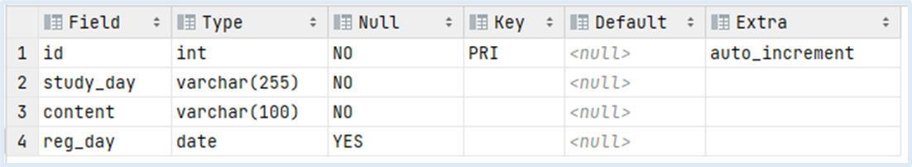

<hr>

## 배경

동료 개발자의 추천으로 SQL 첫걸음이라는 책을 읽게 되었다.
<br>

<br>
[<a href="https://www.aladin.co.kr/shop/wproduct.aspx?ItemId=69025381" style="color: blue;">책 구매 링크</a>]

이 책은 정말 기초적인 부분이 주를 이루기 때문에 SQL에 능통한 개발자 분들은 SQL 레벨업 책으로 넘어갈 것을 추천한다.
나는 이 책을 통해 SQL 기초 지식을 다시 상기 시킬 수 있었다.
이 책의 분량은 350 페이지 정도 되며 이미지가 많아 한 페이지씩 가볍게 읽을 수 있다.

## 정리

SQL의 기초 지식을 배울수 있는 곳은 많기 떄문에 입문자의 입장에서 간과하기 쉬운부분들을 위주로 정리해보려고 한다. 이 블로그의 모든 예시 Case는 Mysql을 기준으로 한다. 

### 1. NULL

- Null인 필드의 의미
    - 아무런 데이터도 저장되어 있지 않은 상태를 말한다.
- Null인 필드를 검색시에는 “IS NULL” 혹은 “IS NOT NULL”을 사용해야 한다.

### **2. 테이블 구조 검색**

- DESC 명령
    - 테이블에 정의된 Column에 대한 Type, Key, Default Value 등을 확인 가능하다.
    - ex) 명령어 입력 : `DESC [테이블명:study_record]`
        
        
        
    - DDL을 통해 보는것을 더 추천한다.

### 3. CHAR vs VARCHAR

- CHAR
    - ( )를 통해 최대 길이를 지정할 수 있다.
    - 고정된 저장 공간에 값이 할당 되는데, 문자열의 길이가 지정한 길이보다 짧을 경우 나머지 공간을 공백(ex, 0x20)으로 채운다.
    - ex, CHAR(5) = ‘ABC’
        
        
        | 1 | 2 | 3 | 4 | 5 |
        | --- | --- | --- | --- | --- |
        | A | B | C | 0x20 | 0x20 |
- VARCHAR
    - ( )를 통해 최대 길이를 지정할 수 있다.
    - 가변적으로 저장 공간의 길이가 변경되며 값이 할당 된다.
    - 추가적으로 문자열의 길이를 저장하기 위해 1바이트를 사용한다.
    - ex, VARCHAR(5) = ‘ABC’
        
        
        | 1 | 2 | 3 | 4 | 5 |
        | --- | --- | --- | --- | --- |
        | A | B | C | (길이:3) |  |

### 4. SELECT와 WHERE

- SELECT 구 : column을 선택할때 사용하는 것으로 인식하면 된다.
- WHERE 구 : row를 선택할때 사용하는 것으로 인식하면 된다.
- 문자열 비교시에는 싱글쿼터(’ ‘)를 사용한다.

### 5. 연산자 우선순위

- AND와 OR
    - ex) `WHERE (a=10 AND b=11) OR (c=12 AND d=13)`
    - AND가 OR보다 우선순위가 높기 때문에 OR 조건식을 사용시에는 괄호로 묶어서 사용하는것을 권장한다.
- NOT (생략)

### 6. 패턴 매칭 검색

- 전방일치
    - ex) WHERE [table] LIKE ‘keyword%’
    - keyword로 시작하는 column을 대상으로 row를 매칭
- 후방일치
    - ex) WHERE [table] LIKE ‘%keyword’
    - keyword로 끝나는 column을 대상으로 row를 매칭
- 중간일치
    - ex) WHERE [table] LIKE ‘%keyword%’
    - keyword가 포함되는 column을 대상으로 row를 매칭

### 7. ORDER BY

- ORDER BY 사용시 주의사항
    - Default는 ASC(오름차순) 정렬로 동작
    - 문자열 데이터는 사전식 순서에 의해 결정된다. (ex, ‘사과’ < ‘바나나’ < ‘오렌지’)
    - 만약, 문자열 타입에 숫자를 저장하여 정렬하게 되면 문자로 인식하여 대소관계 계산법이 달라진다.

### 8. LIMIT과 OFFSET

- 사용 예시
    - ex) SELECT column1 FROM [table] `LIMIT rowCountPerPage OFFSET rowOffset`
        - rowOffset : (currentPage-1) * rowCountPerPage
    - ex) SELECT column1 FROM [table] `rowOffset, rowCountPerPage`

### 9. 문자열 연산

- 제공 함수 : CONCAT, SUBSTRING, TRIM, CHARACTER_LENGTH, OCTET_LENGTH
- EUC-KR vs UTF-8
    - EUC-KR :  ASCII 문자는 1바이트, 한글은 2바이트 용량을 가진다.
    - UTF-8 : ASCII 문자는 1바이트, 한글은 3바이트 용량을 가진다.

### 10. 날짜 연산

- 제공 함수 : CURRENT_TIMESTAMP,  CURRENT_DATE,  INTERVAL
- 날짜 형식
    - 한국과 일본 : 연월일을 슬래시나 하이픈으로 표시 (ex, 2024/01/10,  2024-01-10)
    - 미국 : 월의 경우 Jan, Feb 등으로 표기 (ex, 01 Jan 2024)
- ex) 시스템 날짜로부터 3일 후 계산
    - SELECT CURRENT_DATE + INTERVAL 3 DAY;
- ex) 날짜간의 뺄셈
    - SELECT DATEDIFF(’2024-10-13’, ‘2014-10-01’)

### 11. CASE문

- CASE문 문법
    
    ```sql
    CASE WHEN 조건식1 THEN 식1
        WHEN 조건식2 THEN 식2...
        ELSE
    END
    ```
    
- 주의사항
    - ELSE는 생략 가능하고 생략시 ELSE NULL이 된다
    - CASE문은 WHERE구와 ORDER BY 구에서도 사용 가능하다.

### 12. DELETE 사용시 주의사항

- ~~ORDER BY 구는 사용 불가하다.~~
- 물리 삭제 vs 논리 삭제
    - 물리 삭제 : Table 1개의 row를 삭제하는 것을 의미한다.
    - 논리 삭제 : Table 1개의 row에 flag 등의 column을 두어 활성화(1)/비활성화(0) 처리를 통해 삭제된것처럼 인식하게 하는 것을 의미한다.

### 13. 집계함수

- 종류 : COUNT, SUM, AVG, MIN, MAX
- 주의사항
    - *를 인수로 사용 가능한 집계함수는 COUNT 밖에 없다.
    - 집계함수 실행 중에 NULL이 있을경우 제외하고 처리한다.]]
    - WHERE 절에서 집계함수는 사용 불가하다. (HAVING에서 사용 가능)

### 14. GROUP BY ~ HAVING 구

- group by : 집계함수의 결과 집합을 그룹으로 묶을때 사용한다.
- 주의사항
    - GROUP BY로 지정한 Column 이외의 Column은 SELECT로 출력시 집계함수로 묶어주지 않으면 여러 행의 동일한 값이 충돌되어 오류가 발생한다.

### 15. SQL 실행 순서

- 1️⃣From ⇒ 2️⃣Where ⇒ 3️⃣Group By ⇒ 4️⃣Having ⇒ 5️⃣Select ⇒ 7️⃣Order By
- 주의사항
    - 실행 순서에 의해 알수 있듯이 단일 쿼리에서 Select구에서 사용되는 Alias를 Where 구에서 사용하게 되면 오류가 발생한다.
    - 그 이유는 Where 구를 통해 row를 추출하고,  Select 구를 통해 column을 선택 후 Alias를 붙이기 때문이다.  (Order By 구에서는 Alias를 사용할 수 있다)

 

### 16. 서브쿼리

- 서브쿼리 : 하나의 SQL문 안에 포함된 또 다른 SQL문
    - ex) 전 부서에서 ‘New York’에서 일하는 직원들만 조회
        
        ```java
        SELECT *
        FROM employees
        WHERE department_id IN (SELECT id FROM departments WHERE location = 'New York');
        ```
        
        [참고로 이 예시는 chatGPT가 알려준 예시이고, 이 밖에도 다양한 예시들을 생각해 볼 수 있다]
        
    - 서브쿼리는 select, from, where구 모두에서 사용 가능하다.
- 스칼라 서브쿼리란 하나의 row만 반환하는 SubQuery를 말한다.

### 17. 데이터베이스 객체

- 데이터베이스 내에서 데이터를 저장하는 구조를 말한다.
- 종류로는 테이블, 뷰, 인덱스, 프로시저 등이 있다.
- SQL 명령어는 객체가 아니라 문법에 불과하다.
- 테이터베이스 객체가 만들어지는 곳은 스키마이다.

### 18. 인덱스

- 데이터베이스 객체 중 하나로,  테이블에 붙여진 색인(== 목차, 인덱스의 일종)이라 할수 있다.
- 사용하는 이유는 인덱스 테이블을 통해 정렬된 데이터들을 바탕으로 빠른 검색이 가능하기 때문이다.
- 자세한 내용은 ‘SQL 레벨업’ 책에서 다루려고 한다.

### 19. **뷰 (View)**

- 테이블과 같은 부류의 데이터베이스 객체 중 하나로, SELECT 쿼리문을 객체로 이름지어 관리하는 것을 말한다.
- 물리적인 저장소에 저장되는 테이블과 달리 뷰는 CPU에 저장된다고 한다.

### 20. UNION

- 기본적으로 DISTINCT로 동작하기 때문에 중복 제거를 원치 않는다면 ALL 키워드를 사용하면 된다.
- 주의사항 첫번쨰 SELECT 쿼리문에서는 ORDER BY를 지정할 수 없다.

### 21. JOIN

- UNION, GROUP BY 등의 연산이 세로(row) 방향으로 데이터가 늘어나고 줄어드는것과 달리
JOIN에서는 가로(column) 방향으로 데이터가 추가되고 제거된다.
- 상황에 따라 Inner Join, Left Join, Right Join을 사용하면 된다.

### 22. 정규화

- 입문자 입장에서는 이것만 기억해도 좋을것 같다.
- 제1 정규화 : 하나의 Column에는 하나의 값만 저장할 수 있다
- 제2 정규화 : PrimaryKey와 중복되는 Column을 파악해 별도의 테이블로 분리한다.
- 제3 정규화 : PrimaryKey 이외에 중복되는 Column들을 파악해 별도의 테이블로 분리한다.

### 23. 기타

- COALESCE vs IFNULL
    - COALESCE와  IFNULL는 NULL 대체 값을 지정할때 사용하는 함수이다
    - 차이점을 보자면,
        - COALESCE은 여러개의 값에 대한 NULL 처리가 가능하고 SQL 표준함수이다.
        - IFNULL은 1개의 값에 대한 NULL 처리만 가능하고, MYSQL에서만 지원되는 함수이다.

## 마무리

이 글의 독자분들도 위에서 정리한 내용의 대부분은 알고 있는 지식일 수 있수 있겠지만,  SQL 실행순서와 인덱스 등의 개념은 중요하기 때문에 좀더 깊이있게 공부하는 것을 권장한다.

테이블 생성, 제약조건, SQL 쿼리문, 인덱스, 트랜잭션에 대한 깊이 있는 내용은 다루지 못했는데,
앞으로 DB를 계속 공부하며 포스팅을 업그레이드 해나갈 예정이다.
다음 DB 파트는 ‘SQL 레벨업’이다. 


