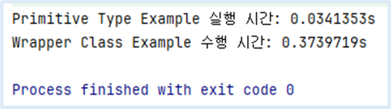

<hr>


## **⬛︎ 목차**

1. [JOL로 Wrapper Class의 instance 메모리 크기 측정](#JOL로-Wrapper-Class의-instance-메모리-크기-측정)
2. [Java의 다양한 타입 - 원시 타입 (Primitive Type)](#Java의-다양한-타입-원시-타입-Primitive-Type)
3. [Java의 다양한 타입 - 참조 타입 (Reference Type)](#Java의-다양한-타입-원시-타입-Reference-Type)
4. [Java의 다양한 타입 - 원시 타입 vs 참조 타입](#Java의-다양한-타입-원시-타입-vs-참조-타입)
5. [Auto Boxing](#Auto-Boxing)
6. [UnBoxing](#UnBoxing) 
7. [Primitive Type과 Wrapper Class 사용시의 성능 비교](#Primitive-Type과-Wrapper-Class-사용시의-성능-비교)   

<br>

우리는 **Java 코드를 작성할떄 int, double, char, String 등 많은 자료형들을 사용**하고 있습니다.  
그렇다면 이 자료형들이 **메모리 공간에서 실제로 얼마큼의 크기를 차지고 있는지 궁금**증이 생길 수 있습니다.  

지금부터 **Reference Type(ex, Wrapper Class)과 내부의 Primitive Type에 의해 할당되는 Heap 메모리 크기**를 알아보겠습니다.

<br>

## 🔰 **JOL로** Wrapper Class의 instance 메모리 크기 측정 {#JOL로-Wrapper-Class의-instance-메모리-크기-측정}

### **1️⃣** Dependency 추가
<br>
개발 환경은 Intellij Ultimate, Java 17, SpringBoot 3.x로 구축 하였습니다.  
Heap 메모리 측정은 다양한 방법 중 하나인 [**Java Object Layout (JOL) 라이브러리**](https://mvnrepository.com/artifact/org.openjdk.jol/jol-core/0.17)를 사용했습니다.

```java
<!-- jol -->
<dependency>
  <groupId>org.openjdk.jol</groupId>
  <artifactId>jol-core</artifactId>
  <version>0.17</version>
</dependency>
```

> *[**JOL**](https://openjdk.org/projects/code-tools/jol/)은 JVM에서 객체 레이아웃의 체계를 분석하는 도구입니다.*  
> *JOL을 통해 JVM이 Heap 메모리에 객체를 어떻게 할당해 배치하는지 확인할 수 있습니다.*
> 

> *JOL로 메모리를 측정하는 방식에는 2가지가 있습니다.*  
> *1)  IDE상에서 코드를 실행하여 측정*  
> *2) Terminal 환경에서 JAR 파일 실행하여 측정*

이 포스팅에서는 **코드 영역에서 메모리를 측정**해 보겠습니다

<br>

### **2️⃣** Wrapper Class Instance’s Heap 메모리 크기 측정
<br>

**👨‍💻 구현 코드**

```java
public class WrapperClassTest {

    public static void main(String[] args) {
        //1) 각 Wrapper 클래스의 인스턴스 생성
        Byte byteObj = 1;
        Short shortObj = 1;
        Integer intObj = Integer.valueOf(1);
        Long longObj = 1L;
        Float floatObj = 1.0f;
        Double doubleObj = 1.0;
        Character charObj = 'A';
        Boolean boolObj = true;
        String strObj = "str";

        //2) JOL을 사용하여 각 객체의 메모리 레이아웃 출력
        printMemoryLayout("Byte", byteObj);
        printMemoryLayout("Short", shortObj);
        printMemoryLayout("Integer", intObj);
        printMemoryLayout("Long", longObj);
        printMemoryLayout("Float", floatObj);
        printMemoryLayout("Double", doubleObj);
        printMemoryLayout("Character", charObj);
        printMemoryLayout("Boolean", boolObj);
        printMemoryLayout("String", strObj);
    }

    private static void printMemoryLayout(String className, Object obj) {
        System.out.println(className + ": " + **ClassLayout**.**parseInstance**(obj).**toPrintable**());
    }
}
```

<br>

**🔎 주요 메서드 분석**

1. [`ClassLayout`](https://javadoc.io/doc/org.openjdk.jol/jol-core/0.16/org/openjdk/jol/info/ClassLayout.html) : 메모리 구조를 분석해 정보를 제공하는 클래스
2. `ClassLayout.parseInstance(obj)` : 객체의 메모리 레이아웃을 분석해 ClassLayout 객체 반환하는 메서드
    
    ```java
    public class ClassLayout {
      public static ClassLayout parseInstance(Object instance) {
		return parseInstance(instance, new CurrentLayouter());
      }
	
      public static ClassLayout parseInstance(Object instance, Layouter layouter) {
        return layouter.layout(ClassData.parseInstance(instance));
      }
    }
    ```
    
3. `ClassLayout.toPrintable(obj)` : 분석된 메모리 레이아웃을 문자열로 변환하는 메서드
    
    ```java
    public class ClassLayout {
      private final ClassData classData;
    	
      public String toPrintable() {
        return this.toPrintable(this.classData.instance());
      }
    }    
    ```

<div style="margin-bottom:40px;"></div>
이 포스팅에서 JOL 라이브러리에 대한 자세한 설명은 생략하오니 궁금하신 점이 있다면 [**<u>공식 문서</u>**](https://javadoc.io/doc/org.openjdk.jol/jol-core/latest/index.html)를 참고해 주시면 됩니다.


<br>

**🖥️ 결과**

결과를 확인하기전에 표에서 각 지표의 의미를 이해하는 시간을 가져보겠습니다. 이미 알고 있는 내용이라면 건너뛰어도 좋습니다.  

**OFFSET** (OFF)은 각 필드가 메모리에서 어디에 위치하는지를 바이트 단위로 표시합니다.  
**SIZE** (SZ)는 각 필드가 차지하는 바이트 크기를 의미합니다.  
**TYPE**은 해당 필드의 데이터 타입입니다.  
**DESCRIPTION**은 object header (ex, mark, class), 필드 정보 (ex, Integer.value), 메모리 관리 정보 (ex, alignment/padding gap)를 나타냅니다.  
**VALUE**에는 해당 필드에 저장된 실제 값을 표시해 줍니다.

이해가 되지 않는 지표가 있다면 검색을 통해 찾아 나가시는것을 권장드립니다.
<br>

> Integer: java.lang.Integer object internals:   **<== 결과 출력 화면**
> 
> 
> 
> | OFF | SZ | TYPE | DESCRIPTION | VALUE |
> | --- | --- | --- | --- | --- |
> | 0 | 8 |  | (object header: mark) | 0x0000000000000001  (non-biasable; age: 0) |
> | 8 | 4 |  | (object header: class)  | 0x0004fcf0 |
> | 12 | 4 | int | Integer.value  | 1 |
> 
> Instance size: 16 bytes  
> Space losses: 0 bytes internal + 0 bytes external = 0 bytes total
 
<div style="margin-bottom:50px;"></div>

모든 Wrapper Class 객체에 대한 메모리 크기 측정 결과를 보여드리기에는 포스팅 글이 길어질수 있어 **Integer Type으로 설명**드리겠습니다. 핵심 지표인 SZ(size)를 보면, **Integer 객체는 총 16 Byte의 Heap 메모리 공간을 차지**하고 있음을 알 수 있습니다.

더 자세히 살펴보면,  
**8 Byte**는 **인스턴스의 메타 데이터**(동적인 데이터)를 가리키는 포인터이고,  
**4 Byte**는 **클래스의 메타 데이터**(정적인 데이터)를 가리키는 포인터를 의미합니다.  
**4 Byte**는 **실제 정수값**(ex, 1)을 저장하는 메모리 공간으로 사용되고 있음을 확인할 수 있습니다.  
 

Wrapper Class는  Primitive Type의 값을 감싸고 있기 때문에 int와 같이 value로 4 Byte의 Heap 메모리 공간이 할당됩니다.

> *나머지 Type에 대한 결과는 아래의  Github 소스코드를 참고해 주시면 감사합니다.*  
> [*https://github.com/gusdn7142/JavaTypeTest*](https://github.com/gusdn7142/JavaTypeTest/commit/c248470fbf39bad109987216b661fcbe2e395536)

<br>

## 🏚︎ Java의 다양한 타입

### 1️⃣ 원시 타입 (**Primitive Type)** {#Java의-다양한-타입-원시-타입-Primitive-Type}
<div style="margin-bottom:20px;"></div>

**개념**

- stack 메모리에 저장되어 다른 변수와 값을 공유하지 않습니다.

<div style="margin-bottom:40px;"></div>


**종류**

1. 정수형
    
    
    | type | allocated memory size (stack) | default value | value ranges |
    | --- | --- | --- | --- |
    | byte | 1byte | 0 | -128 to 127, |
    | short | 2byte | 0 | -32768 to 32767 |
    | int | 4byte | 0 | -2147483648 to 2147483647 |
    | long | 8byte | 0 | -9223372036854775808 to 9223372036854775807 |
    
    > 각 Byte의 최상위 비트는 부호 비트로 사용됩니다.
<br>
2. 실수형
    

    | type | allocated memory size 
    (stack) | default value | value ranges |
    | --- | --- | --- | --- |
    | float | 4byte | 0.0F |  (3.4 X 10-38) ~ (3.4 X 1038) 의 근사값 |
    | double | 8byte |  0.0 |  (1.7 X 10-308) ~ (1.7 X 10308) 의 근사값 |
    
    > [IEEE 754 표준](https://ko.wikipedia.org/wiki/IEEE_754)을 따라 stack 메모리에 저장됩니다.

    > IEEE 754
    > - IEEE에서 개발한 컴퓨터에서 부동소수점을 표현하는데 가장 널리 쓰이는 표준으로, 크게 세 부분으로 구성됩니다.
    > - 최상위 비트는 부호이고, 지수 부분(exponent)과 가수 부분(fraction/mantissa)으로 구성됩니다.
<br>
3. 문자형
    
    
    | type | allocated memory size (stack) | default value | value ranges |
    | --- | --- | --- | --- |
    | char | 2byte |  \u0000 (화면에서 표시되지 않는 null문자) | 0 to 65,535 (unsigned) |
    
    char의 경우 c언어에서는 1byte (ASCII코드)를 가지고 있지만, Java에서는 유니코드( 2 byte 문자 체계)를 사용하기 때문에 2 byte의 크기를 가집니다.
<br>
4. 논리형
    
    
    | type | allocated memory size (stack) | default value | value ranges |
    | --- | --- | --- | --- |
    | boolean | 1byte | false | true or false |
    
<br>

### 2️⃣ 참조 타입 (Reference Type) {#Java의-다양한-타입-원시-타입-Reference-Type}
<div style="margin-bottom:20px;"></div>

**개념**

- Heap 메모리에 저장되어 Garbage Collection의 대상이 되며  참조 변수간의 값이 공유될 수 있습니다.
- 참조 변수는 객체의 실제 값이 아닌 주소값을 저장합니다.

<div style="margin-bottom:40px;"></div>


**종류**

1. Wrapper Class
    
    | type | allocated memory size (stack + heap) | default value | value ranges |
    | --- | --- | --- | --- |
    | Byte | 16byte~ (expactation) | Null | -128 to 127, |
    | Short | 16byte~ (expactation) | Null | -32768 to 32767 |
    | Integer | 16byte~ (expactation) | Null | -2147483648 to 2147483647 |
    | Long | 16byte~ (expactation) | Null | -9223372036854775808 to 9223372036854775807 |
    | Float | 16byte~ (expactation) | Null |  (3.4 X 10-38) ~ (3.4 X 1038) 의 근사값 |
    | Double | 16byte~ (expactation) | Null |  (1.7 X 10-308) ~ (1.7 X 10308) 의 근사값 |
    | Charater | 16byte~ (expactation) | Null | 0 to 65,535 (unsigned) |
    | Boolean | 16byte~ (expactation) | Null | true or false |
    | String | 16byte~ (expactation, 길이에 따라 달라짐) | Null | 길이에 따라 달라짐 (각 문자는 UTF-16 2Byte) |

2. Class
3. Array
4. Interface
5. Enumeration

<br>

### 3️⃣ 원시 타입(Primitive Type) vs 참조 타입(Reference Type) {#Java의-다양한-타입-원시-타입-vs-참조-타입}
<div style="margin-bottom:20px;"></div>


| 비교요소 | Primitive Type | Reference Type |
| --- | --- | --- |
| NULL Save Possible | X | O |
| Generic Type Available | X | O |
| Allocated Memory Area | stack memory | stack + heap memory |
| Number of Memory Access | 1회 | 2회 (stack → heap 메모리 주소 접근,  stack → heap 메모리내 객체의 값 접근) |

<br>

## 🔌 Auto Boxing과 UnBoxing
<div style="margin-bottom:40px;"></div>

### 1️⃣ **Auto Boxing** {#Auto-Boxing}
<div style="margin-bottom:20px;"></div>
**개념**

- 기본 데이터 타입(Primitive Type) 값을 해당 래퍼 클래스(Wrapper Class)의 객체로 자동 변환하는 과정입니다.

<div style="margin-bottom:20px;"></div>

**코드**

```java
//1) Auto Boxing
int intNum = 10;
Integer integerNum = intNum;    
System.out.println("integerNum : " + integerNum);
```
<div style="margin-bottom:40px;"></div>

### 2️⃣ **Auto UnBoxing** {#UnBoxing}
<div style="margin-bottom:20px;"></div>
**개념**

- 래퍼 클래스(Wrapper Class)의 객체를 해당 기본 데이터 타입(Primitive Type) 값으로 자동 변환하는 과정입니다.
- 주의사항으로는 Integer형 변수에 null을 할당하고 int형 변수에 값을 대입하려 하면 NullPointerException이 발생합니다.

<div style="margin-bottom:20px;"></div>

**코드**

```java
//2) Auto UnBoxing
Integer integerNum2 = Integer.valueOf(10);
int intNum2 = integerNum2;           
System.out.println("intNum2 : " + intNum2);
```

<div style="margin-bottom:100px;"></div>


## 🛩️ Primitive Type과 Wrapper Class 사용시의 성능 비교 {#Primitive-Type과-Wrapper-Class-사용시의-성능-비교}
<div style="margin-bottom:40px;"></div>
**Wrapper Class를 사용해 연산을 하다 보면 Boxing/UnBoxing 과정이 수시로 일어나 성능이 저하될 것으로 예상**되는데 직접 코드로 확인해 보겠습니다.  

<div style="margin-bottom:20px;"></div>

```java
public class BoxingPractice {

    public static void main(String[] args) {
        long startTime, endTime;

        //1) Primitive Type 사용시 실행시간 측정 - add 100_000_000
        startTime = System.nanoTime();
        int sumPrimitive = 0;
        for (int num = 0; num < 100_000_000; num++) {
            sumPrimitive += num;
        }
        endTime = System.nanoTime();
        System.out.println("Primitive Type Example 실행 시간: " + ((endTime - startTime) / 1_000_000_000.0) + "s");

        //2) Wrapper Class 사용시 실행시간 측정 - add 100_000_000
        startTime = System.nanoTime();
        Integer sumWrapper = 0;       //Auto-Boxing 발생
        for (int num = 0; num < 100_000_000; num++) {
            sumWrapper += num;        // Auto-Unboxing 및 Auto-Boxing 발생
        }
        endTime = System.nanoTime();
        System.out.println("Wrapper Class Example 수행 시간: " + ((endTime - startTime) / 1_000_000_000.0) + "s");

    }
}
```



<div style="margin-bottom:40px;"></div>

System.nanoTime()을 통해 **100_000_000번의 연산**을 수행 후 나노초(ns) 단위로 측정하였고 초(s)단위로 비교해 보았습니다.
그 결과 **약 11배의 성능 차이**가 발생했습니다.  
Wrapper Class 사용시의 <b>코드 실행 시간이 몇 배로 더 많이 걸린 이유에는 2가지</b> 문제점이 있었습니다.

<div style="margin-bottom:50px;"></div>


**1) Auto-Boxing 비용 발생**  

- `Integer sumWrapper = 0` 코드가 실행될때 <u>Integer.valueOf(0) 메서드가 호출되어 Auto-Boxing이 발생</u>합니다.

<div style="margin-bottom:20px;"></div>

**2) Auto-Unboxing과 Auto-Boxing 비용 발생**

- `sumWrapper += num` 코드가 실행될때 `sumWrapper = Integer.valueOf(sumWrapper.intValue() + num)`로 변환됩니다.
- 이때 `sumWrapper.intValue()` 메서드 호출시 <u>Integer 값이 int로 변환되는 Auto-unBoxing이 발생</u>하고,
- `Integer.valueOf()` 메서드가 호출되어 <u>int 값이 Integer로 변환되는 Auto-Boxing이 발생</u>합니다.

<br>

> *전체 코드는 아래의  Github를 참고해 주시면 감사합니다.*  
> [https://github.com/gusdn7142/JavaTypeTest](https://github.com/gusdn7142/JavaTypeTest/commit/37efb57fbe5fcd411ad30622f912a609a647da57)

<br>


## **정리**

먼저 Wrapper Class의 Instance가 생성될 때 할당되는 Heap 메모리 크기를 살펴보았습니다.

이 블로그 글을 다 읽으셨다면 지금 진행 중이신 프로젝트, 코드들이 얼만큼의 메모리를 할당하고 있는지 예측하고 측정 후 비교해 보시는 것을 권장드립니다.
이 포스팅에서 사용한 방식은 JOL을 통해 간단하게 메모리 사용량을 알아보았는데, 이 밖에도 Instrumentation API 등 다양한 방식이 존재합니다.

다음으로 Auto Boxing과 UnBoxing을 알아보았는데, **Wrapper Class를 사용하는 것이 성능 면에서 좋지 않다**는 것을 눈으로 직접 확인할 수 있었습니다. 
그럼에도 불구하고 Wrapper Class는 Collection Framework와의 호환 (ex, List<Integer>), 유틸리티 메서드 제공 (ex, Integer.parseInt), Generic 타입 요구 등의 이유로 사용해야 할 때가 있기 때문에 상황에 따라 판단하면 됩니다.

<br>

### 참고

- Primitive type And Reference type
    - [https://devpad.tistory.com/57](https://devpad.tistory.com/57)
    - [https://docs.oracle.com/javase/specs/jls/se12/html/jls-4.html#jls-4.2](https://docs.oracle.com/javase/specs/jls/se12/html/jls-4.html#jls-4.2)
    - [https://velog.io/@wkdwoo/Primitive-type원시타입-vs.-Reference-type참조타입](https://velog.io/@wkdwoo/Primitive-type%EC%9B%90%EC%8B%9C%ED%83%80%EC%9E%85-vs.-Reference-type%EC%B0%B8%EC%A1%B0%ED%83%80%EC%9E%85)
    - [https://jminc00.tistory.com/13](https://jminc00.tistory.com/13)
- JOL (Java Object Layout)
    - [https://openjdk.org/projects/code-tools/jol/](https://openjdk.org/projects/code-tools/jol/)
    - [https://github.com/openjdk/jol/tree/master/jol-samples/src/main/java/org/openjdk/jol/samples](https://github.com/openjdk/jol/tree/master/jol-samples/src/main/java/org/openjdk/jol/samples)
    - [https://mvnrepository.com/artifact/org.openjdk.jol/jol-core/0.17](https://mvnrepository.com/artifact/org.openjdk.jol/jol-core/0.17)
    - [https://www.baeldung.com/java-memory-layout](https://www.baeldung.com/java-memory-layout))
- AutoBoxing & UnBoxing
    - [https://velog.io/@wkdwoo/AutoBoxing오토-박싱-UnBoxing언박싱](https://velog.io/@wkdwoo/AutoBoxing오토-박싱-UnBoxing언박싱)