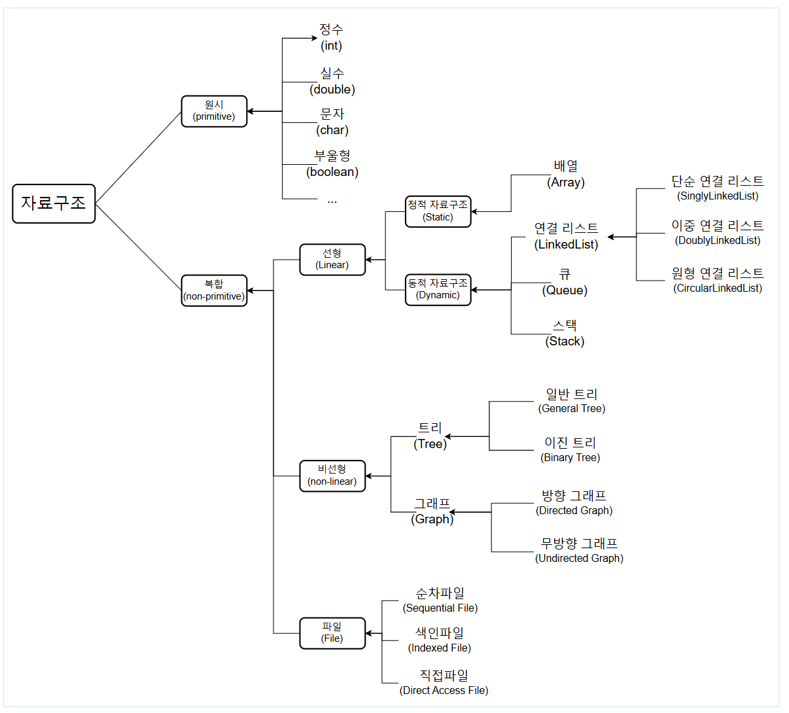
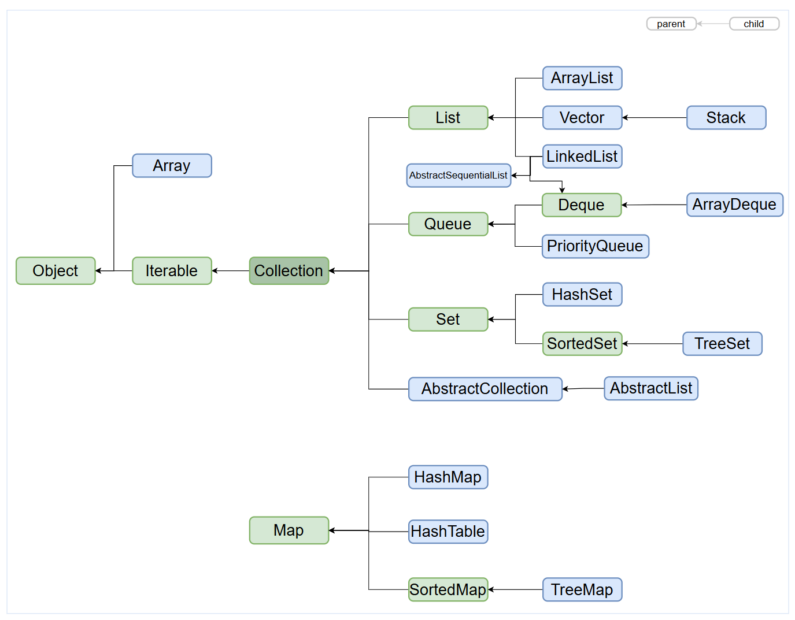
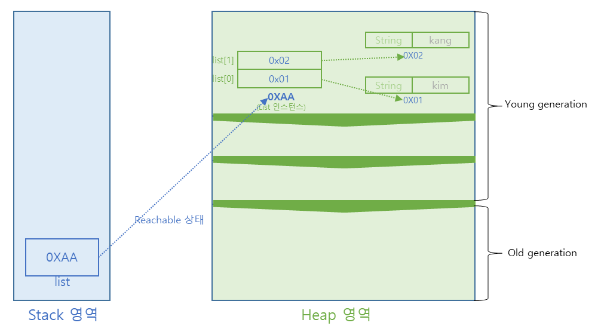
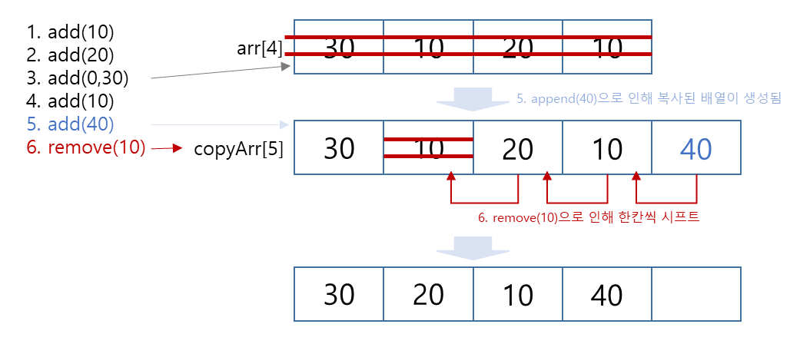
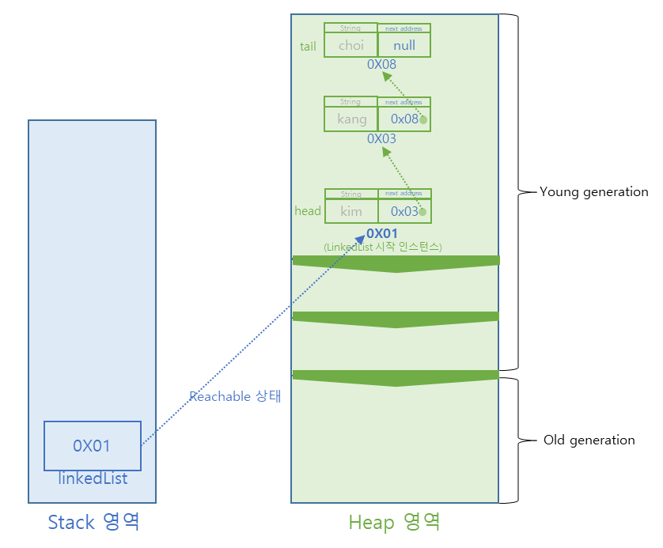
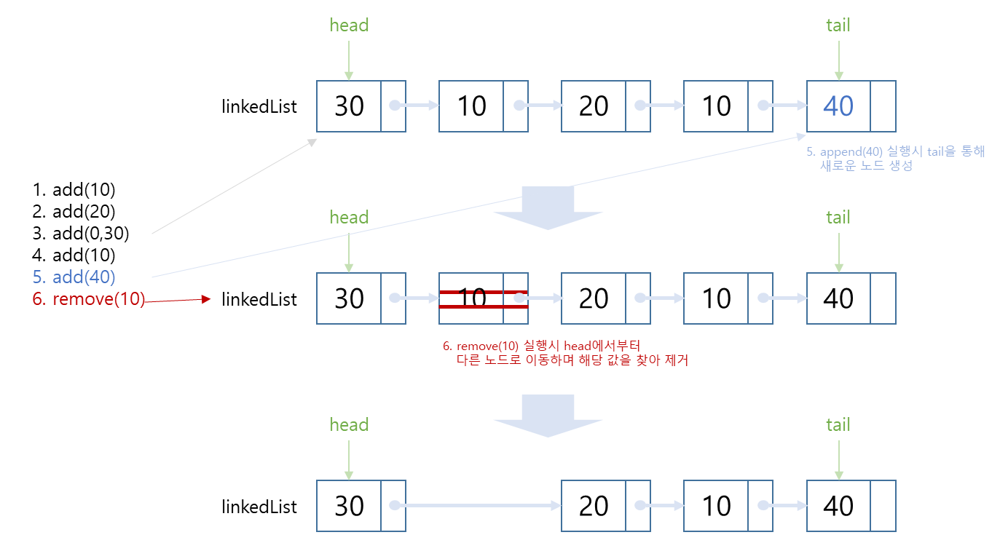
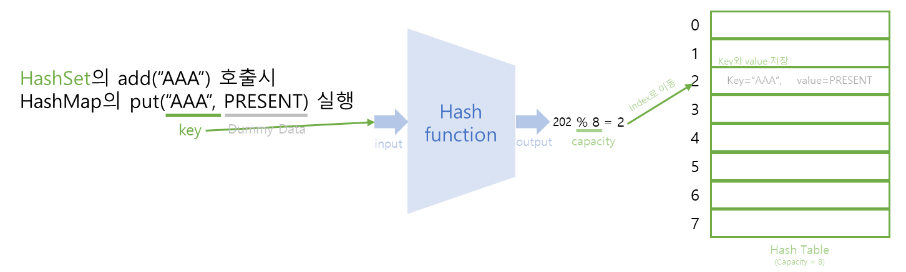
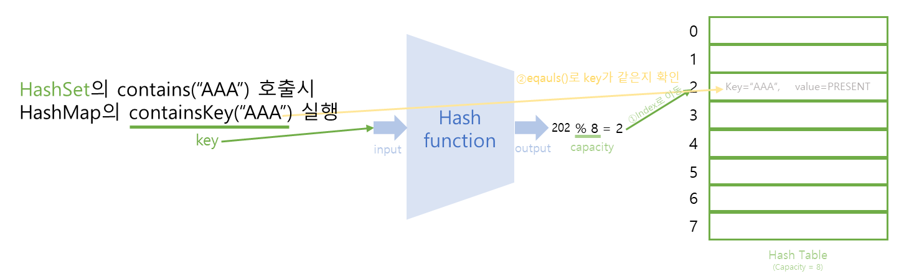
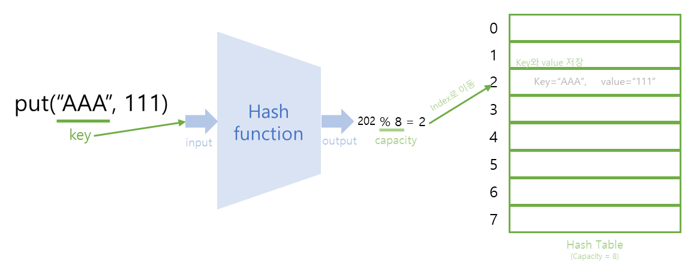
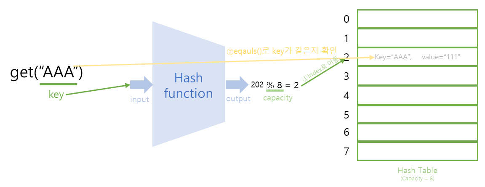

<hr>


### **⬛︎ 목차**

1. [**자료구조**와 **Java Colleciton 인터페이스**](#Java_Colleciton_인터페이스)
2. [Java Collection 인터페이스 **- List**](#List)
3. [Java Collection 인터페이스 **- Set**](#Set)
4. [Java Collection 인터페이스 **- Map**](#Map)
5. [**배열**](#배열)
6. [**Collections**](#Collections)

<div style="margin-bottom:60px;"></div>

이번 포스팅은 Java의 Collection에 대해 다뤄보겠습니다.

<div style="margin-bottom:20px;"></div>


## 1️⃣ **자료구조와 Java Colleciton 인터페이스** {#Java_Colleciton_인터페이스}


### 1-1) 자료구조




**1-1-1)** <b>원시 자료구조</b> : 컴퓨터 프로그래밍의 기본 구성 요소로, 프로그램 내에서 데이터가 어떻게 구성되고, 저장 및 조작되는지 정의한 것으로, 기본 자료형이라 부릅니다.

<div style="margin-bottom:20px;"></div>

**1-1-2)** <b>복합 자료구조</b> : 원시 자료구조를 기반으로 만들어진 자료구조입니다.
- 선형 자료구조 : 데이터 요소를 순차적으로 연결하며, 데이터간의 관계가 1:1인 자료구조입니다.
- 비선형 자료구조 : 데이터 요소를 비순차적으로 연결하며, 데이터간의 관계가 1:N 혹은 N:M 등으로 연결됩니다.

<div style="margin-bottom:60px;"></div>


### 1-2) Collection

<div style="margin-bottom:30px;"></div>


**1-2-1) 등장 배경**

컬렉션 프레임워크는 Java의 기본 저장소인 배열의 많은 문제점을 해결하기 위해 등장하였습니다.

배열의 문제점은 다음과 같습니다.  
① 초기화 이후에 크기 변경이 불가능합니다.  
② 데이터 삽입, 삭제 시 인덱스를 기준으로 이동해야 합니다.  
③ 같은 타입의 데이터만 저장할 수 있습니다.  

<div style="margin-bottom:60px;"></div>


**1-2-2) 개념**  

다수의 데이터를 효율적으로 저장할 수 있도록 제공해주는 자료구로, List, Set, Map 등의 Collection 인터페이스를 제공합니다.

<div style="margin-bottom:60px;"></div>

**1-2-3) 주요 메서드**  

| Method | explan |
| --- | --- |
| boolean add(E e) | 지정된 요소를 컬렉션에 추가 |
| boolean remove(Object o): | 지정된 요소를 컬렉션에서 제거 |
| boolean contains(Object o) | 지정된 요소가 컬렉션에 포함되어 있는지 여부를 반환 |
| int size() | 컬렉션 내의 요소 수를 반환 |
| boolean isEmpty()  | 컬렉션이 비어 있는지 여부를 반환 |
| Iterator iterator()  | 컬렉션의 요소를 반복하는 데 사용할 반복자를 반환 |
| void clear() | 컬렉션 내부 요소 모두 제거 |

<div style="margin-bottom:60px;"></div>

**1-2-4) 주요 구현체**  (java.util 패키지 안에 위치)

> 
> 
> 
> 
> 
>①List
>   - 순서가 있는 데이터의 집합을 다루며, 데이터 중복을 허용합니다.
>   - 저장 공간이 동적으로 할당됩니다.
>   - ArrayList, LinkedList 등의 구현체가 있습니다.
> 
>②Set
>   - 순서를 유지하지 않고, 중복을 허용하지 않는 데이터 저장소입니다.
>   - HashSet, LinkedHashSet, TreeSet 등의 구현체가 있음
> 
>③Map
>   - 키(Key)와 값(Value)의 쌍으로 데이터를 저장합니다.
>   - 키는 중복될 수 없고, 데이터는 중복을 허용합니다.
>   - HashMap, TreeMap, LinkedHashMap 등의 구현체가 있습니다.

<div style="margin-bottom:80px;"></div>


## 2️⃣ Java Collection 인터페이스 **- List** {#List}


### 2-1) 특징
<div style="margin-bottom:20px;"></div>

①순서 유지  
    - 요소가 삽입된 순서를 유지합니다.  

②인덱스 기반 접근     
    - 인덱스를 사용하여 특정 위치의 요소에 접근할 수 있습니다.  

③중복 허용  
    - 동일한 데이터를 여러 번 저장할 수 있습니다.  


<div style="margin-bottom:60px;"></div>


### 2-2) 구현체

<div style="margin-bottom:30px;"></div>


**2-2-1)** AbstractList  
<div style="margin-bottom:20px;"></div>  

- Java Collection Framework에서 제공하는 추상 클래스로, List 인터페이스를 구현하고, 일부 메서드의 기본 구현을 제공합니다.  
- 이를 기반으로 ArrayList, LinkedList와 같은 구현체 클래스가 만들어집니다

<div style="margin-bottom:50px;"></div>

**2-2-2)** ArrayList  
- 개념
    - 배열을 사용해 List가 구현되었습니다.
    - 데이터의 삽입시 임시 배열을 생성해 복사하고,  삭제시에는 한칸씩 시프트하는 방법이 사용되었습니다.
- 특징
    - **데이터 검색** : 인덱스를 통해 데이터에 빠르게 접근할 수 있습니다. 랜덤 접근시에도 유용합니다.
    - **데이터 삽입/삭제** : 데이터의 복사와 이동이 많이 발생해 시간이 많이 걸립니다.
    - 잘못된 요소에 접근할 경우 java.lang.IndexOutOfBoundsException 이 발생합니다.
    - 동기화 되어 있지 않아 동시에 여러 스레드가 작업할 수 있습니다.
- 메모리 구조
    
    ```java
    List<String> list = new ArrayList<String>();  
    list.add("kim");     //index 미포함
    list.add(1,"kang");  //index 포함
    ```
    
    

- 동작 과정
    
    

    | 메서드 | 설명 |
    | --- | --- |
    | add(Object elem) | ArrayList에 요소를 추가 |
    | remove(int index) | index 에 위치하는 요소 제거 |
    | remove(Object elem) | elem과 일치하는 요소 제거 |
    | contains(Object elem) | elem을 포함하고 있으면 true 아니면 false |
    | isEmpty() | ArrayList 가 비어있으면 true 비어있지 않으면 false |
    | indexOf(Object elem) | elem과 일치하는 요소의 index를 리턴, 없으면 -1 |
    | size() | ArrayList의 요소의 개수를 리턴 |
    | get(int index) | index에 위치한 요소를 리턴 |
    | clear() | ArrayList를 비움(모든 요소를 삭제) |
- 실습 - feat) AbstractList를 확장하고 List 인터페이스를 구현하여 필요에 따라 길이가 늘어나고 동적 배열을 지원하는 <b>🔗[ArrayList Test Code](https://github.com/gusdn7142/Java-Collection/commit/33fe33bd0e8bd611c2dde7ba26fed291b00cc02d)</b>
    
    
<div style="margin-bottom:60px;"></div>


**2-2-3)** Vector
- 개념
    - ArrayList와 마찬가지로 데이터의 삽입, 삭제 시 임시 배열을 생성해 데이터를 복사하는 방법 이 사용되었습니다.
    - 동기화(Thread Safe) 되어있어 한번에 하나의 스레드만 작업할 수 있습니다.
    - 속도가 느려 잘 사용되지 않습니다.

<div style="margin-bottom:60px;"></div>

**2-2-4)** LinkedList 

- 개념
    - ArrayList의 단점을 보완하기 위해 개발되었습니다.
    - 노드를 이중 연결(linked)시키는 형태로 구현되어 있습니다.
    - 스택, 큐, 양방향 큐 등을 만들기 위한 용도로 사용됩니다.
- 특징
    - **데이터 검색** : 첫번째 데이터부터 순차적으로 접근하기 때문에 시간이 많이 걸립니다.
    - **데이터 삽입/삭제** : 위치에 해당되는 노드의 주소 값만 바꾸면 되기 때문에 ArrayList보다 더  빠릅니다.
    - 배열이 아닌 노드이기 때문에  값을 삽입시  주소가 연속적이지 않습니다.
- 메모리 구조
    
    ```java
    LinkedList<String> linkedList = new LinkedList<String>();  
    linkedlist.add("kim");     //index 미포함
    linkedlist.add(1,"kang");  //index 포함
    linkedlist.add("choi");  //index 미포함
    ```
    
    
    
- 동작 과정
    
    
    
    | 메서드 | 설명 |
    | --- | --- |
    | add(Object elem) | LinkedList에 요소를 추가 |
    | addFirst(Object elem) | LinkedList의 첫번째 위치에 요소를 추가 |
    | addList(Collection<?> list) | list의 모든 요소를 LinkedList에 추가 |
    | getFirst() | LinkedList의 첫번째 요소를 반환 |
    | getLast() | LinkedList의 마지막 요소를 반환 |
    | removeFirst() | LinkedList의 첫번째 요소를 제거하고 반환 |
    | removeLast() | LinkedList의 마지막 요소를 제거하고 반환 |
- 실습 - AbstractSequentialList를 확장하고 List, Deque, Cloneable 인터페이스를 구현하는 <b>🔗[LinkedList Test Code](https://github.com/gusdn7142/Java-Collection/commit/7c688c074820f56c509345b59efa47c4f3ed5165)</b>
    
    

<div style="margin-bottom:60px;"></div>


**2-2-5)** CopyOnWriteArrayList

- 개념
    - 쓰기 시 새로운 배열을 생성하여 스레드에 안전한 리스트를 구현한 것입니다.
    - 읽기 작업은 매우 빠르지만, 쓰기 작업은 상대적으로 느립니다.


<div style="margin-bottom:80px;"></div>


## 3️⃣ Java Collection 인터페이스 **- Set** {#Set}


### **3-1) 특징**
<div style="margin-bottom:20px;"></div>

①집합을 정의하며 요소의 중복을 허용하지 않습니다.  
②스스로 정의한 메서드는 없고, 상위 메서드를 사용합니다.

<div style="margin-bottom:40px;"></div>

### **3-2) 구현체**
<div style="margin-bottom:20px;"></div>

3-2-1) HashSet

- 개념
    - 기본적인 Set의 구조를 가지며 순서가 보장되지 않고 중복을 허용하지 않는 자료구조입니다.
    - 해시 테이블(hash table)을 사용하여 구현하기 떄문에 크기에 상관없이 데이터 조회가 빠릅니다.
    - Java에서는 내부적으로 HashMap을 사용하고 있습니다.  
        > **Hash function** : 임의의 크기를 가지는 type의 데이터를 고정된 크기를 가지는 type (ex, 정수)의 데이터로 변환하는 함수
        > 
        > **Hash table** : 일반적으로 테이블의 크기에 상관없이 key를 통해 상수 시간에 빠르게 데이터에 접근 가능
        > 
<div style="margin-bottom:20px;"></div>
- 특징
    - Set중 에서 가장 빠른 속도를 제공합니다.
<div style="margin-bottom:20px;"></div>
- 주의사항
    - 중복된 객체를 add() 할때는 value에 대해  equals()와 hashcode() 메서드 재정의가 필요합니다.
        
        ```java
        public class HashSet<E>
        		private transient HashMap<E,Object> map;
        
        		//생성자
        		public HashSet() {
                map = new HashMap<>();   **//내부적으로 HashMap을 사용**
            }
        
        		//add() 메서드
        		public boolean add(E e) {                  //Hashmap의 key에 값을 넣고,  value에 더미데이터 (PRESENT)를 넣음
                return map.put(e, PRESENT)==null;      //중복값이 있으면 false를 리턴
            }
        
        		//containse 메서드
        		public boolean contains(Object o) {   //Hashmap의 key 중에 값이 있는지 확인하는것과 같음.
                return map.containsKey(o);  
            }
        
        }
        ```
        
    - 재정의 하지 않으면 주소를 비교하기 때문에 중복된 객체의 값들도 저장이 됩니다.
- 동작 과정
    - 삽입 : add() 
        
        
        

        ①HashSet의 add(”AAA”) 메서드 호출시 HashMap의 put(”AAA”, PRESENT) 메서드 실행    
        
        ②HashMap의 key를 hash function에 넣어 hash 값 생성    

        ③hash 값을 hash table의 capacity로 모듈러 연산 수행    
            - 모듈러 연산 : (hash 값) % (hash table의 capacity)  
        
        ④모듈러 연산 결과 값(ex, 2)과 동일한 hash table의 인덱스에 key와 value 저장  
            - 이떄, eqauls() 메서드로 중복된 key가 HashTable에 존재하는지도 확인  
            - 참고 : key, value 외에 hash 값도 Hash Table에 같이 저장됩니다.  

    <div style="margin-bottom:20px;"></div>
    
    - 값이 존재하는지 확인 : contains()
        
        


        ①HashSet의 contains(”AAA”) 메서드 호출시 HashMap의 containsKey(”AAA”) 메서드 실행 
        <div style="margin-bottom:5px;"></div>
        ②HashMap의 key를 hash function에 넣어 hash 값 생성  
        
        ③hash 값을 hash table의 capacity로 모듈러 연산 수행  
            - 모듈러 연산 : (hash 값) % (hash table의 capacity)
        
        ④모듈러 연산 결과 값(ex, 2)과 동일한 hash table의 인덱스에 값이 있는지 확인  
        
        ⑤hash table에 값이 있다면 eqauls()로 key(”AAA”)를 비교하여 일치하는지 확인  
        
- 실습 - <b>🔗[HashSet Test Code](https://github.com/gusdn7142/Java-Collection/commit/ffb26dffbccbfbd496e8ac9e4d29f4bb08fdc046)</b>


<div style="margin-bottom:60px;"></div>


3-2-2) LinkedHashSet

- 개념
    - HashSet과의 차이점은 순서를 보장해준다는 점에서 다릅니다.
    - 내부 구현이 해시 테이블과 연결 리스트를 결합한 것으로, 요소들이 추가된 순서를 유지하기 때문에  LinkedHashSet 클래스를 사용하면 요소들이 추가된 순서대로 출력되는 것을 보장합니다.
    - HashSet을 확장했지만 자신의 메서드는 추가되지 않습니다.
- 실습 -  <b>🔗[LinkedHashSet Test Code](https://github.com/gusdn7142/Java-Collection/commit/af04ec5870f381d5f3de54466f84b3f3136ef097)</b>
    
    


<div style="margin-bottom:60px;"></div>


3-2-3) TreeSet

- 개념
    - 정렬된 순서대로 데이터를 보관하고 정렬 방법을 지정할 수 있습니다.
- 특징
    - 오름차순 정렬로 저장되며 많은 양의 데이터를 저장하는데 효과적이고 검색속도가 매우 빠릅니다.
- 실습 - <b>🔗[TreeSet Test Code](https://github.com/gusdn7142/Java-Collection/commit/d1281a108fc41cb52db49dc4dd3ec143f0702314)</b>


<div style="margin-bottom:60px;"></div>


## 4️⃣ Java Collection 인터페이스 **- Map** {#Map}

### **4-1) 특징**
<div style="margin-bottom:20px;"></div>
①Key-Value 쌍의 데이터를 저장하는 인터페이스입니다.  
<div style="margin-bottom:5px;"></div>
②Key는 중복될 수 없고, Value는 중복이 가능합니다.  
<div style="margin-bottom:5px;"></div>
③Key를 통해 Value를 검색하고 추가, 삭제할 수 있습니다.  
<div style="margin-bottom:5px;"></div>
④컬렉션은 아니지만 entrySet 메서드를 이용하여 맵의 컬렉션 뷰를 얻을 수 있습니다.  
    - key의 컬렉션 뷰를 얻기 위해서는 keySet 메서드를 이용하면 되고,
값에 대한 컬렉션 뷰는 values 메서드로 가능합니다.  
<div style="margin-bottom:5px;"></div>
⑤주요 인터페이스  

| 인터페이스 | 설명 |
| --- | --- |
| Map | 유일한 키와 값을 연결(map)합니다. |
| Map.Entry | 맵에 있는 요소(키/값 쌍)을 표현합니다.  Map 인터페이스의 내부 클래스입니다. |
| SortedMap | 키를 오름차순으로 유지하기 위해 Map 인터페이스를 확장합니다. |

<div style="margin-bottom:60px;"></div>


### **4-2) 구현체**

<div style="margin-bottom:40px;"></div>

4-2-1) AbstractMap

- 개념
    - Map 인터페이스를 구현하고, HashMap, TreeMap, LinkedHashMap 등의 구현체 클래스가 만들어집니다.

<div style="margin-bottom:40px;"></div>

4-2-2) HashMap 

- 개념
    - 배열과 해시함수(**hash function**)을 사용하여 map을 구현한 자료구조입니다.
    - (일반적으로) 상수 시간으로 데이터에 접근하기 때문에 빠릅니다.
    - Map 컬렉션 클래스 중에서 가장 빠르고 가장 많이 사용됩니다.
- 특징
    - Key는 중복을 허용하지 않고 , Value는 중복을 허용합니다.
    - 삽입 순서가 유지되지 않습니다.
    - 데이터 정렬은 불가능합니다.
    - key와 value는 묶여서 하나의 entry로 저장됩니다.
- 주의사항
    - 중복된 객체를 put() 할때는 key에 대해 equals()와 hashcode() 메서드 재정의가 필요합니다.
    - 재정의를 하지 않으면 주소를 비교하기 때문에 중복된 객체의 값들도 저장됩니다.
- 동작과정
    1. 삽입 : put()
        
        
        
        [Hash function은 hashcode() 메서드를 의미]
        
        ①key를 hash function에 넣어 hash 값을 생성
        
        ②hash 값을 hash table의 capacity로 모듈러 연산을 수행     
            - 모듈러 연산 : (hash 값) % (hash table의 capacity)  
        
        ③모듈러 연산 결과 값(ex, 2)과 동일한 hash table의 인덱스에 key와 value를 저장      
            - 이떄, eqauls() 메서드로 중복된 key가 HashTable에 존재하는지도 확인  
            - 참고 : key, value 외에 hash 값도 Hash Table에 같이 저장됩니다.  

    2. 조회 : get()
        
        
        
        ①key를 hash function에 넣어 hash 값 생성
        
        ②hash 값을 hash table의 capacity로 모듈러 연산 수행  
            - 모듈러 연산 : (hash 값) % (hash table의 capacity)
        
        ③모듈러 연산 결과 값(ex, 2)과 동일한 hash table의 인덱스에 값이 있는지 확인  
        
        ④hash table에 값이 있다면 eqauls()로 key(”AAA”)를 비교하여 일치하면 해당 value (ex, “111”)를 조회

<div style="margin-bottom:30px;"></div>


- 주요 메서드
    
    
    | 메서드 | 설명 |
    | --- | --- |
    | void clear() | HashMap에 저장된 모든 객체를 제거. |
    | Object clone() | 현재 HashMap을 복제하여 반환. |
    | boolean containsKey(Object key) | HashMap에 지정된 키(key)가 포함되어 있으면 true 리턴 |
    | boolean containsValue(Object key) | HashMap에 지정된 값(value)가 포함되어 있으면 true 리턴 |
    | Set entrySet() | HashMap에 저장된 키와 값을 엔트리(키와 값의 결합)의 형태로 Set에 저장하여 반환. |
    | Object get(Object key) | 지정된 키(Key)의 값(객체)을 반환. |
    | boolean isEmpty() | HashMap이 비어 있는지 확인. |
    | Set keySet() | HashMap에 저장된 모든 키가 저장된 Set을 반환. |
    | Object put(Object key, Object value) | HashMap에 키와 값을 저장. |
    | void putAll(Map m) | Map에 해당하는 모든 요소를 HashMap에 저장. |
    | Object remove(Object key) | HashMap에서 지정된 키로 저장된 값(객체)를 제거. |
    | int size() | HashMap에 저장된 요소의 개수를 반환 |

- 실습 - <b>🔗[HashMap Test Code](https://github.com/gusdn7142/Java-Collection/commit/90bfdaba86cfef60b25c9a7aa1531dd6249ecbab)</b>


<div style="margin-bottom:60px;"></div>


4-2-3) TreeMap 

- 개념
    - key와 value을 한 쌍으로 하는 데이터를 이진 검색 트리(binary search tree)의 형태로 저장됩니다.
- 특징
    - 키를 오름차순으로 정렬해서 저장하기 때문에 저장시간이 길기 때문에 HashMap보다 느릴수 있습니다.
- 실습 - [TreeMap Test Code](https://github.com/gusdn7142/Java-Collection/commit/888a9bc91cf44d6e36c8b3b565b9497d2479594b)

<div style="margin-bottom:60px;"></div>


4-2-4) LinkedHashMap

- 개념
    - HashMap보다는 느리고, 데이터 정렬이 불가능 하지만,  데이터의 삽입 순서가 보장됩니다.
    - HashMap을 상속받았기 때문에 HashMap과 매우 흡사합니다.

<div style="margin-bottom:60px;"></div>


4-2-5) Hashtable 

- 개념
    - HashMap보다는 느리지만 동기화가 지원됩니다.,  HashMap 과는 다르게 null 값이 허용하지 않습니다.
    - 기본적으로 HashMap 사용을 권장합니다.

- 실습 - [HashTable Test Code](https://github.com/gusdn7142/Java-Collection/commit/e4ce6775a3121b3dbcda0d0a9823ab693edd4bd2)

<div style="margin-bottom:60px;"></div>


4-2-6) WeakHashMap 

- 개념
    - Key가 가비지 컬렉션의 대상이 될 때마다 해당 Key와 Value가 자동으로 삭제됩니다.
    - 메모리 누수를 방지하기 위해 사용됩니다.

4-2-7) EnumMap 

- 개념
    - EnumMap은 Key가 Enum 타입인 Key-Value 쌍의 데이터를 저장하는 맵 구조를 제공합니다.
    - Key가 Enum 타입이기 때문에 내부적으로 ordinal이라는 순차적인 정수값을 가지므로 키 순서가 보장됩니다.

<div style="margin-bottom:60px;"></div>


4-2-8) IdentityHashMap

- 개념
    - AbstractMap을 확장하고 요소(document)를 비교할 때 참조가 같은지 비교합니다.

<div style="margin-bottom:80px;"></div>


## 5️⃣ 배열 {#배열}


### **5-1) 특징**

- 타입이 같은 여러 개의 자료를 하나로 모아 저장하는 방식입니다.

### **5-2)** 장점

- 데이터 접근과 사용이 매우 효율적입니다.
- index를 사용해 특정 요소에 대한 접근이 매우 빠릅니다.
- Type-safe : 배열에 선언된 데이터 타입만 추가될수 있습니다.
- 구현이 간단합니다.

### **5-3)** 단점

- 고정 크기, 복사와 크기 재조정에 오버헤드가 존재합니다.
- 배열안에 몇 개의 데이터가 있는지 일일이 검사해야 합니다.
- 컬렉션에 비해 제한된 기능, 좀 더 범용적인 기능이 필요합니다.
- 이러한 단점들로 인해 컬렉션이 등장했습니다.

### **5-3)** 샘플 코드

```java
String[] userInfoArray1 = new String[10];
String[] userInfoArray2 = new String[] {"depth", "steve"};

for (int i = 0; i < userInfoArray.length; i++) {
    String s = userInfoArray[i];    //depth, steve
}
```


<div style="margin-bottom:80px;"></div>


## 6️⃣ Collections {#Collections}


### **6-1) 특징**

- 컬렉션을 조작하는 데 도움이 되는 정적 유틸리티 메서드를 제공하는 클래스로,
- 인스턴스를 생성할 수 없고,  컬렉션의 정렬, 검색, 동기화, 불변 컬렉션 생성 등 여러 기능을 제공합니다.

### 6-2) 주요 메서드

| 메서드 | 설명 |
| Collections.copy(list, list) | 컬렉션 요소들을 복사합니다. |
| Collections.reverse(list) | list 요소의 순서를 반대로 변경합니다. |
| Collections.reverseOrder() | list 요소의 순서를 역순으로 정렬합니다. |
| Collections.shuffle(list) | list 순서를 변경합니다.  (Shuffle) |
| Collections.sort(list) | list 를 정렬합니다. |
| Collections.min(list) | list 의 요소중 가장 작은값을 반환합니다. |
| Collections.max(list) | list 의 요소중 가장 큰 값을 반환합니다. |
| Collections.emptyList() | immutable한 빈 리스트를 반환합니다.  |

- 실습 - <b>🔗[Collections Test Code](https://github.com/gusdn7142/Java-Collection/commit/07c379aa83f4ebd811edc3c2fe8de0201a67fc1b)</b>


<div style="margin-bottom:80px;"></div>


## **정리**


Collection 프레임워크가 등장한 배경에는 데이터의 타입, 저장 순서, 중복 관점, 동시성 관점에서 다양한 Case가 필요하다고 생각했기 때문일 것입니다.

많은 Java 개발자들은 List, Map, Set 자료구조를 가장 많이 사용합니다. 이 자료구조들의 구현체, 동작과정, 어떻게 사용이 되는지에 대한 예시 코드를 각 챕터에 첨부하였으니 참고해 주시면 감사합니다.

> *전체 소스코드는 여기를 참고하시면 됩니다.*  
> [*https://github.com/gusdn7142/Java-Collection*](https://github.com/gusdn7142/Java-Collection)

마지막으로, 주어진 상황에 따라 어떤 자료구조가 적합한지를 판단할 수 있는 능력을 기르는 것이 진정한 개발자가 되는 길이라 생각합니다.

### 참고

---

- 자료구조
    - [https://www.geeksforgeeks.org/data-structures/](https://www.geeksforgeeks.org/data-structures/)
    - [https://www.hanbit.co.kr/channel/category/category_view.html?cms_code=CMS2832062046](https://www.hanbit.co.kr/channel/category/category_view.html?cms_code=CMS2832062046)
    - [https://www.youtube.com/watch?v=oJATUR8RZJI](https://www.youtube.com/watch?v=oJATUR8RZJI)
    - [https://developerjun2.tistory.com/149](https://developerjun2.tistory.com/149)
    - [https://leegicheol.github.io/datastructure/data-structure/](https://leegicheol.github.io/datastructure/data-structure/)
    - [https://seokyoungg.tistory.com/84](https://seokyoungg.tistory.com/84)
- Collection
    - [https://docs.oracle.com/javase/8/docs/api/?java/util/Collection.html](https://docs.oracle.com/javase/8/docs/api/?java/util/Collection.html)
    - [https://mvthanoshan.medium.com/java-collection-framework-21a085bc3228](https://mvthanoshan.medium.com/java-collection-framework-21a085bc3228)
    - [https://velog.io/@jinmin2216/자료구조-2.-JAVA-Collection](https://velog.io/@jinmin2216/%EC%9E%90%EB%A3%8C%EA%B5%AC%EC%A1%B0-2.-JAVA-Collection)
    - [https://github.com/villainscode/collections](https://github.com/villainscode/collections)
    - [https://sueee.tistory.com/54](https://sueee.tistory.com/54)
    - [https://velog.io/@devharrypmw/Java-List-Set-Map의-특징과-차이점](https://velog.io/@devharrypmw/Java-List-Set-Map%EC%9D%98-%ED%8A%B9%EC%A7%95%EA%B3%BC-%EC%B0%A8%EC%9D%B4%EC%A0%90)
- Collections
    - [https://docs.oracle.com/javase/8/docs/api/?java/util/Collections.html](https://docs.oracle.com/javase/8/docs/api/?java/util/Collections.html)
- All
    - [https://github.com/villainscode/collections](https://github.com/villainscode/collections)