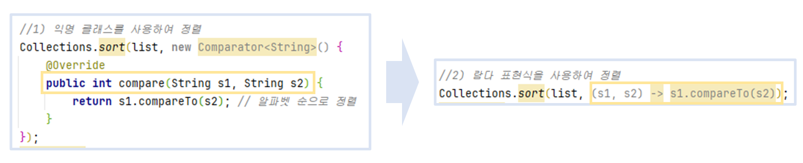

<hr>


### **⬛︎ 목차**

1) [**Lambda 표현식의 등장**](#Lambda_표현식의_등장)  
2) [**Stream API 제공**](#Stream_API_제공)     
3) [**Optional 클래스 도입**](#Optional_클래스_도입)  
4) [**interface static method 제공**](#interface_static_method_제공)    
5) [**interface default method 제공**](#interface_default_method_제공)     
6) [**Time API 제공**](#Time_API_제공)    

<div style="margin-bottom:40px;"></div>

먼저 [**LTS 버전**](https://en.wikipedia.org/wiki/Software_release_life_cycle#STABLE-RELEASE)이란,  **Long Term Support**의 약자로 소프트웨어 제품에 대한 지원이 장기적으로 제공된다는 것을 의미합니다.

<div style="margin-bottom:40px;"></div>


**LTS 버전별 업데이트 지원 기간**은 아래와 같습니다.

| **version** | **support period** |
| --- | --- |
| <b>21</b> <span style="font-size:10px;">(LTS)</span>   | 2023-09-19 ~ 2031-09-30 |
| <b>17</b> <span style="font-size:10px;">(LTS)</span> | 2021-09-14 ~ 2029-09-30 |
| <b>11</b> <span style="font-size:10px;">(LTS)</span>  | 2018-09-25 ~ 2026-09-30 |
| <b>8</b> <span style="font-size:10px;">(LTS)</span> | 2014-03-18 ~ 2030-12-31 |

<span style="font-size:15px;">[🔗출처 : [https://www.java.com/releases](https://www.java.com/releases/#:~:text=Java%20Release%20Support%20Timeline)]</span>


<div style="margin-bottom:40px;"></div>


그럼 이제 **Java의 8의 주요 변경 사항**을 알아보겠습니다.

<div style="margin-bottom:100px;"></div>


## 📌 Java 8버전 주요 변경사항


### 1) **Lambda [람다] 표현식의 등장** {#Lambda_표현식의_등장}
<div style="margin-bottom:40px;"></div>

**1-1) 개념**     
람다 표현식은 메서드를 하나의 식으로 표현한 것입니다.

<div style="margin-bottom:60px;"></div>

**1-2) 특징**
메서드를 람다 표현식으로 사용하면, 클래스에 대한 객체를 생성하지 않아도 메서드를 사용할 수 있습니다.


<span style="font-size:15px;">[🔗참고 : [https://www.tcpschool.com/java/java_lambda_concept](https://www.tcpschool.com/java/java_lambda_concept)]</span>


> *단, Java에서는 메서드를 사용하려면 객체가 필요하여 함께 만들어지기 떄문에  람다표현식을 익명 클래스(객체)와 비슷하다고 볼 수 있습니다.*
> 

<div style="margin-bottom:60px;"></div>

**1-3) 예시 코드**

<p style="margin-bottom: 0;">1-3-1) lambda 도입 전</p>
```java
//일반 메서드
list.forEach(new Consumer<String>() {
    @Override
    public void accept(String fruit) {
        System.out.println(fruit);
    }
});
```
<div style="margin-bottom:30px;"></div>


<p style="margin-bottom: 0;">1-3-2) lambda 도입 후</p>
```java
//람다 메서드
List<String> list = Arrays.asList("Apple", "Cherry", "Banana");
list.forEach(fruit -> System.out.println(fruit));
```


위의 코드는 list의 foreach() 메서드 호출을 람다식으로 표현한 것입니다.

람다식을 통해 익명 클래스 Consumer가 사라지고 accept 메서드의 구현부만 남음과 동시에  fruit 변수의 타입을 명시하지 않아도 되어 간결하고 가독성이 좋아졌습니다,

> *전체 예시 소스코드는 여기를 참고하시면 됩니다.   
> <b><span style="font-size:15px;">[🔗feat: add test for lambda expression](https://github.com/gusdn7142/JDK_8version_Test/commit/b1322faedf604902f46120500dd26ba8f0849086)</span></b>*
 


<div style="margin-bottom:100px;"></div>


### 2) Stream [스트림] API 제공 {#Stream_API_제공}
<div style="margin-bottom:40px;"></div>

**2-1) 개념**      
stream api는 순차 및 병렬적인 집계연산을 지원하는 연속된 요소로, 
다양한 데이터 소스(ex, 컬렉션, 배열 등)를 표준화 된 방법으로 다룰 수 있게 해줍니다.

<div style="margin-bottom:60px;"></div>

**2-2) 특징**
컬렉션, 배열 등을 파이프라인 형식으로 다루기 때문에 데이터를 필터링, 변환, 정렬, 연산하는 등의 작업을 간결하고 명확하게 표현할 수 있습니다.

<div style="margin-bottom:60px;"></div>


**2-3) 예시 코드**
<p style="margin-bottom: 0;">2-3-1) Stream API 도입 전</p>
```java
List<String> list = Arrays.asList("Apple", "Banana", "Cherry", "Date");

//1) 기존 코드
List<String> filtered1 = new ArrayList<>();
for (String s : list) {
    if (s.length() >= 6) {            // 길이가 6 이상인 문자열만 필터링
    	filtered1.add(s.toUpperCase()); // 대문자로 변환하여 리스트에 추가
    }
}

Collections.sort(filtered1, Collections.reverseOrder());  // 알파벳 역순으로 정렬
System.out.println(filtered1); // 출력: [CHERRY, BANANA]
```

<div style="margin-bottom:30px;"></div>


<p style="margin-bottom: 0;">2-3-2) Stream API 도입 후</p>
```java
List<String> list = Arrays.asList("Apple", "Banana", "Cherry", "Date");

//2) Stream API 도입
List<String> filtered = list.stream()
		.filter(s -> s.length() >= 6)      // 길이가 6 이상인 문자열만 필터링
		.map(s -> s.toUpperCase())         // 문자열을 대문자로 변환
		.sorted(Comparator.reverseOrder()) // 알파벳 역순으로 정렬
		.collect(Collectors.toList());

System.out.println(filtered); // 출력: [CHERRY, BANANA]
```


위의 코드는 알파벳이 담긴 list를 데이터 길이로 필터링하고, 대문자로 변환, 역순으로 정렬하는 예시코드를 스트림 API를 사용해 변경한 것입니다.

가독성이 향상되고 데이터가 많을 경우 list.parallelStream()을 통한 병렬 처리로 성능 향상도 기대할 수 있습니다. 또한,  stream()은 새로운 컬렉션을 반환하기 때문에 원본 List는 수정되지 않습니다.


> *전체 예시 소스코드는 여기를 참고하시면 됩니다.   
> <b><span style="font-size:15px;">[🔗feat: add test for stream api](https://github.com/gusdn7142/JDK_8version_Test/commit/33644eb028712e8e32b7465b6616aad27926afab)</span></b>*


 


<div style="margin-bottom:100px;"></div>


### 3) **Optional 클래스 도입** {#Optional_클래스_도입}
<div style="margin-bottom:40px;"></div>

**3-1) 개념**      
객체의 값이 없는 상태에서 메서드나 필드를 참조할때 발생하는 NullPointerException을 방지하기 위해 탄생하였습니다.

<div style="margin-bottom:60px;"></div>

**3-2) 특징**  
Optional Class는 isPresent(), isEmpty() 메서드 등을 통해 명시적으로 값의 존재 여부를 검사할 수 있습니다. 가장 많이 활용되는 Case로는 DB 쿼리문 결과를 return 받을때 Null Value Exception 처리를 명확하게 할 수 있습니다.

<div style="margin-bottom:60px;"></div>


**3-3) 예시 코드**
<p style="margin-bottom: 0;">3-3-1) Optional  도입 전</p>
```java
String tempStr = null;

//1) Optional 사용 전
if (tempStr != null) {
    System.out.println("Value is present: " + tempStr);  // 값이 있으면 출력
} else {
    System.out.println("No value present");  // 값이 없으면 출력
    throw new NullPointerException("No value present");  // 예외 던지기
}
```
<div style="margin-bottom:30px;"></div>

<p style="margin-bottom: 0;">3-3-2) Optional  도입 후</p>
```java
String tempStr = null;

//2) Optional 사용 후
Optional optional = Optional.ofNullable(tempStr);

if (optional.isPresent()) { // 값이 있을 때 실행
    System.out.println("Value is present: " + optional.get());
} else { // 값이 없을 때 실행
    System.out.println("No value present");
    throw new NullPointerException("No value present");
}

```


위의 코드는 Optional 클래스 도입 전/후의 비교 코드입니다. 

Optional을 사용함으로써 null 체크로 인한 실수를 줄이고 isPresent() 메서드 등을 통해 명시적인 코드 작성이 가능해졌습니다.


> *전체 예시 소스코드는 여기를 참고하시면 됩니다.   
> <b><span style="font-size:15px;">[🔗feat: add test for optional class](https://github.com/gusdn7142/JDK_8version_Test/commit/ebead253f38627b36a23577ee7d3f3acbc1ccfc7)</span></b>*


<div style="margin-bottom:100px;"></div>


### 4) **interface static method** 제공 {#interface_static_method_제공}
<div style="margin-bottom:40px;"></div>

**4-1) 개념**  
Java 8버전부터 interface도 객체 생성 없이 static 메서드를 가질 수 있게 되었습니다.

<div style="margin-bottom:60px;"></div>


**4-2) 특징**  
해당 메서드는 구현 클래스에서 재정의할 수 없습니다.
외부에서 호출시에는 객체 생성 없이 클래스를 통해 호출이 가능합니다.

<div style="margin-bottom:60px;"></div>


**4-3) 예시 코드**
```java
public static void main(String[] args) {
    String deviceType = Device.getDeviceType();
    System.out.println(deviceType);
}

interface Device  {
    public static final String deviceType = "Mobile";
    static String getDeviceType() { 
        return deviceType;
    }
}
```

위의 코드에서 Device 인터페이스의 static 메서드 getDeviceType()은 인터페이스를 통해서만 호출할 수 있고 구현 클래스에서 재정의가 불가능 합니다.


> *전체 예시 소스코드는 여기를 참고하시면 됩니다.   
> <b><span style="font-size:15px;">[🔗feat: add test for interface static method](https://github.com/gusdn7142/JDK_8version_Test/commit/bfabbef20c67d873a1669d95b319cc4da2392888)</span></b>*


<div style="margin-bottom:100px;"></div>


### 5) **interface default method** 제공 {#interface_default_method_제공}     
<div style="margin-bottom:40px;"></div>

**5-1) 개념**  
interface 내부에 default 메서드 구현도 가능해졌습니다.
<div style="margin-bottom:60px;"></div>

**5-2) 특징**  
default 메서드를 호출하려면 인터페이스를 **구현한 클래스의 인스턴스 생성이 필요**합니다.
단, 인터페이스의 default 메서드는 구현 클래스에서 재정의가 강제 되지 않습니다. 

활용할만한 Case를 생각해 보자면  인터페이스용 Test 메서드를 만들거나, 구현 클래스에서 재정의할 필요가 없는 메서드를 사용하고 싶을떄 유용할 것 같습니다.

<div style="margin-bottom:60px;"></div>


**5-3) 예시 코드**

```java
public class Interface_DefaultMethodTest {
    public static void main(String[] args) {
        Book book = new ItBook();
        System.out.println(book.getAuthor());
        System.out.println(Book.getWrittenDate());
    }
}

interface Book {
    public static final Date writtenDate = new Date();
    public static final String author = "depth";

    default String getAuthor() {
        return this.author;
    }

    static String getWrittenDate() {
        return String.valueOf(writtenDate);
    }
}

class ItBook implements Book {
    //public String getAuthor() {
    //    return "steve";
    //}
}
```

위의 코드에서 Book 인터페이스의 default로 지정자로 생성된 getAuthor() 메서드는 ItBook이라는 구현체에 의해 객체로 만들어져 호출되었습니다.

> *전체 예시 소스코드는 여기를 참고하시면 됩니다.   
> <b><span style="font-size:15px;">[🔗feat: add test for interface default method](https://github.com/gusdn7142/JDK_8version_Test/commit/df307489eff757f347c149cfe1ef1801f2c64766)</span></b>*

<div style="margin-bottom:100px;"></div>


### 6) **Time API** 제공 {#Time_API_제공}    
<div style="margin-bottom:40px;"></div>


**6-1) 개념**  
기존의 Date와 Calendar가 가진 Mutable, 날짜/시간 계산의 어려움 등의 문제를 해결하기 위해 Time  APi가 도입되었습니다.

<div style="margin-bottom:60px;"></div>


**6-2) 특징**  

| 패키지 | 설명 |
| --- | --- |
| java.time | 날짜, 시간, 기간, 시간대 등 날짜와 시간 관련 작업을 처리하기 위한 핵심 클래스 제공 |
| java.time.chrono | 다양한 달력 시스템을 지원하는 날짜와 시간 관련 클래스 제공 |
| java.time.format | 날짜와 시간 객체를 문자열로 변환하거나 문자열을 날짜/시간 객체로 변환하는 포맷팅 및 파싱 관련 클래스 제공 |
| java.time.temporal | 날짜와 시간 객체를 세부적으로 조작하고 계산할수 있는 클래스 제공 |
| java.time.zone | 시간대와 관련된 정보를 제공하고, 시간대 변환 및 규칙을 처리하는 클래스 |

많이 사용되는 라이브러리로는 java.time.LocalDate, java.time.LocalDateTime,  java.time.format.DateTimeFormatter이 있습니다..

<div style="margin-bottom:60px;"></div>


**6-3) 예시 코드**

```java
public class DateTimeApiTest {

    public static void main(String[] args) {

        //1) Current Date
        LocalDate today = LocalDate.now();
        System.out.println("Today: " + today);

        //2) Adding 5 days
        LocalDate futureDate = today.plusDays(5);
        System.out.println("Future Date: " + futureDate);

        //3) Formatting the future date
        DateTimeFormatter formatter = DateTimeFormatter.ofPattern("dd-MM-yyyy");
        String formattedDate = futureDate.format(formatter);
        System.out.println("Formatted Future Date: " + formattedDate);

        //4) Parsing a date string
        String dateString = "25-12-2024";
        LocalDate parsedDate = LocalDate.parse(dateString, formatter);
        System.out.println("Parsed Date: " + parsedDate);

        //1) Current DateTime
        LocalDateTime todayDateTime = LocalDateTime.now();
        System.out.println("\nTodayDateTime: " + todayDateTime);

        //2) Adding 5 time
        LocalDateTime futureDateTime = todayDateTime.plusHours(5);
        System.out.println("Future DateTime: " + futureDateTime);

        //3) Formatting the future datetime
        DateTimeFormatter formatter2 = DateTimeFormatter.ofPattern("yyyy-MM-dd HH:mm:ss");
        String formattedDateTime = todayDateTime.format(formatter2);
        System.out.println("TodayFormattedDateTime: " + formattedDateTime);

        //4) Parsing a datetime string
        String dateTimeString = "2024-12-25 07:30:20";
        LocalDateTime parsedDateTime = LocalDateTime.parse(dateTimeString, formatter2);
        System.out.println("Parsed Date: " + parsedDateTime);
        
    }
}

```

위 코드에서 사용되는 time 패키지 LocalDate, LocalDateTime, DateTimeFormatter 클래스는 Immutable 객체로 생성되어 날짜와 시간관련 작업을 스레드에 안전하고 직관적으로 처리할 수 있게 해줍니다.


> *전체 예시 소스코드는 여기를 참고하시면 됩니다.   
> <b><span style="font-size:15px;">[🔗feat: add test for time api](https://github.com/gusdn7142/JDK_8version_Test/commit/d235ec32e04a09670317bbbe2f60e6a201699d72)</span></b>*


<div style="margin-bottom:100px;"></div>


이 밖에도 아래와 같이 많은 변경사항이 있었으니 참고해 주시면 되겠습니다.  
- Functional interfaces
- Base64 Encode Decode
- Collectors class
- ForEach() method
- Nashorn JavaScript Engine
- Parallel Array Sorting
- Type and Repating Annotations
- IO Enhancements
- Concurrency Enhancements
- JDBC Enhancements etc


<div style="margin-bottom:100px;"></div>


## 📂 **정리**  

Java 8버전에서는 람다와 스트림, Optional의 등장 등 많은 변경사항이 있었습니다.

이 블로그에서는 간략하게 소개를 해드렸는데, 각 기능이 어떤 문제를 해결해 주기 위해 등장했는지와 사용법에 대해 깊이 있게 학습해 두신다면 개발하며 마주하게 되는 많은 고민 들을 해결하는 데 도움을 줄 것입니다.

번외로, JDK를 다운로드 해야할때 Oracle JDK(상용)인지 OpenJDK(오픈소스)인지도 잘 확인해야 한다는점 알려드립니다.

JVM에 대한 변경사항은 추후 JVM 톺아보기로 찾아오겠습니다.

<div style="margin-bottom:100px;"></div>


## 📃 참고  
- java 8 version feature
    - [https://f-lab.kr/insight/java-8-features-and-impact](https://f-lab.kr/insight/java-8-features-and-impact)
    - [https://www.oracle.com/java/technologies/javase/8-whats-new.html](https://www.oracle.com/java/technologies/javase/8-whats-new.html)
    - [https://www.baeldung.com/java-8-new-features#3-reference-to-an-instance-method-of-an-object-of-a-particular-type](https://www.baeldung.com/java-8-new-features#3-reference-to-an-instance-method-of-an-object-of-a-particular-type)
    - [https://www.javatpoint.com/java-8-features](https://www.javatpoint.com/java-8-features)
- lambda와 stream
    - [https://beatmejy.tistory.com/51](https://beatmejy.tistory.com/51)
    - [https://www.tcpschool.com/java/java_lambda_concept](https://www.tcpschool.com/java/java_lambda_concept)
- Oracle JDK와 OpenJDK의 차이점
    - [https://velog.io/@ljo_0920/java-버전별-차이-특징#:~:text=Oracle JDK와 OpenJDK의 차이점](https://velog.io/@ljo_0920/java-%EB%B2%84%EC%A0%84%EB%B3%84-%EC%B0%A8%EC%9D%B4-%ED%8A%B9%EC%A7%95#:~:text=Oracle%20JDK%EC%99%80%20OpenJDK%EC%9D%98%20%EC%B0%A8%EC%9D%B4%EC%A0%90)
- Software release life cycle
    - [https://en.wikipedia.org/wiki/Software_release_life_cycle#STABLE-RELEASE](https://en.wikipedia.org/wiki/Software_release_life_cycle#STABLE-RELEASE)