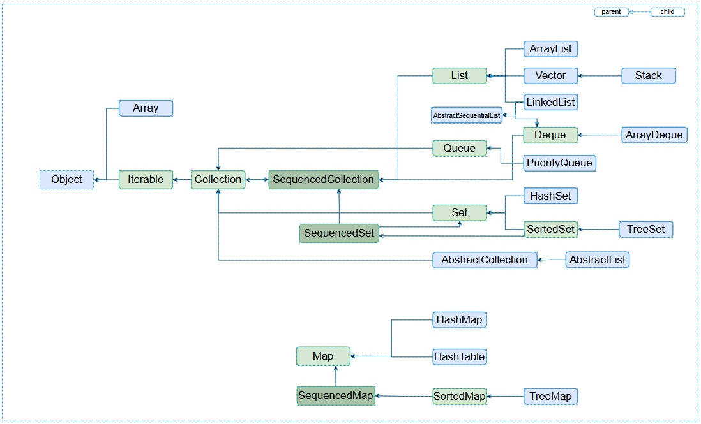

<hr>


### **⬛︎ 목차**
<div style="margin-bottom:20px;"></div>
<span style="display: block; margin-bottom: 15px;">&ensp;&ensp;<b>[✅ Java 21버전 주요 변경사항](#Java_21버전_주요_변경사항) </b></span>
<span style="display: block; margin-bottom: 10px;">&ensp;&ensp;&ensp;&ensp;&ensp;&ensp;[1) Record Pattern](#Record_Pattern)</span>
<span style="display: block; margin-bottom: 10px;">&ensp;&ensp;&ensp;&ensp;&ensp;&ensp;[2) Switch Pattern Matching](#Switch_Pattern_Matching)</span>
<span style="display: block; margin-bottom: 10px;">&ensp;&ensp;&ensp;&ensp;&ensp;&ensp;[3) Sequenced Collections](#Sequenced_Collections)</span>
<span style="display: block; margin-bottom: 10px;">&ensp;&ensp;&ensp;&ensp;&ensp;&ensp;[4) Virtual Thread](#Virtual_Thread)</span>


<div style="margin-bottom:100px;"></div>


## **✅** Java 21버전 주요 변경사항 {#Java_21버전_주요_변경사항}

### 1) Record Pattern {#Record_Pattern}
<div style="margin-bottom:40px;"></div>

#### 1-1)  개념
Java 21에서 도입된 Record Pattern은 **record 객체를 패턴 매칭의 대상으로 사용할 수 있도록 확장한 기능**입니다. 
이를 통해 **record 타입의 타입 검사와 필드 추출을 한번 처리**할 수 있습니다
record의 개념은 아래의 포스팅을 통해 이해하실 수 있습니다.

<div style="margin-bottom:70px;"></div>   


#### 1-2) 특징

<table style="background-color: transparent; border-collapse: collapse;">
  <tr>
    <td style="border: 0.5px solid rgb(175, 165, 143); font-size:1.2em;">record pattern을 사용해 <b>record 객체에서 직접 필드 추출 가능</b></td>
  </tr>
  <tr>
    <td style="border: 0.5px solid rgb(175, 165, 143); font-size:1.2em;"><b>중첩된 record pattern을 지원</b>하여, 여러 단계의 필드를 한 번에 추출 가능</td>
  </tr>
  <tr>
    <td style="border: 0.5px solid rgb(175, 165, 143); font-size:1.2em;"><b>switch 표현식과 결합</b>해 더욱 간결한 코드 작성 <b>가능</b></td>
  </tr>
</table>


<div style="margin-bottom:70px;"></div>   


#### 1-3) 예시코드

```java
record Address(String city, String street) { }
record Person(String name, int age, Address address) { }

public class PatternMatchingTest {
    public static void main(String[] args) {
        // 중첩된 레코드 객체 생성
        Address address = new Address("Seoul", "Gangnam");
        Person person = new Person("Depth", 28, address);

        // 1) 레코드 패턴을 사용한 필드 추출
        if (person instanceof Person(String name, int age, Address addr)) {
            // 필드 추출
            System.out.println("Name: " + name);
            System.out.println("Age: " + age);
            System.out.println("City: " + addr.city());
            System.out.println("Street: " + addr.street());
        }

        System.out.println();

        // 2) 중첩된 레코드 패턴을 사용한 필드 추출
        if (person instanceof Person(String name, int age, Address(String city, String street))) {
            // 중첩된 레코드 패턴 사용
            System.out.println("Name: " + name);
            System.out.println("Age: " + age);
            System.out.println("City: " + city);
            System.out.println("Street: " + street);
        }
        
        // 3) 레코드와 switch 표현식 통합
        String result = switch (person) {
            case Person(String name, int age, Address(String city, String street)) -> {
                if (age >= 18) {
                    yield name + " is an adult living in " + city + ", " + street;
                } else {
                    yield name + " is a minor living in " + city + ", " + street;
                }
            }
            default -> "Unknown person";
        };

        System.out.println(result);
    }
}

```

위의 코드에서는 record pattern을 사용해  record 객체 Person에 대한 패턴 매칭을 수행 후 name, age, Address 필드를 추출하였습니다.
또한, switch 표현식을 사용해 Person 객체의 패턴 매칭을 수행하고 필드들을 추출 후 age 필드 값에 따라 출력 결과를 다르게 처리하였습니다.


> *예시 소스코드는 여기를 참고하시면 됩니다.   
> [🔗feat: add test for Record Pattern](https://github.com/gusdn7142/JDK_21version_Test/commit/5e77b9d09a4a4d1bd65fb4398e81ac36c635e890)*
> 


<div style="margin-bottom:100px;"></div>   


### 2) **Switch Pattern Matching**  {#Switch_Pattern_Matching}
<div style="margin-bottom:40px;"></div>


#### 2-1)  개념

Java 17에서 preview 기능으로 도입되었으며, Java 21에서 정식 기능으로 채택된 Switch Pattern Matching은 **switch 문에서 객체의 타입을 검사하고 자동으로 변수에 매핑**할 수 있도록 해줍니다.


<div style="margin-bottom:70px;"></div>   

#### 2-2) 특징


<table style="background-color: transparent; border-collapse: collapse;">
  <tr>
    <td style="border: 0.5px solid rgb(175, 165, 143); font-size:1.2em;">switch 문에서 <b>instanceof 없이 타입을 검사하고, 자동으로 변수에 값 할당 가능</b><br>(명시적 형변환 과정이 줄어들어 가독성이 개선됨)</td>
  </tr>
  <tr>
    <td style="border: 0.5px solid rgb(175, 165, 143); font-size:1.2em;">switch 문에서 null을 명시적으로 처리할 수 있음.</td>
  </tr>
</table>


<div style="margin-bottom:70px;"></div>   


#### 2-3) 예시코드

```java
Object number = null;

String result = switch (number) {
    case null -> "Input is null";   // null 처리
    case Integer i -> "IntegerValue : " + i;
    case String s -> "StringValue : " + s;
    default -> "Other type";
};
System.out.println(result);
```

위 코드에서는 Object 타입을 사용했지만, 만약 Integer나 String을 타입으로 사용한다면, switch 문에서도 해당 타입에 맞는 조건만 작성해야 합니다. 
switch문에 Integer와 String을 혼합해서 사용할 수 없으며, 각 타입에 맞는 조건문을 별도로 작성해야 합니다.


> *예시 소스코드는 여기를 참고하시면 됩니다.   
> [🔗feat: add test for Switch Pattern Matching](https://github.com/gusdn7142/JDK_21version_Test/commit/fa101e38472ce6f4851895e51f5785a0ef7231c1)*
> 


<div style="margin-bottom:100px;"></div>   


### 3) **Sequenced Collections** {#Sequenced_Collections}
<div style="margin-bottom:40px;"></div>

#### 3-1)  개념

Java 21에서는 **삽입 순서가 있는 컬렉션을 더 잘 표현하기 위해** 새로운 인터페이스 **SequencedCollection, SequencedMap, SequencedSet을 제공**합니다. 
이 인터페이스들은 순서가 중요한 컬렉션들에 대해 순차 접근을 명확하게 지원합니다.


<div style="margin-bottom:70px;"></div>   


#### 3-2) 특징

<br>
<span style="font-size:15px;">[🔗참고 : [https://www.baeldung.com/wp-content/uploads/2024/04/SequencedCollections.png](https://www.baeldung.com/wp-content/uploads/2024/04/SequencedCollections.png)]</span>

<div style="margin-bottom:40px;"></div>   


<table style="background-color: transparent; border-collapse: collapse;">
  <tr>
    <td style="border: 0.5px solid rgb(175, 165, 143); font-size:1.2em;">SequencedCollection에서는 <b>순차 접근을 위한 표준화된 메서드 제공</b> <br> - addFirst(), addLast(), getFirst(), getLast(), removeFirst() , removeLast() </td>
  </tr>
  <tr>
    <td style="border: 0.5px solid rgb(175, 165, 143); font-size:1.2em;">기존의 List, Deque, SortedSet 등 순서가 있는 컬렉션들이 SequencedCollection을 구현하도록 지원하며, <b>삽입된 순서대로 데이터를 처리하고 접근</b>할 수 있음.</td>
  </tr>
</table>


<div style="margin-bottom:70px;"></div>   


#### 3-3) 예시코드

<div style="margin-bottom:20px;"></div>
<p style="margin-bottom: 0;">3-3-1) SequencedCollection 제공 전 - ArrayList</p>


```java
//1) Java 17 - List 기반의 ArrayList 사용
List<String> list = new ArrayList<>(List.of("A", "B", "C"));

//1-1) 첫 번째와 마지막 요소 가져오기
System.out.println("First Element: " + list.get(0)); // 출력: A
System.out.println("Last Element: " + list.get(list.size() - 1)); // 출력: C

//1-2) 첫 번째와 마지막에 요소 추가 (ArrayList에서 add는 뒤에만 추가 가능)
list.add(0, "Start"); // 첫 번째에 요소 추가
list.add("End"); // 마지막에 요소 추가
System.out.println("Updated List: " + list); // 출력: [Start, A, B, C, End]

//1-3) 첫 번째와 마지막 요소 제거
list.remove(0); // 첫 번째 요소 제거
list.remove(list.size() - 1); // 마지막 요소 제거
System.out.println("Final List: " + list); // 출력: [A, B, C]

```

<div style="margin-bottom:20px;"></div>
<p style="margin-bottom: 0;">3-3-2) SequencedCollection 제공 후 - ArrayList</p>


```java
//2) Java 21 - SequencedCollection 기반의 ArrayList 사용
SequencedCollection<String> list = new ArrayList<>(List.of("A", "B", "C"));

// 첫 번째와 마지막 요소 가져오기
System.out.println("First Element: " + list.getFirst()); // 출력: A
System.out.println("Last Element: " + list.getLast());   // 출력: C

// 첫 번째와 마지막에 요소 추가
list.addFirst("Start");
list.addLast("End");
System.out.println("Updated List: " + list); // 출력: [Start, A, B, C, End]

// 첫 번째와 마지막 요소 제거
list.removeFirst();
list.removeLast();
System.out.println("Final List: " + list); // 출력: [A, B, C]

```

> *예시 소스코드는 여기를 참고하시면 됩니다.   
> [🔗feat: add test for Sequenced Collections](https://github.com/gusdn7142/JDK_21version_Test/commit/b3b46ee2af776dec37566b267e7a290459998758)*
> 


<div style="margin-bottom:100px;"></div>   


### 4) **Virtual Thread** {#Virtual_Thread}
<div style="margin-bottom:40px;"></div>

#### 4-1)  개념

Java 19에서 Preview 기능으로 등장한 **Virtual Thread**는 **Java 21에서 정식 도입**되었습니다.  
기존 운영 체제 수준의 **Native Thread**는 생성 비용이 높고, I/O 대기 시간이 많은 애플리케이션에서 비효율적인 문제가 있었습니다.   
**Virtual Thread**는 이러한 문제를 해결하기 위해 **JVM이 직접 관리하는 경량 스레드**를 제공하여, 대규모 동시 실행을 더욱 효율적으로 처리할 수 있도록 설계되었습니다.  

<div style="margin-bottom:70px;"></div>


#### 4-2) 특징  

| 특징 | Native Thread (운영체제 스레드) | Virtual Thread (가상 스레드) |
| --- | --- | --- |
| 관리 방식 | 운영 체제 커널에서 관리 | JVM의 스케줄러에서 관리 |
| 자원 소비 | 스레드당 운영 체제 리소스 사용 | 최소한의 자원 소모 (메모리 및 CPU) |
| 성능 | 많은 스레드 생성 시 성능 저하 | 수만 개의 스레드를 효율적으로 실행 |
| 스케줄링 | 운영 체제 스케줄러에 의존 | JVM의 경량화된 스케줄러 활 |
| 오버헤드 | 높은 스레드 생성 비용 및 Context-Switching 비용 | 낮은 스레드 생성 비용, 빠른 컨텍스트 스위칭 |
| 한계 | 스레드 수에 한계가 있음 <br> (시스템 자원 한계) | 수많은 스레드 지원 가능  |
| 적용 시나리오 | CPU 집약적인 병렬 처리 | I/O 대기 시간이 많은 애플리케이션 <br> (ex, 웹 서버, DB 요청) |

<div style="margin-bottom:70px;"></div>


#### 4-3) 예시코드


<div style="margin-bottom:20px;"></div>
<p style="margin-bottom: 0;">4-3-1) Native Thread 사용</p>

```java
long startTimeNative = System.currentTimeMillis();

for (int i = 0; i < 1000; i++) {
    Thread nativeThread = new Thread(() -> {
    // 단순 작업: 아무 것도 하지 않음
    });
    nativeThread.start();
    try {
        nativeThread.join();  // 각 스레드가 완료될 때까지 기다림
    } catch (InterruptedException e) {
        e.printStackTrace();
    }
}
long endTimeNative = System.currentTimeMillis();
System.out.println("Native Threads took " + (endTimeNative - startTimeNative) + " ms");
```


<div style="margin-bottom:20px;"></div>
<p style="margin-bottom: 0;">4-3-2) Virtual Thread 사용</p>
```java
long startTimeVirtual = System.currentTimeMillis();
for (int i = 0; i < 1000; i++) {
    Thread virtualThread = Thread.ofVirtual().start(() -> {
    // 단순 작업: 아무 것도 하지 않음
    });
    try {
        virtualThread.join();  // 각 스레드가 완료될 때까지 기다림
    } catch (InterruptedException e) {
        e.printStackTrace();
    }
}
long endTimeVirtual = System.currentTimeMillis();
System.out.println("Virtual Threads took " + (endTimeVirtual - startTimeVirtual) + " ms");

```
<div style="margin-bottom:40px;"></div>
<p style="margin-bottom: 0;">실행 결과는 아래와 같이 출력되었습니다.</p>

```
Native Threads took 144 ms
Virtual Threads took 32 ms
```

운영체제에서 관리하는 Native Thread 대신 Virtual Thread를 사용하면 JVM에서 스레드를 관리하기 떄문에 스레드 생성과 실행 시간이 크게 단축되는 것을 확인 할 수 있습니다.

> *예시 소스코드는 여기를 참고하시면 됩니다.  
> [🔗feat: add test for Virtual Thread](https://github.com/gusdn7142/JDK_21version_Test/commit/902bfc7708dbe43c90bff031be850d01d426c0a6)*
> 


<div style="margin-bottom:100px;"></div>


## **📂 정리**


Java 21버전에서도 아래와 같은 변경 사항들이 있었습니다.

| 버전 | 기능 | 설명 |
| --- | --- | --- |
| Java&nbsp;21 | Record Pattern  | record 객체를 instanceof 패턴 매칭에 활용하여 타입 검사 및 필드 추출을 간결하게 처리 |
| Java&nbsp;21 | Switch Pattern Matching | switch문에서 패턴 매칭을 지원하여 객체 타입 검사 및 필드 추출을 간결하게 처리 (null 처리도 가능) |
| Java&nbsp;21 | Sequenced Collections  | List, Deque, SortedSet 등 순서가 있는 컬렉션을 위한 표준 인터페이스 SequencedCollection 제공하며, 순차 접근을 위한 메서드 지원 |
| Java&nbsp;21 | Virtual Thread | JVM이 가상 스레드를 관리하여 많은 경량 스레드를 생성할 수 있으며, 특히 I/O 대기 작업에서 성능이 향상됨 |


<div style="margin-bottom:70px;"></div>


이 밖에도 아래와 같은 기능들이 제공되므로 관련 Docs를 참고해 도입을 검토하시는 걸 권장 드립니다.

| 버전 | 기능 |
| --- | --- |
| Java 18 | UTF-8 by Default |
| Java 18 | Internet-Address Resolution SPI |
| Java 21 | Deprecate the Windows 32-bit x86 Port for Removal |
| Java 21 | Key Encapsulation Mechanism API |


<div style="margin-bottom:100px;"></div>


## 📃 참고


1. java 18 version feature 
    - [https://openjdk.org/projects/jdk/18/](https://openjdk.org/projects/jdk/18/)
    - [https://www.oracle.com/java/technologies/javase/18-relnote-issues.html](https://www.oracle.com/java/technologies/javase/18-relnote-issues.html)
2. java 19 version feature 
    - [https://openjdk.org/projects/jdk/19/](https://openjdk.org/projects/jdk/19/)
    - [https://www.oracle.com/java/technologies/javase/19-relnote-issues.html](https://www.oracle.com/java/technologies/javase/19-relnote-issues.html)
3. java 20 version feature 
    - [https://www.baeldung.com/java-20-new-features](https://www.baeldung.com/java-20-new-features)
    - [https://openjdk.org/projects/jdk/20/](https://openjdk.org/projects/jdk/20/)
    - [https://www.oracle.com/java/technologies/javase/20-relnote-issues.html](https://www.oracle.com/java/technologies/javase/20-relnote-issues.html)
4. java 21 version feature 
    - [https://www.baeldung.com/java-lts-21-new-features](https://www.baeldung.com/java-lts-21-new-features)
    - [https://openjdk.org/projects/jdk/21/](https://openjdk.org/projects/jdk/21/)
    - [https://www.oracle.com/java/technologies/javase/21-relnote-issues.html](https://www.oracle.com/java/technologies/javase/21-relnote-issues.html)
    - [https://www.baeldung.com/java-21-sequenced-collections](https://www.baeldung.com/java-21-sequenced-collections)

