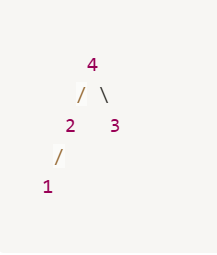

---


### **⬛︎ 목차**
<div style="margin-bottom:20px;"></div>
<span style="display: block; margin-bottom: 12px;">&ensp;&ensp;<b>[1️⃣ 선택 정렬 (Selection Sort)](#선택_정렬) </b></span>
<span style="display: block; margin-bottom: 12px;">&ensp;&ensp;<b>[2️⃣ 삽입 정렬 (Insertion Sort)](#삽입_정렬) </b></span>
<span style="display: block; margin-bottom: 12px;">&ensp;&ensp;<b>[3️⃣ 버블 정렬 (Bubble Sort)](#버블_정렬) </b></span>
<span style="display: block; margin-bottom: 12px;">&ensp;&ensp;<b>[4️⃣ 합병 정렬 (Merge Sort)](#합병_정렬) </b></span>
<span style="display: block; margin-bottom: 12px;">&ensp;&ensp;<b>[5️⃣ 퀵 정렬 (Quick Sort)](#퀵_정렬) </b></span>
<span style="display: block; margin-bottom: 12px;">&ensp;&ensp;<b>[6️⃣ 힙 정렬 (Heap sort) ](#힙_정렬) </b></span>


<div style="margin-bottom:100px;"></div>


## 1️⃣ 선택 정렬 (Selection Sort)  {#선택_정렬}
<div style="margin-bottom:40px;"></div>

### 🔹 개념

선택 정렬은 배열을 정렬할때  **앞에서(ex, 0번 인덱스)부터 차례대로, 해당 위치에 들어갈 가장 작은 값을 찾아 그 자리에 놓는 방식**으로 동작합니다.
<div style="margin-bottom:70px;"></div>   

### 🔹 Java 코드

```java
static void selectionSort(int[] arr) {
    int length = arr.length;
    for (int curIdx = 0; curIdx < length - 1; curIdx++) {
        int minIdx = curIdx;
        for (int nextIdx = curIdx + 1; nextIdx < length; nextIdx++) {
            if (arr[nextIdx] < arr[minIdx]) {
                minIdx = nextIdx;
            }
        }
        swap(arr, curIdx, minIdx);
    }
}

private static void swap(int[] arr, int i, int j) {
    int temp = arr[i];
    arr[i] = arr[j];
    arr[j] = temp;
}
```
<div style="margin-bottom:70px;"></div>   


### 🔹 동작 과정  
<div style="margin-bottom:20px;"></div> 

1) 데이터 초기화   
&nbsp;&nbsp;&nbsp;&nbsp;&nbsp;● arr[4] = [3, 1, 4, 2] 

2) selectionSort() 실행  
&nbsp;&nbsp;&nbsp;&nbsp;&nbsp;● **curIdx=0**   
&nbsp;&nbsp;&nbsp;&nbsp;&nbsp;&nbsp;&nbsp;&nbsp;&nbsp;&nbsp;● nextIdx=1~3까지 비교하여 minIdx=1    
&nbsp;&nbsp;&nbsp;&nbsp;&nbsp;&nbsp;&nbsp;&nbsp;&nbsp;&nbsp;● arr[0]과 arr[1] 교환 → 3과 1교환 → `arr[1, 3, 4, 2]`     
&nbsp;&nbsp;&nbsp;&nbsp;&nbsp;● **curIdx=1**     
&nbsp;&nbsp;&nbsp;&nbsp;&nbsp;&nbsp;&nbsp;&nbsp;&nbsp;&nbsp;● nextIdx=2~3까지 비교하여 minIdx=3  
&nbsp;&nbsp;&nbsp;&nbsp;&nbsp;&nbsp;&nbsp;&nbsp;&nbsp;&nbsp;● arr[1]과 arr[3] 교환 → 3과 2교환 → `arr[1, 2, 4, 3]`  
&nbsp;&nbsp;&nbsp;&nbsp;&nbsp;● **curIdx=2**  
&nbsp;&nbsp;&nbsp;&nbsp;&nbsp;&nbsp;&nbsp;&nbsp;&nbsp;&nbsp;● nextIdx=3만 비교하여 minIdx=3  
&nbsp;&nbsp;&nbsp;&nbsp;&nbsp;&nbsp;&nbsp;&nbsp;&nbsp;&nbsp;● arr[2]과 arr[3] 교환  → 3과 4교환 → `arr[1, 2, 3, 4]`  
&nbsp;&nbsp;&nbsp;&nbsp;&nbsp;● **curIdx=3** → END  

<div style="margin-bottom:70px;"></div>   

### 🔹 시간 복잡도

&nbsp;&nbsp;&nbsp;&nbsp;&nbsp;● `최선/평균/최악: O(n²)`  
&nbsp;&nbsp;&nbsp;&nbsp;&nbsp;● 비교가 반복되기 때문에 **시간 복잡도가 O(n²)**로 상대적으로 비효율적입니다. 크기가 큰 배열에서는 성능이 저하될 수 있습니다.  


<div style="margin-bottom:100px;"></div>   


## 2️⃣ 삽입 정렬 (Insertion Sort)  {#삽입_정렬}
<div style="margin-bottom:40px;"></div>


### 🔹 개념
- 삽입 정렬은 배열을 정렬할 때 **앞에서(ex, 0번 인덱스)**부터 차례대로, **각 요소를 그 앞의 정렬된 영역과 비교**해 **자신이 들어갈 올바른 위치를 찾아 삽입하는 방식**으로 동작합니다.

<div style="margin-bottom:70px;"></div>   


### 🔹 Java 코드

```java
static void selectionSort(int[] arr) {
    for (int unsortedIdx = 1; unsortedIdx < arr.length; unsortedIdx++) {
        for (int sortedIdx = unsortedIdx; sortedIdx > 0; sortedIdx--) {
            if (arr[sortedIdx - 1] <= arr[sortedIdx]) break;
            swap(arr, sortedIdx - 1, sortedIdx);
        }
    }   
}

private static void swap(int[] arr, int i, int j) {
    int temp = arr[i];
    arr[i] = arr[j];
    arr[j] = temp;
}
```

<div style="margin-bottom:70px;"></div>   


### 🔹 동작 과정 

1) 데이터 초기화  
&nbsp;&nbsp;&nbsp;&nbsp;&nbsp;● arr[4] = [3, 1, 4, 2]  


2) selectionSort() 실행  
&nbsp;&nbsp;&nbsp;&nbsp;&nbsp;● **unsortedIdx = 1**    
&nbsp;&nbsp;&nbsp;&nbsp;&nbsp;&nbsp;&nbsp;&nbsp;&nbsp;&nbsp;● sortedIdx = 1과 0 값 비교    
&nbsp;&nbsp;&nbsp;&nbsp;&nbsp;&nbsp;&nbsp;&nbsp;&nbsp;&nbsp;&nbsp;&nbsp;&nbsp;&nbsp;● arr[0] > arr[1]이므로 교환 →  `arr[1, 3, 4, 2]`    
&nbsp;&nbsp;&nbsp;&nbsp;&nbsp;● **unsortedIdx = 2**  
&nbsp;&nbsp;&nbsp;&nbsp;&nbsp;&nbsp;&nbsp;&nbsp;&nbsp;&nbsp;● sortedIdx = 2와 1 값 비교  
&nbsp;&nbsp;&nbsp;&nbsp;&nbsp;&nbsp;&nbsp;&nbsp;&nbsp;&nbsp;&nbsp;&nbsp;&nbsp;&nbsp;● arr[1] < arr[2]이므로 break →  `arr[1, 3, 4, 2]`   
&nbsp;&nbsp;&nbsp;&nbsp;&nbsp;● **unsortedIdx = 3**  
&nbsp;&nbsp;&nbsp;&nbsp;&nbsp;&nbsp;&nbsp;&nbsp;&nbsp;&nbsp;● sortedIdx = 3와 2 값 비교   
&nbsp;&nbsp;&nbsp;&nbsp;&nbsp;&nbsp;&nbsp;&nbsp;&nbsp;&nbsp;&nbsp;&nbsp;&nbsp;&nbsp;● arr[2] > arr[3]이므로 교환 →  `arr[1, 3, 2, 4]`  
&nbsp;&nbsp;&nbsp;&nbsp;&nbsp;&nbsp;&nbsp;&nbsp;&nbsp;&nbsp;● sortedIdx = 2와 1 값 비교  
&nbsp;&nbsp;&nbsp;&nbsp;&nbsp;&nbsp;&nbsp;&nbsp;&nbsp;&nbsp;&nbsp;&nbsp;&nbsp;&nbsp;● arr[1] > arr[2]이므로 교환 →  `arr[1, 2, 3, 4]`  
&nbsp;&nbsp;&nbsp;&nbsp;&nbsp;&nbsp;&nbsp;&nbsp;&nbsp;&nbsp;● sortedIdx = 1와 0 값 비교  
&nbsp;&nbsp;&nbsp;&nbsp;&nbsp;&nbsp;&nbsp;&nbsp;&nbsp;&nbsp;&nbsp;&nbsp;&nbsp;&nbsp;● arr[0] < arr[1]이므로 break  →  `arr[1, 2, 3, 4]`  
&nbsp;&nbsp;&nbsp;&nbsp;&nbsp;● **unsortedIdx = 4** → END  


<div style="margin-bottom:70px;"></div>   

### 🔹 시간 복잡도

| 케이스 | 시간 복잡도 | 설명 |
| --- | --- | --- |
| **최선** | O(n) | 데이터가 **이미 정렬된 경우** (한 번도 교환이 일어나지 않음) |
| **평균** | O(n²) | 데이터가 **무작위로 섞인 경우** (최대 한 칸씩 계속 비교 & 교환) |
| **최악** | O(n²) | 데이터가 **역순으로 정렬된 경우** (모든 요소가 정렬된 부분의 맨 앞에 삽입되어야 함) |
| **공간 복잡도** | O(1) | 추가 메모리 사용이 거의 없음 (제자리 정렬: in-place sorting) |


<div style="margin-bottom:100px;"></div>   


## 3️⃣ 버블 정렬 (Bubble Sort)    {#버블_정렬}
<div style="margin-bottom:40px;"></div>  


### 🔹 개념
- 버블 정렬은 배열의 **0번 인덱스**부터 끝까지 반복하면서, **서로 이웃한 두 값을 비교해 작은 값을 앞으로**, **큰 값을 뒤로** 보내는 정렬 방식입니다.


<div style="margin-bottom:70px;"></div>


### 🔹 Java 코드

```java
static void bubbleSort(int[] arr) {
    for (int step = 0; step < arr.length - 1; pass++) {
        for (int currentIdx = 0; currentIdx < arr.length-1 -step; currentIdx++)
            if (arr[currentIdx] > arr[currentIdx + 1]) {
                swap(arr, currentIdx, currentIdx + 1);
            }
        }
    }
}

private static void swap(int[] arr, int i, int j) {
    int temp = arr[i];
    arr[i] = arr[j];
    arr[j] = temp;
}
```

<div style="margin-bottom:70px;"></div>


### 🔹 동작 과정

1) 데이터 초기화   
&nbsp;&nbsp;&nbsp;&nbsp;&nbsp;● arr = [3, 1, 4, 2]   

2) bubbleSort() 실행  
&nbsp;&nbsp;&nbsp;&nbsp;&nbsp;🔽 1회차 (step = 0)    
&nbsp;&nbsp;&nbsp;&nbsp;&nbsp;&nbsp;&nbsp;&nbsp;&nbsp;&nbsp;● currentIdx = 0   
&nbsp;&nbsp;&nbsp;&nbsp;&nbsp;&nbsp;&nbsp;&nbsp;&nbsp;&nbsp;&nbsp;&nbsp;&nbsp;&nbsp;&nbsp;● arr[0] > arr[1]이므로 교환 → `arr[1, 3, 4, 2]`  
&nbsp;&nbsp;&nbsp;&nbsp;&nbsp;&nbsp;&nbsp;&nbsp;&nbsp;&nbsp;● currentIdx = 1  
&nbsp;&nbsp;&nbsp;&nbsp;&nbsp;&nbsp;&nbsp;&nbsp;&nbsp;&nbsp;&nbsp;&nbsp;&nbsp;&nbsp;&nbsp;● arr[1] < arr[2] 이므로 그대로 유지 → `arr = [1, 3, 4, 2]`  
&nbsp;&nbsp;&nbsp;&nbsp;&nbsp;&nbsp;&nbsp;&nbsp;&nbsp;&nbsp;● currentIdx = 2   
&nbsp;&nbsp;&nbsp;&nbsp;&nbsp;&nbsp;&nbsp;&nbsp;&nbsp;&nbsp;&nbsp;&nbsp;&nbsp;&nbsp;&nbsp;● arr[2] > arr[3] 이므로 교환 → `arr = [1, 3, 2, 4]`    //3번 인덱스 정렬 완료  
    
&nbsp;&nbsp;&nbsp;&nbsp;&nbsp;🔽 2회차 (step = 1)  
&nbsp;&nbsp;&nbsp;&nbsp;&nbsp;&nbsp;&nbsp;&nbsp;&nbsp;&nbsp;● currentIdx = 0    
&nbsp;&nbsp;&nbsp;&nbsp;&nbsp;&nbsp;&nbsp;&nbsp;&nbsp;&nbsp;&nbsp;&nbsp;&nbsp;&nbsp;&nbsp;● arr[0] < arr[1] 이므로 그대로 유지 → `arr = [1, 3, 2, 4]`    
&nbsp;&nbsp;&nbsp;&nbsp;&nbsp;&nbsp;&nbsp;&nbsp;&nbsp;&nbsp;● currentIdx = 1    
&nbsp;&nbsp;&nbsp;&nbsp;&nbsp;&nbsp;&nbsp;&nbsp;&nbsp;&nbsp;&nbsp;&nbsp;&nbsp;&nbsp;&nbsp;● arr[1] > arr[2] 이므로 교환 → `arr = [1, 2, 3, 4]`    //2번 인덱스 정렬 완료    
    
&nbsp;&nbsp;&nbsp;&nbsp;&nbsp;🔽 3회차 (step = 2)    
&nbsp;&nbsp;&nbsp;&nbsp;&nbsp;&nbsp;&nbsp;&nbsp;&nbsp;&nbsp;● currentIdx = 0    
&nbsp;&nbsp;&nbsp;&nbsp;&nbsp;&nbsp;&nbsp;&nbsp;&nbsp;&nbsp;&nbsp;&nbsp;&nbsp;&nbsp;&nbsp;● arr[0] < arr[1] 이므로 그대로 유지 → `arr = [1, 2, 3, 4` //1번 인덱스 정렬 완료  
    
&nbsp;&nbsp;&nbsp;&nbsp;&nbsp;🔽 4회차 (step = 3)  
&nbsp;&nbsp;&nbsp;&nbsp;&nbsp;&nbsp;&nbsp;&nbsp;&nbsp;&nbsp;● END  


<div style="margin-bottom:70px;"></div>

### 🔹 시간 복잡도


| 경우                 | 시간 복잡도                      |
|----------------------|----------------------------------|
| 최선 (이미 정렬됨)   | O(n) *(조건: 최적화된 버전일 때만)* |
| 평균                 | O(n²)                           |
| 최악                 | O(n²)                           |


- 기본 버블 정렬은 항상 **O(n²)** 시간이 걸리며,
조건문 최적화가 포함되면 최선의 경우 O(n)까지 줄어들 수 있습니다.

<div style="margin-bottom:100px;"></div>


## 4️⃣ 합병 정렬 (Merge Sort)    {#합병_정렬}
<div style="margin-bottom:40px;"></div>


### 🔹 개념

- 합병 정렬은 배열을 **반으로 나누고**, 나뉜 배열을 **재귀적으로 정렬한 후**, 두 개의 정렬된 배열을 병합(merge)하여 전체를 정렬하는 **분할 정복**(Divide and Conquer) 알고리즘입니다.

<div style="margin-bottom:70px;"></div>


### 🔹 Java 코드

```java
static void mergeSort(int[] arr) {
    if (arr.length < 2) return;

    int mid = arr.length / 2;
    int[] left = Arrays.copyOfRange(arr, 0, mid);
    int[] right = Arrays.copyOfRange(arr, mid, arr.length);

    mergeSort(left);
    mergeSort(right);
    merge(arr, left, right);
}

static void merge(int[] arr, int[] left, int[] right) {
    int leftIdx = 0;     // 왼쪽 배열의 현재 위치
    int rightIdx = 0;    // 오른쪽 배열의 현재 위치
    int currentIdx = 0;  // 병합 대상 배열(arr)의 현재 위치

    // 왼쪽과 오른쪽 배열 요소를 비교해 더 작은 값을 arr에 채움
    while (leftIdx < left.length && rightIdx < right.length) {
        if (left[leftIdx] <= right[rightIdx]) {
            arr[currentIdx++] = left[leftIdx++];
        } else {
            arr[currentIdx++] = right[rightIdx++];
        }
    }

    // 왼쪽 배열이 남아 있는 경우 모두 복사
    while (leftIdx < left.length) {
        arr[currentIdx++] = left[leftIdx++];
    }

    // 오른쪽 배열이 남아 있는 경우 모두 복사
    while (rightIdx < right.length) {
        arr[currentIdx++] = right[rightIdx++];
    }
}
```

<div style="margin-bottom:70px;"></div>


### 🔹 동작 과정

1) 데이터 초기화  
&nbsp;&nbsp;&nbsp;&nbsp;&nbsp;● arr = [3, 1, 4, 2]  

2) mergeSort() 실행  
&nbsp;&nbsp;&nbsp;&nbsp;&nbsp;🔽 **1단계 - 분할**    
&nbsp;&nbsp;&nbsp;&nbsp;&nbsp;&nbsp;&nbsp;&nbsp;&nbsp;&nbsp;● `mergeSort(arr=[3,1,4,2])`  
&nbsp;&nbsp;&nbsp;&nbsp;&nbsp;&nbsp;&nbsp;&nbsp;&nbsp;&nbsp;&nbsp;&nbsp;&nbsp;&nbsp;&nbsp;● mid=2 → left=[3,1], right=[4,2]    
&nbsp;&nbsp;&nbsp;&nbsp;&nbsp;&nbsp;&nbsp;&nbsp;&nbsp;&nbsp;● 각각 재귀 호출:  
&nbsp;&nbsp;&nbsp;&nbsp;&nbsp;&nbsp;&nbsp;&nbsp;&nbsp;&nbsp;&nbsp;&nbsp;&nbsp;&nbsp;&nbsp;● `mergeSort(arr=[3,1])`  
&nbsp;&nbsp;&nbsp;&nbsp;&nbsp;&nbsp;&nbsp;&nbsp;&nbsp;&nbsp;&nbsp;&nbsp;&nbsp;&nbsp;&nbsp;&nbsp;&nbsp;&nbsp;&nbsp;&nbsp;● mid=1 → left=[3], right=[1]  
&nbsp;&nbsp;&nbsp;&nbsp;&nbsp;&nbsp;&nbsp;&nbsp;&nbsp;&nbsp;&nbsp;&nbsp;&nbsp;&nbsp;&nbsp;● `mergeSort(arr=[4,2])`  
&nbsp;&nbsp;&nbsp;&nbsp;&nbsp;&nbsp;&nbsp;&nbsp;&nbsp;&nbsp;&nbsp;&nbsp;&nbsp;&nbsp;&nbsp;&nbsp;&nbsp;&nbsp;&nbsp;&nbsp;● mid=1 → left=[4], right=[2]    
    
&nbsp;&nbsp;&nbsp;&nbsp;&nbsp;🔽 **2단계 - 병합**      
&nbsp;&nbsp;&nbsp;&nbsp;&nbsp;&nbsp;&nbsp;&nbsp;&nbsp;&nbsp;● `merge(arr=[3,1], left=[3], right=[1])`   
&nbsp;&nbsp;&nbsp;&nbsp;&nbsp;&nbsp;&nbsp;&nbsp;&nbsp;&nbsp;&nbsp;&nbsp;&nbsp;&nbsp;&nbsp;● 초기: leftIdx=0, rightIdx=0, currentIdx=0    
&nbsp;&nbsp;&nbsp;&nbsp;&nbsp;&nbsp;&nbsp;&nbsp;&nbsp;&nbsp;&nbsp;&nbsp;&nbsp;&nbsp;&nbsp;● 비교: 3 > 1 → `arr[0] = 1`    
&nbsp;&nbsp;&nbsp;&nbsp;&nbsp;&nbsp;&nbsp;&nbsp;&nbsp;&nbsp;&nbsp;&nbsp;&nbsp;&nbsp;&nbsp;&nbsp;&nbsp;&nbsp;&nbsp;&nbsp;● leftIdx=0, rightIdx=1, currentIdx=1  
&nbsp;&nbsp;&nbsp;&nbsp;&nbsp;&nbsp;&nbsp;&nbsp;&nbsp;&nbsp;&nbsp;&nbsp;&nbsp;&nbsp;&nbsp;● right 배열 끝  
&nbsp;&nbsp;&nbsp;&nbsp;&nbsp;&nbsp;&nbsp;&nbsp;&nbsp;&nbsp;&nbsp;&nbsp;&nbsp;&nbsp;&nbsp;● 남은 left 배열 요소 복사: `arr[1] = 3`  
&nbsp;&nbsp;&nbsp;&nbsp;&nbsp;&nbsp;&nbsp;&nbsp;&nbsp;&nbsp;&nbsp;&nbsp;&nbsp;&nbsp;&nbsp;&nbsp;&nbsp;&nbsp;&nbsp;&nbsp;● leftIdx=1, rightIdx=1, currentIdx=2  
&nbsp;&nbsp;&nbsp;&nbsp;&nbsp;&nbsp;&nbsp;&nbsp;&nbsp;&nbsp;&nbsp;&nbsp;&nbsp;&nbsp;&nbsp;● ✅ 결과: arr = [1, 3]
    
    
&nbsp;&nbsp;&nbsp;&nbsp;&nbsp;&nbsp;&nbsp;&nbsp;&nbsp;&nbsp;● `merge(arr=[4,2], left=[4], right=[2])`  
&nbsp;&nbsp;&nbsp;&nbsp;&nbsp;&nbsp;&nbsp;&nbsp;&nbsp;&nbsp;&nbsp;&nbsp;&nbsp;&nbsp;&nbsp;● 초기: leftIdx=0, rightIdx=0, currentIdx=0  
&nbsp;&nbsp;&nbsp;&nbsp;&nbsp;&nbsp;&nbsp;&nbsp;&nbsp;&nbsp;&nbsp;&nbsp;&nbsp;&nbsp;&nbsp;● 비교: 4 > 2 → `arr[0] = 2`  
&nbsp;&nbsp;&nbsp;&nbsp;&nbsp;&nbsp;&nbsp;&nbsp;&nbsp;&nbsp;&nbsp;&nbsp;&nbsp;&nbsp;&nbsp;&nbsp;&nbsp;&nbsp;&nbsp;&nbsp;● leftIdx=0, rightIdx=1, currentIdx=1  
&nbsp;&nbsp;&nbsp;&nbsp;&nbsp;&nbsp;&nbsp;&nbsp;&nbsp;&nbsp;&nbsp;&nbsp;&nbsp;&nbsp;&nbsp;● right 배열 끝  
&nbsp;&nbsp;&nbsp;&nbsp;&nbsp;&nbsp;&nbsp;&nbsp;&nbsp;&nbsp;&nbsp;&nbsp;&nbsp;&nbsp;&nbsp;● 남은 left 배열 요소 복사: `arr[1] = 4`  
&nbsp;&nbsp;&nbsp;&nbsp;&nbsp;&nbsp;&nbsp;&nbsp;&nbsp;&nbsp;&nbsp;&nbsp;&nbsp;&nbsp;&nbsp;&nbsp;&nbsp;&nbsp;&nbsp;&nbsp;● leftIdx=1, rightIdx=1, currentIdx=2   
&nbsp;&nbsp;&nbsp;&nbsp;&nbsp;&nbsp;&nbsp;&nbsp;&nbsp;&nbsp;&nbsp;&nbsp;&nbsp;&nbsp;&nbsp;●  ✅ 결과: arr = [2, 4]  
    

&nbsp;&nbsp;&nbsp;&nbsp;&nbsp;🔽 **3단계 - 최종 병합**  
&nbsp;&nbsp;&nbsp;&nbsp;&nbsp;&nbsp;&nbsp;&nbsp;&nbsp;&nbsp;● `merge(arr=[3,1,4,2], left=[1,3], right=[2,4])`  
&nbsp;&nbsp;&nbsp;&nbsp;&nbsp;&nbsp;&nbsp;&nbsp;&nbsp;&nbsp;&nbsp;&nbsp;&nbsp;&nbsp;&nbsp;● 초기: leftIdx=0, rightIdx=0, currentIdx=0  
&nbsp;&nbsp;&nbsp;&nbsp;&nbsp;&nbsp;&nbsp;&nbsp;&nbsp;&nbsp;&nbsp;&nbsp;&nbsp;&nbsp;&nbsp;● 비교: 1 < 2 → `arr[0] = 1`  
&nbsp;&nbsp;&nbsp;&nbsp;&nbsp;&nbsp;&nbsp;&nbsp;&nbsp;&nbsp;&nbsp;&nbsp;&nbsp;&nbsp;&nbsp;&nbsp;&nbsp;&nbsp;&nbsp;&nbsp;● leftIdx=1, rightIdx=0, currentIdx=1  
&nbsp;&nbsp;&nbsp;&nbsp;&nbsp;&nbsp;&nbsp;&nbsp;&nbsp;&nbsp;&nbsp;&nbsp;&nbsp;&nbsp;&nbsp;● 비교: 3 > 2 → `arr[1] = 2`  
&nbsp;&nbsp;&nbsp;&nbsp;&nbsp;&nbsp;&nbsp;&nbsp;&nbsp;&nbsp;&nbsp;&nbsp;&nbsp;&nbsp;&nbsp;&nbsp;&nbsp;&nbsp;&nbsp;&nbsp;● leftIdx=1, rightIdx=1, currentIdx=2  
&nbsp;&nbsp;&nbsp;&nbsp;&nbsp;&nbsp;&nbsp;&nbsp;&nbsp;&nbsp;&nbsp;&nbsp;&nbsp;&nbsp;&nbsp;● 비교: 3 < 4 → `arr[2] = 3`  
&nbsp;&nbsp;&nbsp;&nbsp;&nbsp;&nbsp;&nbsp;&nbsp;&nbsp;&nbsp;&nbsp;&nbsp;&nbsp;&nbsp;&nbsp;&nbsp;&nbsp;&nbsp;&nbsp;&nbsp;● leftIdx=2, rightIdx=1, currentIdx=3  
&nbsp;&nbsp;&nbsp;&nbsp;&nbsp;&nbsp;&nbsp;&nbsp;&nbsp;&nbsp;&nbsp;&nbsp;&nbsp;&nbsp;&nbsp;● left 배열 끝   
&nbsp;&nbsp;&nbsp;&nbsp;&nbsp;&nbsp;&nbsp;&nbsp;&nbsp;&nbsp;&nbsp;&nbsp;&nbsp;&nbsp;&nbsp;● 남은 right 배열 요소 복사: `arr[3] = 4`  
&nbsp;&nbsp;&nbsp;&nbsp;&nbsp;&nbsp;&nbsp;&nbsp;&nbsp;&nbsp;&nbsp;&nbsp;&nbsp;&nbsp;&nbsp;&nbsp;&nbsp;&nbsp;&nbsp;&nbsp;● leftIdx=2, rightIdx=2, currentIdx=4  
&nbsp;&nbsp;&nbsp;&nbsp;&nbsp;&nbsp;&nbsp;&nbsp;&nbsp;&nbsp;&nbsp;&nbsp;&nbsp;&nbsp;&nbsp;● ✅ 결과: arr = [1, 2, 3, 4]   


<div style="margin-bottom:70px;"></div>


### 🔹 시간 복잡도

| 경우 | 시간 복잡도 |
| --- | --- |
| 최선 | **O(n log n)** |
| 평균 | **O(n log n)** |
| 최악 | **O(n log n)** |

합병 정렬의 **시간 복잡도는 항상 O(n log n)**입니다. 이는 배열을 계속해서 반으로 나누기 때문입니다.

**분할 단계에서 배열을 반으로 나누므로, 그 횟수는 log n에 해당**합니다. 그리고 **각 단계에서 병합을 수행하는 데 O(n) 시간**이 걸립니다. 따라서 **전체 시간 복잡도는 O(n log n)으로 일정**합니다.

<div style="margin-bottom:100px;"></div>


## 5️⃣ 퀵 정렬 (**Quick Sort)**   {#퀵_정렬}
<div style="margin-bottom:40px;"></div>


### 🔹 개념

- 퀵 정렬은 배열에서 **피벗을 기준으로** **작은 값은 왼쪽**, **큰 값은 오른쪽**에 배치하여 분할합니다. 그 후, 분할된 배열에 대해 재귀적으로 퀵 정렬을 수행합니다.
    - 평균 시간 복잡도: O(n log n)
    - 최악 시간 복잡도: O(n²)

<div style="margin-bottom:70px;"></div>

### 🔹 Java 코드

```java
static void quickSort(int[] arr, int startIdx, int endIdx) {
    if (startIdx < endIdx) {
        int pivotIdx = partition(arr, startIdx, endIdx); // 피벗 기준으로 분할
        quickSort(arr, startIdx, pivotIdx - 1);          // 왼쪽 정렬
        quickSort(arr, pivotIdx + 1, endIdx);            // 오른쪽 정렬
    }
}

static int partition(int[] arr, int startIdx, int endIdx) {
    int pivot = arr[endIdx];  // 피벗: 맨 마지막 값
    int smallerIdx = startIdx - 1;  // 피벗보다 작거나 같은 값들의 마지막 인덱스

    for (int currentIdx = startIdx; currentIdx < endIdx; currentIdx++) {
        if (arr[currentIdx] <= pivot) {
            smallerIdx++;
            swap(arr, smallerIdx, currentIdx);
        }
    }

    swap(arr, smallerIdx + 1, endIdx);  // 피벗을 제자리로
    return smallerIdx + 1;
}

static void swap(int[] arr, int i, int j) {
    int temp = arr[i];
    arr[i] = arr[j];
    arr[j] = temp;
}
```

<div style="margin-bottom:70px;"></div>

### 🔹 동작 과정

1) 데이터 초기화       
&nbsp;&nbsp;&nbsp;&nbsp;&nbsp;● arr = [3, 1, 4, 2]          

2) quickSort() 실행   

&nbsp;&nbsp;&nbsp;&nbsp;&nbsp;● **1단계 - 분할 (Partition)**:    
&nbsp;&nbsp;&nbsp;&nbsp;&nbsp;&nbsp;&nbsp;&nbsp;&nbsp;&nbsp;● `quickSort(arr=[3, 1, 4, 2], startIdx=0, endIdx=3)`  
&nbsp;&nbsp;&nbsp;&nbsp;&nbsp;&nbsp;&nbsp;&nbsp;&nbsp;&nbsp;&nbsp;&nbsp;&nbsp;&nbsp;&nbsp;● pivot = arr[3] = 2  
&nbsp;&nbsp;&nbsp;&nbsp;&nbsp;&nbsp;&nbsp;&nbsp;&nbsp;&nbsp;&nbsp;&nbsp;&nbsp;&nbsp;&nbsp;● smallerIdx = -1   
&nbsp;&nbsp;&nbsp;&nbsp;&nbsp;&nbsp;&nbsp;&nbsp;&nbsp;&nbsp;● 반복문 실행    
&nbsp;&nbsp;&nbsp;&nbsp;&nbsp;&nbsp;&nbsp;&nbsp;&nbsp;&nbsp;&nbsp;&nbsp;&nbsp;&nbsp;&nbsp;● **currentIdx=0**: arr[0] = 3 → 3 > 2 → 아무 일도 일어나지 않음.    
&nbsp;&nbsp;&nbsp;&nbsp;&nbsp;&nbsp;&nbsp;&nbsp;&nbsp;&nbsp;&nbsp;&nbsp;&nbsp;&nbsp;&nbsp;● **currentIdx=1**: arr[1] = 1 → 1 <= 2 → smallerIdx 증가 → smallerIdx = 0, swap(arr, 0, 1) → arr[1, 3, 4, 2]    
&nbsp;&nbsp;&nbsp;&nbsp;&nbsp;&nbsp;&nbsp;&nbsp;&nbsp;&nbsp;&nbsp;&nbsp;&nbsp;&nbsp;&nbsp;● **currentIdx=2**: arr[2] = 4 → 4 > 2 → 아무 일도 일어나지 않음.    
&nbsp;&nbsp;&nbsp;&nbsp;&nbsp;&nbsp;&nbsp;&nbsp;&nbsp;&nbsp;● 반복문 종료 후  
&nbsp;&nbsp;&nbsp;&nbsp;&nbsp;&nbsp;&nbsp;&nbsp;&nbsp;&nbsp;&nbsp;&nbsp;&nbsp;&nbsp;&nbsp;● swap(arr, 1, 3) → arr[1, 2, 4, 3]    
&nbsp;&nbsp;&nbsp;&nbsp;&nbsp;&nbsp;&nbsp;&nbsp;&nbsp;&nbsp;&nbsp;&nbsp;&nbsp;&nbsp;&nbsp;● pivotIdx = 1 → 왼쪽: [1], 오른쪽: [4, 3]    

&nbsp;&nbsp;&nbsp;&nbsp;&nbsp;● **2단계 - 왼쪽 부분 정렬**  
&nbsp;&nbsp;&nbsp;&nbsp;&nbsp;&nbsp;&nbsp;&nbsp;&nbsp;&nbsp;● `quickSort(arr=[1, 2, 4, 3], startIdx=0, endIdx=0)` → 배열 크기가 1이므로 종료  

&nbsp;&nbsp;&nbsp;&nbsp;&nbsp;● **3단계 - 오른쪽 부분 정렬**  
&nbsp;&nbsp;&nbsp;&nbsp;&nbsp;&nbsp;&nbsp;&nbsp;&nbsp;&nbsp;● `quickSort(arr=[1, 2, 4, 3], startIdx=2, endIdx=3)`  
&nbsp;&nbsp;&nbsp;&nbsp;&nbsp;&nbsp;&nbsp;&nbsp;&nbsp;&nbsp;&nbsp;&nbsp;&nbsp;&nbsp;&nbsp;● pivot = arr[3] = 3  
&nbsp;&nbsp;&nbsp;&nbsp;&nbsp;&nbsp;&nbsp;&nbsp;&nbsp;&nbsp;&nbsp;&nbsp;&nbsp;&nbsp;&nbsp;● smallerIdx = 1  
&nbsp;&nbsp;&nbsp;&nbsp;&nbsp;&nbsp;&nbsp;&nbsp;&nbsp;&nbsp;● 반복문 실행  
&nbsp;&nbsp;&nbsp;&nbsp;&nbsp;&nbsp;&nbsp;&nbsp;&nbsp;&nbsp;&nbsp;&nbsp;&nbsp;&nbsp;&nbsp;● currentIdx=2: arr[2] = 4 → 4 > 3 → 아무 일도 일어나지 않음.  
&nbsp;&nbsp;&nbsp;&nbsp;&nbsp;&nbsp;&nbsp;&nbsp;&nbsp;&nbsp;● 반복문 종료 후  
&nbsp;&nbsp;&nbsp;&nbsp;&nbsp;&nbsp;&nbsp;&nbsp;&nbsp;&nbsp;&nbsp;&nbsp;&nbsp;&nbsp;&nbsp;● swap(arr, 2, 3) → arr[1, 2, 3, 4]  
&nbsp;&nbsp;&nbsp;&nbsp;&nbsp;&nbsp;&nbsp;&nbsp;&nbsp;&nbsp;&nbsp;&nbsp;&nbsp;&nbsp;&nbsp;● pivotIdx = 2  

&nbsp;&nbsp;&nbsp;&nbsp;&nbsp;● **4단계 - 왼쪽 부분 정렬**  
&nbsp;&nbsp;&nbsp;&nbsp;&nbsp;&nbsp;&nbsp;&nbsp;&nbsp;&nbsp;● `quickSort(arr=[1, 2, 3, 4], startIdx=2, endIdx=1)` → 배열 크기가 1이므로 종료  

&nbsp;&nbsp;&nbsp;&nbsp;&nbsp;● **5단계 - 오른쪽 부분 정렬**  
&nbsp;&nbsp;&nbsp;&nbsp;&nbsp;&nbsp;&nbsp;&nbsp;&nbsp;&nbsp;● `quickSort(arr=[1, 2, 3, 4], startIdx=3, endIdx=3)` → 배열 크기가 1이므로 종료  

<div style="margin-bottom:70px;"></div>


### 🔹 시간 복잡도

| 경우 | 시간 복잡도 |
| --- | --- |
| 최선 | **O(n log n)** |
| 평균 | **O(n log n)** |
| 최악 | **O(n²)** |

퀵 정렬의 시간 복잡도는 평균적으로 O(n log n)입니다. 
이는 배열을 반으로 분할하고 각 부분에서 피벗을 정렬하기 때문입니다. 

하지만 최악의 경우(이미 정렬된 배열 등)에는 O(n²)의 시간이 걸릴 수 있습니다. 
이 최악의 경우를 피하려면 피벗 선택 방법을 최적화해야 합니다.


<div style="margin-bottom:100px;"></div>


## 6️⃣ 힙 정렬 **(Heap sort)**   {#힙_정렬}
<div style="margin-bottom:40px;"></div>


### 🔹 개념

- 힙 정렬은 배열을 **힙(Heap)** 자료구조 형태로 만든 다음, **최댓값(또는 최솟값)을 하나씩 꺼내며 정렬**하는 **선형 자료구조 기반 정렬** 알고리즘입니다.
    
    > 최대 힙
    > 
    > - 최대 힙(Max Heap)은 부모 노드의 key가 자식 노드의 key보다 크거나 같은 완전 이진트리
    > - [https://innovation123.tistory.com/111](https://innovation123.tistory.com/111)

<div style="margin-bottom:70px;"></div>


### 🔹 Java 코드

```java
public static int[] heapSort(int[] nums) {
    // MaxHeap: 큰 값이 우선순위 높도록 설정
    PriorityQueue<Integer> maxHeap = new PriorityQueue<>(Collections.reverseOrder());

    for (int num : nums) {
        maxHeap.add(num);
    }

    int[] sorted = new int[nums.length];
    for (int i = nums.length - 1; i >= 0; i--) {
        sorted[i] = maxHeap.poll();
    }

    return sorted;
}
```

<div style="margin-bottom:70px;"></div>


### 🔹 동작 과정

1) 데이터 초기화      
&nbsp;&nbsp;&nbsp;&nbsp;&nbsp;● arr = [3, 1, 4, 2]    


2) heapSort() 실행
    
&nbsp;&nbsp;&nbsp;&nbsp;&nbsp; 🔽 **1단계 - 최대 힙 만들기**  
&nbsp;&nbsp;&nbsp;&nbsp;&nbsp;&nbsp;&nbsp;&nbsp;&nbsp;&nbsp;● Java의 PriorityQueue를 Collections.reverseOrder()로 초기화하여 Max-Heap을 만듦.  
&nbsp;&nbsp;&nbsp;&nbsp;&nbsp;&nbsp;&nbsp;&nbsp;&nbsp;&nbsp;● 원소 삽입 순서:  
&nbsp;&nbsp;&nbsp;&nbsp;&nbsp;&nbsp;&nbsp;&nbsp;&nbsp;&nbsp;&nbsp;&nbsp;&nbsp;&nbsp;&nbsp;● add(3) → heap: [3]  
&nbsp;&nbsp;&nbsp;&nbsp;&nbsp;&nbsp;&nbsp;&nbsp;&nbsp;&nbsp;&nbsp;&nbsp;&nbsp;&nbsp;&nbsp;● add(1) → heap: [3, 1]  
&nbsp;&nbsp;&nbsp;&nbsp;&nbsp;&nbsp;&nbsp;&nbsp;&nbsp;&nbsp;&nbsp;&nbsp;&nbsp;&nbsp;&nbsp;● add(4) → heap: [4, 1, 3]  
&nbsp;&nbsp;&nbsp;&nbsp;&nbsp;&nbsp;&nbsp;&nbsp;&nbsp;&nbsp;&nbsp;&nbsp;&nbsp;&nbsp;&nbsp;● add(2) → heap: [4, 2, 3, 1]  
&nbsp;&nbsp;&nbsp;&nbsp;&nbsp;&nbsp;&nbsp;&nbsp;&nbsp;&nbsp;● ✔️ 최대 힙 구성 완료: [4, 2, 3, 1] (내부 구조는 힙이라 배열과는 다름)     
&nbsp;&nbsp;&nbsp;&nbsp;&nbsp;&nbsp;&nbsp;&nbsp;&nbsp;&nbsp;&nbsp;&nbsp;    


        
&nbsp;&nbsp;&nbsp;&nbsp;&nbsp; 🔽 **2단계 - 정렬 시작** (가장 큰 값부터 꺼내 배열 끝에 넣음)  
&nbsp;&nbsp;&nbsp;&nbsp;&nbsp;&nbsp;&nbsp;&nbsp;&nbsp;&nbsp;● poll()로 가장 큰 값부터 꺼냄 → 뒤에서부터 채워짐 (인덱스 큰 곳부터)  
&nbsp;&nbsp;&nbsp;&nbsp;&nbsp;&nbsp;&nbsp;&nbsp;&nbsp;&nbsp;● sorted[3] = 4 → heap: [3, 2, 1]  
&nbsp;&nbsp;&nbsp;&nbsp;&nbsp;&nbsp;&nbsp;&nbsp;&nbsp;&nbsp;● sorted[2] = 3 → heap: [2, 1]  
&nbsp;&nbsp;&nbsp;&nbsp;&nbsp;&nbsp;&nbsp;&nbsp;&nbsp;&nbsp;● sorted[1] = 2 → heap: [1]  
&nbsp;&nbsp;&nbsp;&nbsp;&nbsp;&nbsp;&nbsp;&nbsp;&nbsp;&nbsp;● sorted[0] = 1 → heap: []  


<div style="margin-bottom:70px;"></div>


### 🔹 시간 복잡도

| 경우 | 복잡도 |
| --- | --- |
| 최선 | **O(n log n)** |
| 평균 | **O(n log n)** |
| 최악 | **O(n log n)** |


- 힙 구성: O(n)
- 정렬 과정(각 요소마다 heapify): O(log n) × n = O(n log n)


<div style="margin-bottom:100px;"></div>


## 🔚  정리


이번 글에서는 대표적인 정렬 알고리즘들인 **버블 정렬, 선택 정렬, 삽입 정렬, 병합 정렬, 퀵 정렬, 힙 정렬**의 동작 원리와 Java 코드 구현, 시간 복잡도를 알아봤습니다.

각 알고리즘은 특징과 장단점이 뚜렷하며, 사용하는 상황에 따라 적절한 선택이 필요합니다.

| 알고리즘 | 특징 | 시간 복잡도 (평균)
| --- | --- | --- | 
| 선택 정렬 | 단순한 구조, 교환 횟수 최소 | O(n²) | 
| 삽입 정렬 | 거의 정렬된 데이터에 적합 | O(n²) | 
| 버블 정렬 | 구현이 매우 쉬움, 성능은 낮음 | O(n²) | 
| 합병 정렬 | 안정적, 재귀 기반, 추가 메모리 필요 | O(n log n) | 
| 퀵 정렬 | 평균적으로 가장 빠름, 피벗 선택 중요 | O(n log n) | 
| 힙 정렬 | 추가 공간 없이 일정한 성능, 트리 기반| O(n log n) | 


<div style="margin-bottom:100px;"></div>


## 참고
1. 선택정렬 이해
    - [https://www.youtube.com/watch?v=uCUu3fF5Dws](https://www.youtube.com/watch?v=uCUu3fF5Dws)
2. 삽입정렬 이해
    - [https://www.youtube.com/watch?v=TyF-UHnoqw4](https://www.youtube.com/watch?v=TyF-UHnoqw4)
3. 버블정렬 이해
    - [https://www.youtube.com/watch?v=YbsQiiubO74](https://www.youtube.com/watch?v=YbsQiiubO74)
4. 합병 정렬 이해
    - [https://www.youtube.com/watch?v=QAyl79dCO_k](https://www.youtube.com/watch?v=QAyl79dCO_k)
5. 퀵정렬 이해
    - [https://www.youtube.com/watch?v=H7CNZujkk0k](https://www.youtube.com/watch?v=H7CNZujkk0k)
6. 힙정렬 이해
    - [https://www.youtube.com/watch?v=gB7qYgikT1Y](https://www.youtube.com/watch?v=gB7qYgikT1Y)