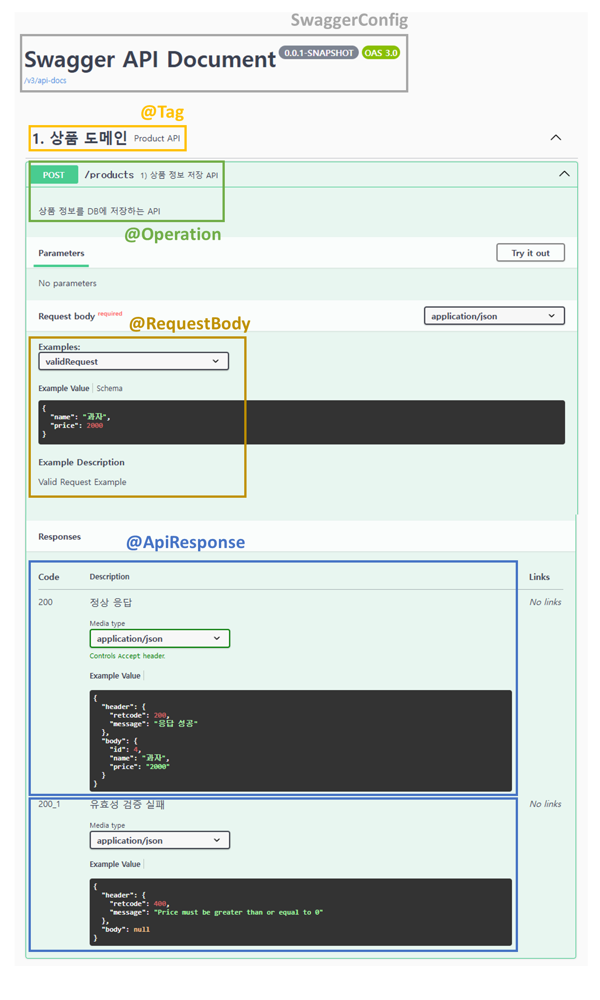

<hr>


## **⬛︎ 목차**

1. [Swagger vs OpenAPI](#swagger-vs-openAPI)
2. [springdoc-openapi v2.6.0 이해](#springdoc-openapi-v2.6.0-이해)
3. [OpenAPI 3 & Swagger-ui 적용](#openAPI-3-swagger-ui-적용) 

<br>
**[Swagger.io 페이지](http://Swagger.io)**에 접속해보면 가장 먼저 이 문구가 우리를 맞이한다.
> *API Development for Everyone*  
> *: 모두를 위한 API 개발*
 

Swagger는 모든 개발자를 위한 <u>Rest API 문서 자동화 도구</u>로 볼 수 있다.  
Swagger Docs를 보니 Swagger는 2024년 10월 기준으로 OpenAPI와 명칭이 혼용되어 사용되고 있다.     
여기서 <u>OpenAPI</u>는 흔히 우리가 알 수 있는 공개 API가 아니라 <u>API를 정의하는 표준 포맷</u>을 말한다.  

실제 실무에서는 Google Sheet, Notion 등을 활용해 <u>API 명세</u>를 개발자가  <u>직접 작성</u>하는 경우가 아직도 많은데 지금부터 이 작업을 <u>자동화</u>하는 방법을 알아볼 것이다.

<br>

## 📢 Swagger vs OpenAPI {#swagger-vs-openAPI}
### Swagger와 OpenAPI의 역사
<br>
Swagger는 2011년 Restful API를 설계, 구축, 문서화하기 위한 오픈소스로 개발되었다.  
주로 API 문서에 초점을 두어 엔드포인트, 요청/응답 페이로드, 매개변수 등을 정의할 수 있다.  

Swagger의 Version을 살펴보면 2.0까지 잘 운영되었지만,   
2015년 OpenAPI Initiative에 기부되어 2017년 OpenAPI Specification 3.0이라는 새로운 이름과 Version으로 출시되었다.   
그래서 현재 표준은 **OpenAPI**이고 3.1 Version이 2021년에 출시되어 유지되고 있다.

> *OpenAPI Initiative의 회원에는 SmartBear, 3scale, Apigee, Capital One, Google, IBM, Intuit, Microsoft, PayPal, Postman, SAP, Salesforce가 있다.*
> 

그럼 이제 Spring boot에서 OpenAPI를 사용하기 위해 **springdoc-openapi**를 살펴보러 갈 것이다.

<br>

## 🔰 springdoc-openapi v2.6.0 이해 {#springdoc-openapi-v2.6.0-이해}
### **1️⃣ Introduction**

> *`springdoc-openapi` java library helps to automate the generation of API documentation using spring boot projects. `springdoc-openapi` works by examining an application at runtime to infer API semantics based on spring configurations, class structure and various annotations.*  
>*: 스프링 Doc-OpenApi 자바 라이브러리는 Spring Boot 프로젝트를 사용해 API 문서  자동화를 지원한다.  그리고 스프링의 구성, 클래스 구조, 다양한 어노테이션을 기반으로 API의 의미를 추론하기 위해 런타임 시점에 애플리케이션을 검사한다.*
> 

**springdoc-openapi에서 지원하는 라이브러리**는 다음과 같다.

- `OpenAPI 3`
- `Spring-boot v3 (Java 17 & Jakarta EE 9)`
- JSR-303, specifically for @NotNull, @Min, @Max, and @Size.
- `Swagger-ui`
- OAuth 2
- GraalVM native images

<br>

### **2️⃣ springdoc-openapi과 swagger-ui의 주요 속성**

- springdoc-openapi 주요 속성
    
    
    | 매개변수 명 | 기본 값 | 설명 |
    | --- | --- | --- |
    | springdoc.api-docs.path | `/v3/api-docs` | OpenAPI 문서의 사용자 정의 경로 (String 타입) 
    | springdoc.api-docs.enabled | `true` | springdoc-openapi 엔드포인트 활성화 (Boolean 타입) 
    | springdoc.packages-to-scan | `*` | 스캔할 패키지 목록 (쉼표로 구분) (List of Strings 타입) 
    | springdoc.paths-to-match | `/*` | 일치시킬 경로 목록 (쉼표로 구분) (List of Strings 타입) 
    | springdoc.produces-to-match | `/*` | 일치시킬 mediaTypes 목록 (쉼표로 구분) (List of Strings 타입)
    | springdoc.headers-to-match | `/*` | 일치시킬 헤더 목록 (쉼표로 구분) (List of Strings 타입)
    | springdoc.paths-to-exclude |  | 제외할 경로 목록 (쉼표로 구분) (List of Strings 타입)
    | springdoc.packages-to-exclude |  | 제외할 패키지 목록 (쉼표로 구분) (List of Strings 타입) |
- swagger-ui 주요 속성
    
    
    | 매개변수 명 | 기본 값 | 설명 |
    | --- | --- | --- |
    | springdoc.swagger-ui.path | `/swagger-ui.html` | swagger-ui HTML 문서의 사용자 정의 경로  (String 타입)
    | springdoc.swagger-ui.enabled | `true` | swagger-ui 엔드포인트 활성화 (Boolean 타입)
    | springdoc.swagger-ui.validatorUrl |  | 유효성 검사기에 대한  URL 설정 |

<br>
더 자세한 속성을 알고 싶다면 이 <a href="https://springdoc.org/#properties"><b>사이트</b></a>를 참고하면 된다.
<br>
<br>


### **3️⃣** Demo 애플리케이션 소스코드

- [https://github.com/springdoc/springdoc-openapi-demos/tree/master](https://github.com/springdoc/springdoc-openapi-demos/tree/master)

<br>

### 4️⃣ Swagger-ui 관련 주요 Annotation

| 설정 종류 | 설정 대상 | 설명 |
| --- | --- | --- |
| **@Tag** | Method, Type | 같은 name끼리 <u>하나의 api로 그룹핑</u> 해준다 |
| **@Operation** | Method |  <u>Api동작에 대한 명세</u>를 작성하기 위해 Controller 메소드에 설정한다. |
| **@Schema** | Field, Method, Parameter, Type | <u>Schema(= Model)에 대한 정보를 작성</u>할 수 있다. |
| **@RequestBody** | Method, Parameter | <u>Request Body에 대한 정보를 작성</u>할 수 있다. (Schema를 어느정도 대체 할 수 있다.) 
| **@Parameter** | Field, Method, Parameter | <u>Request Parameter에 대한 정보를 작성</u>할 수 있다. (header, query, path, cookie에 대한 설정이 가능하다) 
| **@ApiResponse** | Method, Type | 응답 결과에 따른 <u>response 구조를 미리 확인</u>할 수 있게 만들어준다. |

<br>
더 자세한 Annotation 정보는 이 <a href="https://javadoc.io/doc/io.swagger.core.v3/swagger-annotations-jakarta/latest/index.html"><b>페이지</b></a>를 참고하면 된다.
<br>

<br>

## **👨‍💻 OpenAPI 3 &** Swagger-ui 적용 {#openAPI-3-swagger-ui-적용}


### **1️⃣** Dependency 추가

지금 생성한 프로젝트는 Spring Boot 3.x 버전이고 **springdoc-openapi** 최신 버전인 **v2.6.0**을 사용할 것이다. 

만약, Spring Boot 1.x 혹은 2.x를 사용한다면 springdoc-openapi v1.8.0을 사용해야 한다.

```xml
<!-- pom.xml -->
<dependency>
    <groupId>org.springdoc</groupId>
    <artifactId>springdoc-openapi-starter-webmvc-ui</artifactId>
    <version>2.6.0</version>
</dependency>
```

### **2️⃣ applicaiton.properties 설정**

swagger-ui 접속 경로와 각 API의 정렬 방식을 메서드순으로 지정해 주었다.

```yaml
# Swagger Config
springdoc.swagger-ui.path=/swagger-ui
springdoc.api-docs.path = swagger-api-docs-v2.6.0
#springdoc.swagger-ui.tags-sorter=alpha
springdoc.swagger-ui.operations-sorter=method
```

<br>
더 자세한 설정은 이 <a href="https://springdoc.org/#:~:text=5.2.-,swagger%2Dui%20properties,-The%20support%20of"><b>페이지</b></a>를 참고하면 된다.
<br>


### 3️⃣ Swagger Config 설정

Swagger UI 화면에 보여질 제목과 버전을 설정할 수 있다.

```java
@Configuration
public class SwaggerConfig {

    @Bean
    public OpenAPI openAPI(@Value("${application-version}") String appVersion){
        return new OpenAPI()
                .info(new Info()
                        .title("Swagger API Document")
                        .version(appVersion)
                        //.description(appDescription)
                );
    }
}
```

<br>
더 자세한 설정은 이 <a href="https://springdoc.org/#:~:text=swagger%2Dui.html-,13.37.%20How%20can%20I%20set%20a%20global%20header%3F,-You%20may%20have"><b>페이지</b></a>를 참고하면 된다.
<br>


### 4️⃣ Swagger UI 설계

지금부터 상품 도메인 (product) API에 Swagger 속성들을 적용시켜 자동화된 API 문서를 만들어 볼 것이다. 주요 설정 태그들은 앞의 <b>Swagger-ui 관련 주요 Annotation</b> 부분을 참고하면 된다. 

<br>

#### `ProductControllerDocs` 인터페이스
<aside>
👨‍💻

ProductController에 Swagger Annotation들을 직접 적용하는 것 보다, <u>ProductControllerDocs라는 Interface를 생성해 관심사를 분리</u>시켜주면 Swagger 관련 코드를 추가⋅변경시 관리가 용이해지고, 가독성이 좋아져 이 포맷을 적용하였다.

</aside>
```java
@Tag(name = "1. 상품 도메인", description = "Product API")
public interface ProductControllerDocs {

    /**
     * Create Product
     */
    @Operation(summary = "1) 상품 정보 저장 API", description = "상품 정보를 DB에 저장하는 API ")
    @Parameter(name = "Authorization", in = ParameterIn.HEADER, required = true, description = "Access token for authorization")
    @io.swagger.v3.oas.annotations.parameters.RequestBody(required = true, content = @Content(examples = {
            @ExampleObject(name = "validRequest", value = "{ \"name\": \"과자\", \"price\": 2000 }",  description = "Valid Request Example"),
            @ExampleObject(name = "invalidRequest", value = "{ \"name\": \"과자\", \"price\": -1000 }",  description = "Invalid Request Example")
        }))
    @ApiResponses(value = {
            @io.swagger.v3.oas.annotations.responses.ApiResponse(responseCode = "200", description = "정상 응답",
                    content = @Content(
                            mediaType = "application/json",
                            examples = @ExampleObject(value = """
                                {
                                    "header": {
                                        "retcode": 200,
                                        "message": "응답 성공"
                                    },
                                    "body": {
                                        "id": 4,
                                        "name": "과자",
                                        "price": "2000"
                                    }
                                }
                            """)
                    )
            ),
            @io.swagger.v3.oas.annotations.responses.ApiResponse(responseCode = "200_1", description = "유효성 검증 실패",
                    content = @Content(
                            mediaType = "application/json",
                            examples = @ExampleObject(value = """
                                {
                                    "header": {
                                        "retcode": 400,
                                        "message": "Price must be greater than or equal to 0"
                                    },
                                    "body": null
                                }
                            """)
                    )
            ) }
    )
    public ApiResponse<ProductResponse> createProduct(@Valid @RequestBody ProductReqeust productReqeust);

```
<br>

위와 같이 API 설정을 적용 후 <b>[http://localhost:8080/swagger-ui](http://localhost:8080/swagger-ui) 페이지</b>에 접속하면 아래와 같이 API 문서가 만들어져 있는것을 확인할 수 있다.


<br>


<br>

### 정리

지금까지 OpenAPI 3 문법에 따라 코드를 작성해 Swagger-ui를 만들어 API 명세를 자동화 시켜 보았다.

위에서 진행한 실습은 Swagger의 아주 기초적인 부분들만 적용한 것이기 떄문에 JWT를 비롯해 다양한 Case를 고려한다면 커스텀해서 사용할 수 있다.

한가지 아쉬운 점은 서버와 클라이언트간의 통신시 정상 응답과 예외 응답을 모두 HTTP Status Code 200으로 설정하면 Response가 중복되어 화면에는 하나의 Status Code만 표시된다. 
그래서 이 부분은 프론트엔드 개발자와 상호 협의 하에 “200_1” 등 임의의 문자로 처리해 주는 방법을 떠올릴수 있고 더 연구가 필요하다.

마지막으로 Swagger와 자주 비교되는 <u><a href="https://spring.io/projects/spring-restdocs">Spring REST Docs</a></u>도 사용해보며 현재 프로젝트에 더 적합한 방식을 선택하면 좋을 것 같다. REST Docs를 간략하게 설명하자면 테스트를 통과해야만 API 문서가 만들어진다.

> *전체 소스코드는 여기를 참고하면 된다.*  
*[https://github.com/gusdn7142/Swagger_Apply](https://github.com/gusdn7142/Swagger_Apply)*


### 참고

---

- Swagger vs. OpenAPI
    - [https://medium.com/cloud-native-daily/swagger-vs-openapi-understanding-the-difference-e4b735bc0076](https://medium.com/cloud-native-daily/swagger-vs-openapi-understanding-the-difference-e4b735bc0076)
    - [https://blog.postman.com/openapi-vs-swagger/](https://blog.postman.com/openapi-vs-swagger/)
- What Is OpenAPI
    - [https://swagger.io/docs/specification/v3_0/about/](https://swagger.io/docs/specification/v3_0/about/)
- springdoc-openapi v2.6.0 Introduction
    - [https://springdoc.org/#Introduction](https://springdoc.org/#Introduction)
- swagger-annotations 2.2.25 API
    - [https://javadoc.io/doc/io.swagger.core.v3/swagger-annotations-jakarta/latest/index.html](https://javadoc.io/doc/io.swagger.core.v3/swagger-annotations-jakarta/latest/index.html)
- Documenting a Spring REST API Using OpenAPI 3.0 From baeldung
    - [https://www.baeldung.com/spring-rest-openapi-documentation](https://www.baeldung.com/spring-rest-openapi-documentation)
- swagger-ui github
    - [https://github.com/swagger-api/swagger-ui?tab=readme-ov-file](https://github.com/swagger-api/swagger-ui?tab=readme-ov-file)
- OpenAPI 3 Documentation With Spring Boot From DZone
    - [https://dzone.com/articles/openapi-3-documentation-with-spring-boot](https://dzone.com/articles/openapi-3-documentation-with-spring-boot)
- Doing More With Springdoc OpenAPI From DZone
    - [https://dzone.com/articles/doing-more-with-springdoc-openapi](https://dzone.com/articles/doing-more-with-springdoc-openapi)


