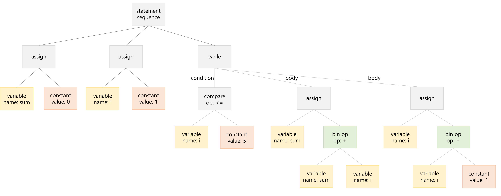
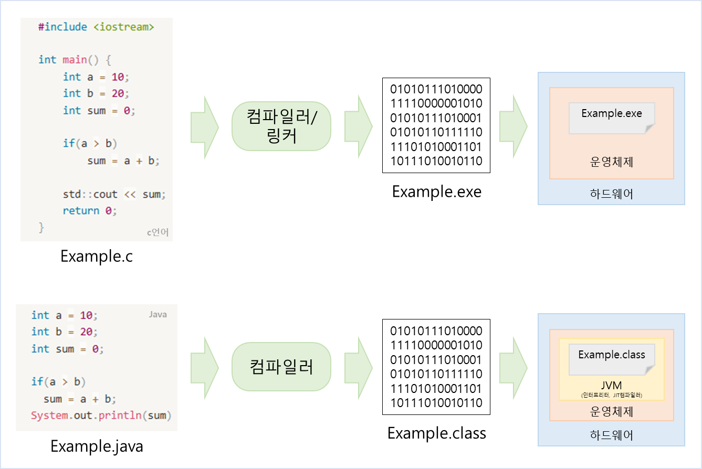
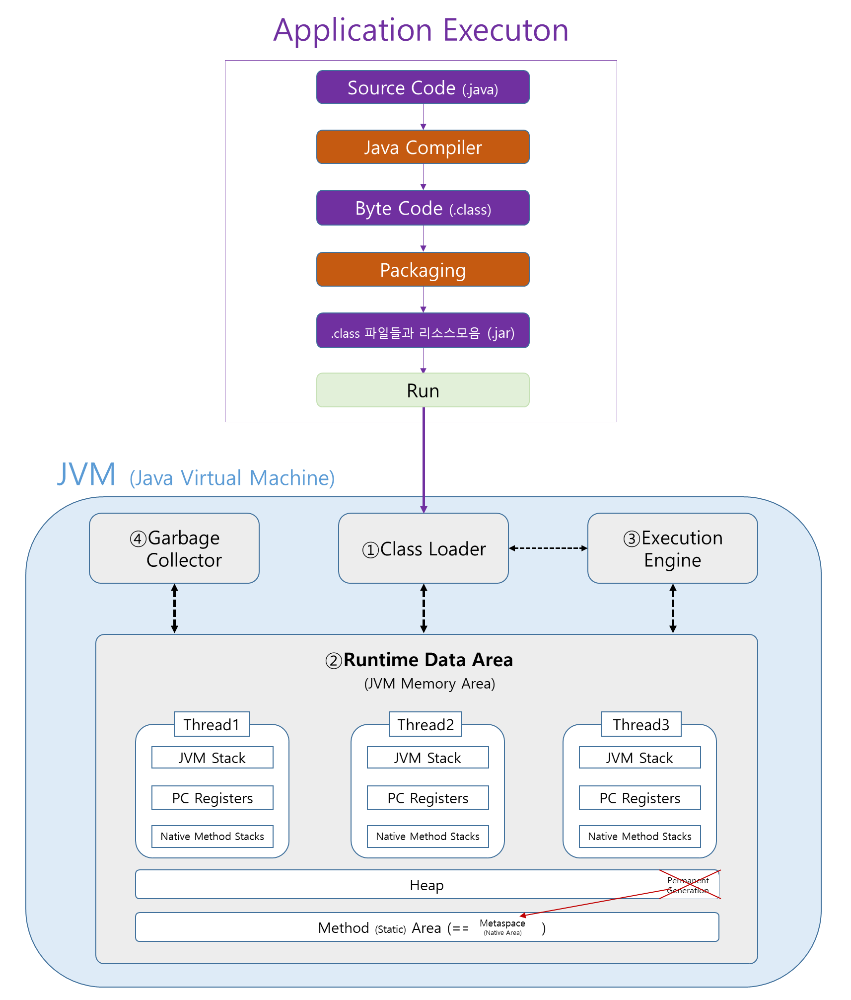

### **⬛︎ 목차**
<div style="margin-bottom:20px;"></div>
<span style="display: block; margin-bottom: 12px;">&ensp;&ensp;<b>[🔓︎ 들어가며](#들어가며) </b></span>
<span style="display: block; margin-bottom: 12px;">&ensp;&ensp;<b>[1️⃣ 컴파일러의 정의](#컴파일러의_정의) </b></span>
<span style="display: block; margin-bottom: 12px;">&ensp;&ensp;<b>[2️⃣ 컴파일러 vs 인터프리터](#컴파일러와_인터프리터) </b></span>
<span style="display: block; margin-bottom: 12px;">&ensp;&ensp;<b>[3️⃣ 컴파일러가 하는 일](#컴파일러가_하는_일) </b></span>
<span style="display: block; margin-bottom: 12px;">&ensp;&ensp;<b>[4️⃣ Java의 컴파일과 프로그램 실행과정](#Java의_컴파일과_프로그램_실행과정) </b></span>
<span style="display: block; margin-bottom: 12px;">&ensp;&ensp;<b>[🔒︎ 마치며](#마치며) </b></span>


<div style="margin-bottom:100px;"></div>


## 🔓︎ 들어가며  {#들어가며}
<div style="margin-bottom:40px;"></div>


「[컴퓨터 밑바닥의 비밀](https://www.yes24.com/Product/Goods/125299750)」이라는 책을 읽으며, 그동안 추상적으로만 이해하고 있던 **컴파일러의 역할**을 더 깊이 있게 이해할 수 있었습니다.

또한, **실무에서 자주 사용하는 Java 언어가 어떻게 컴파일되고 실행되는지**에 대해서도 함께 다루어 봤습니다.

<div style="margin-bottom:100px;"></div>


## 1️⃣ 컴파일러의 정의  {#컴파일러의_정의}

<div style="margin-bottom:40px;"></div>


> 컴파일러(compiler)는 특정 프로그래밍 언어로 쓰여 있는 코드를 다른 프로그래밍 언어(ex, 기계어)로 번역하는 프로그램입니다.  
> [참고 : [위키백과](https://ko.wikipedia.org/wiki/%EC%BB%B4%ED%8C%8C%EC%9D%BC%EB%9F%AC)]
> 

<div style="margin-bottom:100px;"></div>


## 2️⃣ 컴파일러 vs 인터프리터  {#컴파일러와_인터프리터}


| 구분 | 컴파일러 | 인터프리터 | 하이브리드형 |
| --- | --- | --- | --- |
| 코드 처리 | 전체 소스 코드를 한 번에 기계어로 변환 | 한 줄씩 해석하며 실행 | 소스를 중간 코드(바이트코드 등)로 컴파일 후 실행 시 인터프리팅 또는 JIT 컴파일 |
| 실행 속도 | 빠름 (기계어 실행) | 느림 (실행 시 해석) | 중간  (JIT일 경우 빠름) |
| 출력물 | 기계어 기반 실행 파일 | 없음 (실행 결과만 출력됨) | 바이트코드 (.class) |
| 대표 언어 | C, C++, Go | Python, JS, Ruby | Java, Kotlin, C# |
| 에러 처리 | 컴파일 시 전체 문법 오류 탐지 | 실행하면서 오류 발생 시 중단 | 컴파일 시 일부 검사 + 실행 중 동적 검사 (예: null, 타입 등) |

<div style="margin-bottom:100px;"></div>

## 3️⃣ 컴파일러가 하는 일  {#컴파일러가_하는_일}
<div style="margin-bottom:40px;"></div>


**3.1 어휘분석** : 소스코드 → 토큰 변환

**3.2 구문분석** : 토큰 조합 올바른지 검사 → 구문 트리(AST) 생성

**3.3 의미분석** :  구문 트리(AST) 컴파일 오류 검사

**3.4 중간 코드 생성** : 구문 트리(AST) → 플랫폼에 종속되지 않는 중간코드로 변환

**3.5 최적화** : 중간코드 최적화    

**3.6 (기계어) 코드 생성** : 중간코드(IR) → 어셈블리어(Assembly) → 기계어(Machine Code/Object File) 생성  

**3.7 링킹** : Object File을 묶어 실행파일 생성


<div style="margin-bottom:80px;"></div>


### **3.1 어휘 분석 (Lexical Analysis)**

- 소스코드를 잘게 쪼개서 토큰(token)으로 변환합니다.
- ex) 토큰 변환
    
    ```java
    int sum = 0;
    int i = 1;
    
    while (i <= 5) {
        sum = sum + i;
        i = i + 1;
    }
    ```
    
    | 순서 | 토큰 타입 (표준) | 토큰 타입 (KR) | 토큰 값 |
    | --- | --- | --- | --- |
    | 1 | T_Keyword | 키워드 | int |
    | 2 | T_Identifier | 식별자 | sum |
    | 3 | T_Assign | 대입 연산자 | = |
    | 4 | T_Int | 정수 리터럴 | 0 |
    | 5 | T_Semicolon | 세미콜론 | ; |
    | 6 | T_Keyword | 키워드 | int |
    | 7 | T_Identifier | 식별자 | i |
    | 8 | T_Assign | 대입 연산자 | = |
    | 9 | T_Int | 정수 리터럴 | 1 |
    | 10 | T_Semicolon | 세미콜론 | ; |
    | 11 | T_Keyword | 키워드 | while |
    | 12 | T_LParen | 왼쪽 괄호 | ( |
    | 13 | T_Identifier | 식별자 | i |
    | 14 | T_LessThanEqual | 이하 | <= |
    | 15 | T_Int | 정수 리터럴 | 5 |
    | 16 | T_RParen | 오른쪽 괄호 | ) |
    | 17 | T_LBrace | 왼쪽 중괄호 | { |
    | 18 | T_Identifier | 식별자 | sum |
    | 19 | T_Assign | 대입 연산자 | = |
    | 20 | T_Identifier | 식별자 | sum |
    | 21 | T_Plus | 더하기 연산자 | + |
    | 22 | T_Identifier | 식별자 | i |
    | 23 | T_Semicolon | 세미콜론 | ; |
    | 24 | T_Identifier | 식별자 | i |
    | 25 | T_Assign | 대입 연산자 | = |
    | 26 | T_Identifier | 식별자 | i |
    | 27 | T_Plus | 더하기 연산자 | + |
    | 28 | T_Int | 정수 리터럴 | 1 |
    | 29 | T_Semicolon | 세미콜론 | ; |
    | 30 | T_RBrace | 오른쪽 중괄호 | } |
    | 31 | T_Identifier | 식별자 | System |
    | 32 | T_Dot | 점 연산자 | . |
    | 33 | T_Identifier | 식별자 | out |
    | 34 | T_Dot | 점 연산자 | . |
    | 35 | T_Identifier | 식별자 | println |
    | 36 | T_LParen | 왼쪽 괄호 | ( |
    | 37 | T_Identifier | 식별자 | sum |
    | 38 | T_RParen | 오른쪽 괄호 | ) |
    | 39 | T_Semicolon | 세미콜론 | ; |

<div style="margin-bottom:80px;"></div>

### **3.2 구문 분석** (Parsing)

- 토큰(기호)들이 올바르게 조합되었는지 검사하고, 문장의 구조를 구문 트리(AST)로 만듭니다.
- AST (abstract syntax tree)는 코드의 계층적 구조를 표현한 트리 형태의 데이터 구조입니다.
- ex) 구문 트리
    
    ```java
    statement-sequence
    ├── assign (sum = 0)
    │   ├── variable: sum
    │   └── constant: 0
    ├── assign (i = 1)
    │   ├── variable: i
    │   └── constant: 1
    ├── while
    │   ├── condition: (i <= 5)
    │   │   ├── variable: i
    │   │   └── constant: 5
    │   └── body
    │       ├── assign (sum = sum + i)
    │       │   ├── variable: sum
    │       │   └── binary-op (+)
    │       │       ├── variable: sum
    │       │       └── variable: i
    │       └── assign (i = i + 1)
    │           ├── variable: i
    │           └── binary-op (+)
    │               ├── variable: i
    │               └── constant: 1
    ```
        

    
    > 관련 문법 이해
    > 
    > 
    > 
    > | 트리 노드 이름 | 의미 | 예시 코드 | 설명 |
    > | --- | --- | --- | --- |
    > | assign | 대입(할당) | a = a - b; | 변수 a에 값을 대입 |
    > | compare | 비교 연산 | a > b, b != 0 | 두 값을 비교하는 연산 |
    > | bin op | 이항 연산 | a - b, x + y | 두 값을 계산하는 연산자 |
    > | branch | 조건 분기 | if (...) { ... } else { ... } | 조건에 따라 분기 |
    > | while | 반복 | while (b != 0) | 조건 반복 |
    > | condition | 조건식을 나타냄 | a < b, x == y | 분기나 반복문에서 사용하는 조건식 |
    > | body | 본체 | if () { ... },
    > while() { … } | 함수나 조건문/반복문의 실행부 |
    > | return | 반환 | return a; | 값 반환 |
    
<div style="margin-bottom:80px;"></div>

### **3.3 의미 분석** (Semantic Analysis)

- 구문 트리를 기반으로 변수 선언 여부, 타입 일관성, 함수 호출 시 인자 개수/타입 확인 등 컴파일 오류를 검사합니다.
- 예시
    
    
    | 컴파일 유형 | 코드 예시 | 설명 |
    | --- | --- | --- |
    | 선언되지 않은 변수 사용 | x = 3; | 변수 x가 선언되지 않았지만 값을 할당하려고 시도 |
    | 잘못된 함수 호출 | foo(1, "hi") | 함수 foo에 전달된 인자의 개수나 타입이 함수 정의와 맞지 않음 |
    | 타입 불일치 | int a = "hello"; | 변수 a가 int 타입으로 선언되었지만, 문자열 "hello"를 할당하려고 시도함 |

<div style="margin-bottom:80px;"></div>


### **3.4 중간 코드 생성** (Intermediate Code Generation)

- 구문 트리(AST)를 기반으로, 컴파일러 내부에서 사용하는 중립적인 중간 표현(IR, Intermediate Representation)으로 변환합니다.
- 최적화 및 기계어 생성을 위한 중간 단계입니다.
- 종류로는 3-주소 코드, 트리 구조 코드, 가상 기계 코드 등이 있습니다.
- 예시
    - a = b + c * d; 를 3주소 중간 코드로 변환
        
        ```java
        t1 = c * d
        t2 = b + t1
        a = t2
        ```        

<div style="margin-bottom:80px;"></div>


### **3.5 최적화** (Optimization)

- 중간 코드를 더 빠르고 효율적으로 실행되도록 개선합니다.

<div style="margin-bottom:80px;"></div>


### **3.6 코드 생성** (Code Generation)

- 중간 코드(IR)를 실제 CPU가 이해할 수 있는 **기계어로 변환**하는 단계입니다.
- 일반적으로 다음과 같은 과정을 거칩니다:
    - 중간 코드 → 어셈블리어(Assembly) → 기계어(Object File)

<div style="margin-bottom:80px;"></div>


### **3.7 링킹** (Linking)

- 이 과정은 컴파일 이후에 수행되는 과정으로  여러 개의 목적 파일(Object File)과 라이브러리를 하나의 실행 파일(Executable)로 결합하는 과정입니다.
- 링킹은 두 가지 방식이 있습니다:
    - 정적 링크(Static Linking) : 모든 필요한 코드가 실행 파일에 포함되어, 독립적으로 실행됩니다.
    - 동적 링크(Dynamic Linking) : 실행 시점에 외부 공유 라이브러리(.so, .dll 등)를 참조하여 실행됩니다.

<div style="margin-bottom:80px;"></div>    

💡 Tip) 소스 코드를 컴파일하고, 목적 파일을 연결해 실행 파일을 만드는 모든 과정을 빌드(Build)라고 합니다.


<div style="margin-bottom:100px;"></div>    


## 4️⃣ Java의 컴파일과 프로그램 실행과정  {#Java의_컴파일과_프로그램_실행과정}
<div style="margin-bottom:40px;"></div>    


### 4.1 Java는 어떻게 컴파일되어 실행되는가? - 일반 프로그램 vs Java 프로그램


   
<span style="font-size:15px; color:gray;">
  [🔗참고 : [https://wonjun1995.tistory.com/5](https://wonjun1995.tistory.com/5)]
</span>

<div style="margin-bottom:40px;"></div>    

C, C++, Go와 같은 언어로 작성된 일반 프로그램은 **운영체제와 CPU 아키텍처에 맞게 컴파일**되기 때문에, **다른 환경에서는 실행되지 않습니다**. 예를 들어, Windows에서 컴파일된 프로그램은 Linux나 macOS에서 실행할 수 없습니다.

반면, Java는 소스 코드를 컴파일하면 `.class` 파일(바이트코드)이 생성되고, 이 바이트코드는 **운영체제와 무관하게 JVM**(Java Virtual Machine) **위에서 실행됩니다**. 따라서 JVM만 설치되어 있다면 **어떤 환경에서도 동일한 자바 프로그램을 실행할 수 있습니다**.

그럼, 지금부터 Java의 컴파일과 실행과정을 자세히 알아보겠습니다.


<div style="margin-bottom:80px;"></div>  


### 4.2 Java의 컴파일 과정
<div style="margin-bottom:40px;"></div>  

**4.2.1 자바 소스 코드 작성**
- 개발자가 `.java` 파일에 자바 코드를 작성합니다.

**4.2.2 자바 컴파일러(javac)가 소스 코드를 바이트코드로 변환**
- `javac`가 `.java` 파일을 읽어 `.class`라는 바이트코드 파일로 컴파일합니다.
    - ex) `javac Example.java`
- 바이트코드는 플랫폼 독립적인 중간 코드입니다.

**4.2.3 바이트코드(.class 파일) 생성**
- 여러 개의 `.class` 파일이 만들어질 수 있으며, 필요 시 이를 하나로 묶어 JAR 파일로 배포할 수 있습니다.

**4.2.4 JAR 파일 생성** (배포를 위한 패키징 과정)
- 여러 `.class` 파일과 리소스를 하나로 묶어 JAR(Java Archive) 파일로 만듭니다.
- JAR 파일은 자바 프로그램 배포 및 실행에 사용됩니다.
- JAR 파일 생성 명령 예시:
    
    ```bash
    jar cvf Exaplme.jar *.class
    ```
    
    - `c` : 새 JAR 파일 생성(create)
    - `v` : 생성 과정을 자세히 출력(verbose)
    - `f` : 파일 이름 지정(file)
    - `Exaplme.jar` : 생성할 JAR 파일 이름
    - `.class` : 포함할 클래스 파일들


<div style="margin-bottom:100px;"></div>    


### 4.3 Java 프로그램 실행 과정 (JVM 관점)

    

<div style="margin-bottom:40px;"></div>    


**4.3.1 JVM 실행 및 메모리 구조 초기화**

- 사용자가 JAR 파일을 실행하면 (`java -jar Example.jar`), **JVM**(Java Virtual Machine)이 실행되며, 운영체제로부터 **메모리**를 할당받습니다.
- 이 메모리는 Runtime Data Area라 불리며, 클래스 로딩과 실행에 필요한 데이터를 저장하고 관리합니다.

<div style="margin-bottom:80px;"></div>    

💡 참고) **Runtime Data Area** (실행 시 데이터 영역)

- JVM이 실행 중 사용하는 메모리 공간으로, 다음과 같이 크게 두 분류로 나눌 수 있습니다.  
    ① **모든 스레드가 공유하는 영역**
    
    | 영역 | 설명 |
    | --- | --- |
    | **Heap** | `new` 키워드로 생성된 객체 인스턴스를 저장하는 공간,<br>Garbage Collector(GC)의 관리 대상,<br>Java 8부터는 `static` 변수도 이 영역에 저장됨 |
    | **Method Area** | 클래스와 관련된 메타데이터(클래스명, 메서드, 필드 정보 등)를 저장,<br>로더에 의해 로딩된 `.class` 파일의 정보가 이곳에 저장됨,<br>Java 8부터는 PermGen 영역이 제거되고 OS 메모리를 사용하는 Metaspace로 대체됨 |
    
    <div style="margin-bottom:40px;"></div>   

    ② **각 스레드마다 독립적인 영역**
    
    | 영역 | 설명 |
    | --- | --- |
    | **JVM Stack** | 각 메서드 호출 시 생성되는 `Frame`을 저장하는 공간, <br> Frame에는 매개변수, 지역 변수, 반환값 등을 저장 |
    | **PC Register** | 현재 실행 중인 JVM 명령의 주소(Program Counter)를 저장하는 공간 |
    | **Native Method Stack** | C/C++ 등 네이티브 언어로 작성된 코드를 실행하기 위한 공간, <br> Java Native Interface(JNI)를 통해 호출된 네이티브 메서드를 처리 |


<div style="margin-bottom:80px;"></div>    


**4.3.2 Class Loader가 클래스 로딩**

- `.class` 파일 (JAR 안에 포함된 바이트코드 파일들)은 **Class Loader**에 의해 JVM 내부(Method Area)로 로딩됩니다.

<div style="margin-bottom:80px;"></div>    


**4.3.3 Execution Engine이 바이트코드 실행** (기계어로 변환)

- 로딩된 바이트코드는 JVM 내부의 **Execution Engine**에 의해 실행됩니다.
- Execution Engine은 두 가지 방식으로 바이트코드를 실행합니다:
    
    > **인터프리터** (Interpreter)
    > 
    > - 바이트코드를 **한 줄씩 해석하여 기계어로 변환 및 실행**합니다.
    > - 초기 실행 속도는 빠르지만 반복 실행 시 비효율적일 수 있습니다.
    > 
    > **JIT 컴파일러** (Just-In-Time Compiler)
    > 
    > - **반복 실행되는 바이트코드**를 한 번에 기계어로 변환(컴파일)하여 저장합니다.
    > - 이후에는 변환된 기계어를 직접 실행하므로 속도가 향상됩니다.


<div style="margin-bottom:80px;"></div>    


**4.3.4 실행 중 자동 메모리 관리 (Garbage Collection)**

- 실행 도중 더 이상 사용되지 않는 객체는 JVM이 자동으로 감지하여 메모리에서 제거합니다.
- 이 작업을 GC(Garbage Collector)가 수행하며, 프로그래머가 명시적으로 메모리 해제를 하지 않아도 됩니다.


<div style="margin-bottom:80px;"></div>    

**4.3.5 실행 종료**   

- 프로그램 실행이 끝나면 JVM은 모든 자원을 정리하고 종료합니다.


<div style="margin-bottom:100px;"></div>    


## **🔒︎ 마치며**  {#마치며}


지금까지 컴파일러가 하는 일부터 Java 프로그램이 실행되는 과정까지 살펴보았습니다.  
컴파일러가 하는 일은 어휘분석 → 구문분석 → 의미분석 → 중간코드생성(+최적화) → 기계어 생성 입니다.  

Java는 실무에서 웹 개발에 널리 사용되기 때문에, JVM 내부에서 어떤 순서로 동작하는지 깊이 이해해두면 성능 최적화나 디버깅 시 도움이 될것이라 생각됩니다.

정리하자면, Java 프로그램의 실행 흐름은 다음과 같습니다:  

| 실행 순서 | 설명 |
| --- | --- |
| ① Class Loader 동작 | **`.class` 파일(바이트코드)을 JVM으로 로딩**하고,  <br> 메서드 영역(Method Area)에 **클래스의 메타정보(이름, 필드, 메서드 등)를 저장** |
| ② Runtime Data Area 초기화 | JVM은 클래스 로딩과 동시에 **Runtime Data Area** (메서드 영역, 힙, JVM 스택 등)를 **초기화**하고, <br> 각 영역에 필요한 메모리를 할당 (Class Loader와 Runtime Data Area는 함께 작동) |
| ③ Execution Engine 동작 | Execution Engine은 **인터프리터 방식과 JIT 컴파일 방식을 함께 사용하여** **바이트코드를 기계어로 변환하고 실행** |
| ④ Garbage Collector 동작 | Heap 영역에서 더 이상 **사용되지 않는 객체를 감지하여 자동으로 메모리를 해제** <br> (실행 순서상 명확한 위치가 있는 것이 아니라, 백그라운드에서 주기적으로 작동) |


<div style="margin-bottom:100px;"></div>    

## 📑 참고


1. 컴퓨터 밑바닥의 비밀 책
    - [https://www.yes24.com/Product/Goods/125299750](https://www.yes24.com/Product/Goods/125299750)
2. 자바와 타 언어와 실행 환경차이
    - [https://wonjun1995.tistory.com/5](https://wonjun1995.tistory.com/5)
3. 자바(Java) 메모리 구조 소개 
    - [https://www.youtube.com/watch?v=zta7kVTVkuk](https://www.youtube.com/watch?v=zta7kVTVkuk)