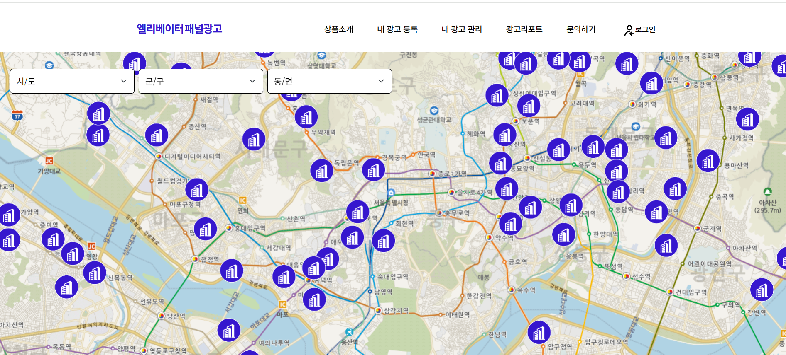
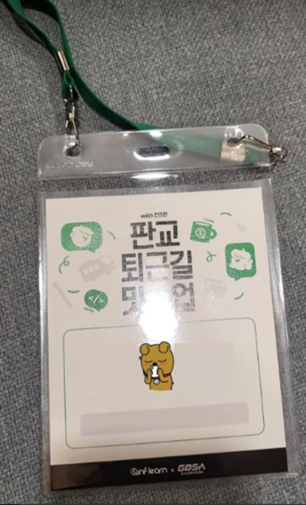

### **⬛︎ 목차**

1.&nbsp;[들어가기 앞서 🙋‍♂](#들어가기_앞서)  
2.&nbsp;[2024년 결산 - Total 🛍️](#결산_total)  
3.&nbsp;[2024년 결산 - Detail - 💼 업무](#결산_Detail_업무)  
4.&nbsp;[2024년 결산 - Detail - 👨🏻‍💻 스터디](#결산_Detail_스터디)   
5.&nbsp;[2024년 결산 - Detail - 🙋🏻‍♂ 커뮤니티 활동](#결산_Detail_커뮤니티_활동)   
6.&nbsp;[2024년의 내게 해주고 싶은 말 💬](#내게_해주고_싶은_말)   
7.&nbsp;[2025년 ‘나’의 목표 🥅](#나의_목표)  

## 들어가기 앞서 🙋‍♂ {#들어가기_앞서}

회사에서 퇴근하며 **“2024 함께 ♥︎ 수서”**를 보았던 게 엊그제 같은데 또다시 **“2024 함께 ♥︎ 수서”**가 찾아왔다.. 그간 가슴이 벅차오를 정도로 많은 일들이 스쳐 지나가지만 블로그에는 모두 담을 수 없었다.

얼마 전에 우연히 SBS 연기대상을 보며 “장나라” 배우님의 대상 수상소감을 들었는데, 순간 **작년 MBC 연예 대상에서 “기안 84”님이 대상을 받았던 장면이 한편의 파노라마처럼 뇌리를 스쳐** 지나갔다.

    

  [출처 : [https://www.youtube.com/watch?v=tlDBL8V6e5Y](https://www.youtube.com/watch?v=tlDBL8V6e5Y) , [https://programs.sbs.co.kr/drama/2024drama/clip/84381/OC473193903](https://programs.sbs.co.kr/drama/2024drama/clip/84381/OC473193903)]

여태까지 살면서 이런 기분을 느껴본 적이 없었는데, 정말 묘했다.  

그래서 곰곰이 생각해 봤다.  1초… 2초… ….  5초… 그러고는 그 이유를 알게 되었다.   
**올해 나의 행동반경은 회사 ↔ 집 ↔ 헬스장이 주가 되었었기 떄문**이다.    
(그러다… 연말에 다가가서야 커뮤니티 활동에 불타오른 점은 Pass한다..)

# 2024년 결산 - Total 🛍️ {#결산_total}

| **📅 일자**      | &nbsp; 👇 내용                                                                                                                                                                                        |
|-------------------|----------------------------------------------------------------------------------------------------------------------------------------------------------------------------------------------|
| **1월 ~ 8월**     | &nbsp; 💼 작년 11월 입사 후 **직무와 사회생활 적응** (이 기간 약 2달간 Full 야근) &nbsp; 💼 S사 엘리베이터 패널광고 웹 서비스 개발 및 운영 (풀스택 담당)                                                    |
| **5월 ~ 7월**     | &nbsp; 🧑🏻‍💻 유튜버 ‘코딩알려주는누나’님이 운영하는 **HTML/CSS 스터디 참여** &nbsp; 🧑🏻‍💻 유튜버 ‘코딩알려주는누나’님이 운영하는 **Javascript 스터디 참여** &nbsp; 🏚️ K사 센터 합동 본부 **단체 워크샵 참여**    |
| **9월 ~ 11월**    | &nbsp; 💼 D사 유해 앱∘사이트 차단 관리 서비스 개발 (백엔드 담당) &nbsp; 🙋🏻‍♂ 판교 퇴근길 밋업 with 인프런 (HTTP 세션) 참여 &nbsp; 🙋🏻‍♂ **글또 10기 참여** (~ing) &nbsp; 🙋🏻‍♂ 글또 10기 백엔드-인프라 반상회 참여 &nbsp; 🙋🏻‍♂ **인프런 워밍업 클럽 스터디 2기 (백엔드 클린 코드, 테스트 코드) 참여** &nbsp; 🙋🏻‍♂ 인프런 워밍업 클럽 2기 오프라인 수료식 & 네트워킹 참여 &nbsp; 📃 인프런 커리어 랠리 이력서 Round 1기 참여 &nbsp; 🙋🏻‍♂ **인프런 워밍업 클럽 네트워킹 데이 참여** &nbsp; 🙋🏻‍♂ H사 CTO 배진호님의 치킨모임 참여 |
| **12월**         | &nbsp; 💼 K사 미승인 인터넷 회선 차단 서비스 개발 (풀스택 담당) &nbsp; 💼 한달 야근 11회 기록 &nbsp; 🙋🏻‍♂ 3달간 링크드인 일촌 100명 이상 증가                                                              |
| **기타**         | &nbsp; 🎸 2024 인프콘, 2024 당근 테크 밋업, 2024 토스 slash-24 등의 컨퍼런스를 신청했으나 모두 추첨에서 탈락의 아픔을 맛봄                                                                          |

# 2024년 결산 - Detail **🎁** {#결산_Detail_업무}

## 💼 업무

  
 
  [S사 엘리베이터 패널광고 웹 서비스]

### 1️⃣ ‘나’의 개발 열정은 여전히 현재 진행형 (~ing) 
- 2023년 11월 **첫 직장에 Join 후 풍파를 많이 겪었고**, **이 시기가 나를 내면적으로 크게 성장**시켜 주었다.
- 입사 직후 사수님과 함께 **S사 엘리베이터 패널광고 웹 서비스** 개발을 담당하게 되었다.
- User 도메인을 맡았는데, **프론트 업무가 나에겐 어렵게 다가왔다.**
- 학부생 시절 HTML/CSS/Javascript의 기초를 터득했었지만, 너무 오랜시간이 지난 후라 기억이 가물가물했기 떄문이다.
- 우선은 기간내에 개발을 완료해야 했기 때문에 평일, 주말 가릴것 없이 프론트 구현 역량을 길러 **6월에 무사히 프로젝트 런칭**을 마칠수 있었다.  (향후 프론트 역량 강화 스터디도 진행했다.)
- 이 기간 중 4월부터 5월까지 **두달간은 사수님과 함께 매일 야근**을 했던 기억이 생생하다.
- 인생 첫 사수님은 나에게 종종 이런 말을 해주셨다.
    
    > **_"회사를 위해 일한다고 생각하면 부정적인 생각이 들 수도 있지만, 나의 성장을 위해 일한다고 생각하면 긍정적인 자세로 일할 수 있어요."_**
    > 
- **이 말의 의미를 온전히 깨닫는 데에는 1년이라는 시간이 걸렸다.** 이 기간 동안 워커홀릭처럼 평일과 주말을 가리지 않고 일과 학습에 매진해 보니 왜 이런 자세를 가지는 게 중요한지 알았다.
- 아직도 개발에 대한 열정은 크기 때문에 건강 유지를 위해 Work와 Life 사이를 잘 조절해 긴 호흡으로 삶을 영위해 나가야겠다.

### 2️⃣ 새로운 시도 역시 현재 진행형 (~ing)

- 1년차가 될 무렵 **주도적으로** 나서 Java, Spring Boot, Tomcat **버전을 업그레이드해 프로젝트를 진행** 해보는 경험을 하였다.
- 또한, 팀내에 의견을 제시해 버전 관리 툴로 Git, 문서관리 툴로는 Notion을 도입하게 되었다.
- 기술 스택의 경우 신규 프로젝트에서는 최신 버전을 사용할 수 있었지만, 기존에 **레거시 기술스택으로 유지되고 있는 프로젝트들은 마이그레이션에 많은 리소스와 비용이 필요해 2025년에는 적절한 해결 방안을 모색할 계획**이다.    

## 👨🏻‍💻 스터디 (및 프로젝트) {#결산_Detail_스터디}

### 1️⃣ Tech 역량 뿐만 아니라 Supporter와 Leadership 역량도 향상

- 5~7월까지 진행한 HTML/CSS, Javascript 스터디에 성실하게 참여해 수료증을 받았다.    

- 이 스터디가 프론트 업무에 많은 도움을 주었다.  
(상황에 맞는 HTML 태그 사용, CSS Class화, Javascript Dom 조작 등)
- **기술적인 역량도 키웠을 뿐 아니라, 개발자가 아닌 분들의 눈 높이에 맞 소통하는 법을 많이 배웠다.**
- 회사에서는 주로 자신이 맡은 업무에만 집중했지만, 스터디에서는 예상치 못한 상황들을 겪으며 숨겨진 나의 역량을 발굴할 수 있었다.
- **스크럼 마스터로 프로젝트에 참여해 노션을 통한 문서화와 Github 코드 관리** 등에 힘쓰며 팀원들간의 소통을 원활하게 하고, 개발 일정과 방향성을 주도적으로 관리했다. 이를 통해 미진한 부분을 빠르게 점검할 수 있었다.   
  

   [참고 : [https://www.youtube.com/watch?v=-EQVeTGlurY](https://www.youtube.com/watch?v=-EQVeTGlurY) (9분 30초) ]

- 프로젝트 기간이 길지 않았기에 제가 맡은 기능의 고도화보다는 필수 기능 구현에 집중하며, **개발에 어려움을 겪는 팀원들을 적극 지원해 서비스의 완성도를 높이는 데 주력**했다.
- 당시에는 하루 3~4시간도 채 못 자며 힘들었지만, **팀원을 돕고 프로젝트를 완성하며 느낀 보람과 성**취**가 더 컸다**. 이 경험은 나의 개발자로서의 정체성을 다시금 확립해준 소중한 계기가 되었다.

### 2️⃣ 완벽에서 완료주의로 가는 중  (~ing)

- 2024년 9월 인프런에서 진행하는 워밍업 클럽이라는 스터디를 알게 되었다.
- 0기부터 있었던 스터디였지만, 2기가 되어서야 이를 접했고 **강의와 미션 해결 기반의 스터디 형식이라는 점에 이끌려 참**여하게 되었다.
- ‘박우빈’님의 클린 코드와 테스트 코드 강의를 한 달 동안 들으며 미션을 수행하는 스터디였다.,
- 배운 내용을 응용하고 싶었지만 회사 업무가 바쁜 시기와 겹치면서 어느 순간부터는 **‘완료’에 초점**을 맞추게 되어 가까스로 수료할 수 있었다.  

- 만약 완벽을 추구하는 태도를 고집했다면 포기했을 수도 있었겠지만, 이번 경험을 통해 **무엇이든 완벽을 목표로 하기보다는 시작과 끝에 집중하는 것이 더 중요하다는 교훈**을 얻었다.
    

## 🙋🏻‍♂ 커뮤니티 활동 {#결산_Detail_커뮤니티_활동}

### 1️⃣ 나’라는 사람의 정체성을 찾아가는 여정 (~ing)

- 이전부터 참여하고 싶었던 글또 (**”글쓰는 또라이가 세상을 바꾼다”**)에 드디어 합류하게 되었다.
- 9기에는 회사 입사 시기와 겹쳐 주저하다가 참여하지 못했지만, 이번 10기는 놓치지 않겠다는 결심으로 일단 지원하였고 다행히 선발되었다.
- 현재 10월부터 2주마다 한 편의 기술 블로그를 작성하고 있으며, 이 회고글 또한 그 일부로 포함될 예정이다.
- 글또는 슬랙 채널을 기반으로 운영되며, 나는 **#감사회고해또**, **#다진마늘**, **#책읽어또**와 같은 다양한 활동에도 적극적으로 참여하고 있다.  
  

  [글또 슬랙]

- 특히 12월에는 약 100명의 백엔드-인프라 개발자들이 모인 **백엔드-인프라 빌리지 반상회**에 처음으로 참여해, 회사 밖에서 다양한 개발자들과 소통하며 의미 있는 시간을 보냈다.   
  

  [백엔드-인프라 빌리지 반상회 단체 사진] 
    
    

    

### 2️⃣ **I에서 E로, 새로운 연결을 향해 나아가는 중**

- 나는 이제 **낯선 사람과의 대화가 두렵지 않게 되었다.**. 모르는 사람에게 먼저 말을 거는 것을 두려워했던 과거의 나는 더 이상 존재하지 않는다.
- 그 변화는 회사에서부터 시작되었다. 시스템이 체계적으로 갖춰져 있지 않아 **구두로 물어보며 일을 진행해야 하는 경우가 많았다.**
- 처음엔 난감했지만, 시간이 해결해준다는 마음으로 팀원 한 분 한 분께 찾아가 **질문하기 시작**했다.
- 처음에는 두서없이 말하기 일쑤였지만, 대화를 나누는 횟수가 늘어날수록 생각이 점점 정리되었고, **기록을 잘하는 나의 장점이 큰 힘이 되어 신입사원으로서 팀 문화에 자연스럽게 녹아들 수 있었다.**
- 그럼에도 회사 내에서 채워지지 않는 **기술적, 커리어적 갈증이 있었다.**
- 올바른 방향으로 가고 있는지 고민이 많았던 나는 **답을 찾기 위해 다양한 네트워킹 모임에 참여하기 시작**했다.    
  

  [판교 퇴근길 밋업 with 인프런  (HTTP 세션) 참여 사진]
    
- 특히, CTO 배진호님이 운영하시는 **치킨모임은 9년 넘게 지속된 모임**으로, IT 종사자들이 이곳을 찾는 이유를 몸소 체감할 수 있었다.
- **나와 같거나 다른 직무, 환경에서 일하는 분들의 커리어와 삶의 이야기를 들으며 많은 인사이트를 얻었고**, 서로의 고민을 나누는 의미 있는 시간을 보냈다.
- 무엇보다 **지난 3개월간 LinkedIn 일촌 수가 100명 이상 증**가한 것은, 내가 이전과는 다른 가치관으로 살고 있음을 증명해주는 것 같다.

# 2024년의 내게 해주고 싶은 말 💬 {#내게_해주고_싶은_말}

- 2024년을 정리하자면, 처음으로 회사생활을 시작하며 **"잘 버텨보자, 중꺾마!"라는 마음으로 살았었다.**
- **환경적인 부분에서** 거주지와 회사가 모두 바뀌었기 때문에 적응하는 데 **시간이 꽤 걸렸다.**
    
    > *“지금은 그때 그런 생각을 했었나 싶고, 원래 고향이었던 것처럼 다니고 있다.  **사람은 역시 적응의 동물**인것 같다.”*
    > 
- 회사 생활을 하며 한 해 동안 수많은 한계에 부딪히고 어려움도 많았지만, **그럼에도 불구하고 묵묵히 해야 할 일을 해낸 내 자신에게 고맙다**는 말을 전한다.”
- 점차 커리어에 대한 고민이 깊어지지만, **내년에는 내 Identity를 찾아 한층 더 성장할 수 있기를 바란다.**

# 2025년 ‘나’의 목표 🥅 {#나의_목표}

## 💼 업무

### 1️⃣ 체계적인 문서화  추진 (~ing)

- 서비스를 운영할 때 서비스의 동작 흐름, ERD 설계도, 아키텍처 설계도 등 문서화가 잘 되어 있다면, 커뮤니케이션 과정에서 발생하는 의견 차이를 줄일 수 있다는 생각을 가지고 있다.
- 따라서 이러한 문서화 노력을 게을리하지 않을 것이며, 필요하다면 다양한 문서화 툴도 도입할 계획이다.

### 2️⃣ 백엔드 개발자로서의 성장

- 백엔드 개발자로서 더 큰 성장을 이루기 위해, 대용량 트래픽과 데이터를 다루는 경험을 쌓고, 그에 맞는 기술적 학습을 지속적으로 해 나가야 한다고 생각한다.
- 그리고 CS 지식 학습도 게을리 하지 않고 해나가야 한다는 생각을 가지고 있다.

### 3️⃣ 비효율적인 프로세스 개선

- 회사에서 비효율적인 프로세스를 발견하면, 이를 개선하기 위한 의견을 적극적으로 제시하고, 개선을 주도하는 활동을 해 나갈 것이다.
- 또한, 반복적인 작업을 자동화하여 업무 생산성을 높이는 데 기여할 것이다.

## **🏃‍♂ 라이프**

### 1️⃣ MBTI 통찰

- ISFJ 개발자로서, **현실적인 계획을 세우느라 실행하는 데 시간이 꽤나 걸렸다.**
- 이제 **업무를 할땐** 결단력 있고 계획적인 **TJ처럼**, **일상생활에서는** 유연하고 감성적인 **FP처럼** **행동**하는 것이 내 목표이다.
- 이를 위해 항상 스스로의 행동을 자각하며 살아가야 겠다.

### 2️⃣ Work와 Life의 밸런스 맞추기

- 2024년에는 야근을 많이 했지만, **일을 미리 처리하려는 욕심 때문에 퇴근하지 않고 일을 계속한 적도 많았다.**
- 2025년에는 업무 시간 내에 모든 일을 마무리하고, **Work(회사)와 Life(집)를 분리**할 수 있도록 노력 할 것이다.

### 3️⃣ Identity 찾기

- 내 정체성을 찾는 한 해로 만들기 위해, 연초에는 **글또 내에서 다양한 소모임 채널을 만들고 운영**할 계획이다.
- 글또 활동을 하며 이전에는 #감사회고해또, #다진마늘, #책읽어또 등의 채널에서 **참여자로서 서포트 역할을 했지만, 이제는 운영자로서 모임을 이끌어 나갈 것**이다.

<!-- ## **마치며** -->

