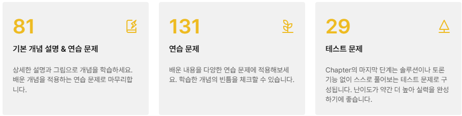

### **⬛︎ 목차**

💡 [**코드트리 체험 계기**](#코드트리_체험_계기)  
🖇 [**코드트리 체험기 > 좋았던 점**](#코드트리_체험기_좋았던_점)  
🖇 [**코드트리 체험기 > 아쉬웠던 점**](#코드트리_체험기_아쉬웠던_점)  
♻️ [**마무리**](#마무리)  

## 💡 코드트리 체험 계기  {#코드트리_체험_계기}

**글 쓰는 개발자 모임 (”글또”)**를 통해 얻게된 코드트리 한달 체험권으로 “**코드트리 챌린지 2기**”를 진행하며 작성하였습니다.  

저는 주로 백준, 프로그래머스, LeetCode 등의 사이트에서 알고리즘을 학습하며 문제를 풀어봤었는데 코드트리는 어떤 특징이 있는지 한번 살펴보겠습니다.

## 🖇 코드트리 체험기 > 좋았던 점  {#코드트리_체험기_좋았던_점}

### **1. 유저 친화적인 커리큘럼**

코드트리의 [<u>첫 페이지</u>](https://www.codetree.ai/trail-info)에 입장하면 가장 먼저 Level별로 분류된 6개의 커리큘럼을 확인해 볼 수 있습니다.  
또한, 각 커리큘럼별로 다른 유형의 알고리즘을 학습할 수 있고 총 문제 수도 직관적으로 알 수 있습니다.

 

   

   

 

1-1) Novice Low

- C, Python, Java 등 다양한 언어의 기초 문법을 학습할 수 있습니다.  
    

   
     

   

1-2) Novice Mid

- 기초 구현력과 디버깅 능력을 배울 수 있습니다. 
    

   
     

   

1-3) Novice High

- 문제 해결에 사용되는 알고리즘과 자료구조들을 학습할 수 있습니다.
    

   
     

   

1-4) Intermediate Low

- BFS, DFS, DP 등 간단한 알고리즘을 학습할 수 있습니다.
    

   
     

   

1-5) Intermediate Mid

- Two Pointer, 이분 탐색 등 시간 최적화에 사용되는 알고리즘과 고급 자료구조들을 학습할 수 있습니다.
    

   
     

   

1-6) Intermediate High 

- Tree, Topological Sort, Disjoint Set 등의 심화 알고리즘을 학습할 수 있습니다.
    

   
     

   

각 커리큘럼에는 Chapter가 있고 Chapter 안에는 Lesson들이 있습니다.. 

Lesson의 문제들에는 평균 풀이 시간, 경험치(XP), 난이도가 유저 친화적으로 적혀 있어 문제를 풀기 전 얼마만큼의 시간이 소요될지 가늠해 볼 수 있습니다.

 

   

### 2. 문제마다의 상세한 해설 제공

제가 이용해본 코딩 테스트 플랫폼(프로그래머스, 백준 등)에서는 문제를 해결한 후 다른 참여자들의 답안을 확인하며 최적의 코드를 비교해볼 수 있었습니다.

코드트리의 최대 장점으로는 해설을 제공해 준다는 것입니다.  
각 문제마다 **어떤 알고리즘을 사용해 접근해야 하는지 코드와 함께 제시**해주고, 친절하게 **시간 복잡도 또한 표기**되어 있습니다.   
그래서 모르는 문제를 마주했을때 Best 풀이 과정을 빠르게 습득할 수 있어 좋았습니다.  

 

   

## 🖇  코드트리 체험기 > 아쉬웠던 점   {#코드트리_체험기_아쉬웠던_점}

코드트리 입문자 분들에게는 Level 별로 문제에 접근해 한 문제씩 풀어나가는게 큰 도움이 될수 있습니다.

반면에 알고리즘 숙련자 분들의 경우에는 특정 알고리즘만 선별하여 풀고 싶은 경우가 생길수 있기 때문에 기존 메인 화면의 각 Level -> 알고리즘 순으로 문제로 접근하는 방식외에 각 알고리즘 > 난이도 순으로 문제에 바로 접근하는 방식도 있었으면 하는 아쉬움이 조금 남았습니다.

풀고 싶은 알고리즘만 선택해 마이페이지 등에서 선별된 알고리즘만 풀수 있는 기능도 추가되면 좋을것 같다는 생각을 하던 도중 북마크 기능이 그 역할을 해준다는 것을 알게 되어 만족감을 느꼈습니다.

   

## ♻️ **마무리**   {#마무리}

짧다면 짧고 길다면 긴 한달이라는 시간이 주어졌는데, 회사도 다니고 다른 일정들도 있어 코드트리 챌린지에 많은 시간을 할애하지는 못하였습니다.

그래서 체험 기회가 더 주어진다면,  『맞춤형 학습 코스』, 『실력 진단』, 『기출 문제』, , 『깃허브 연동』에 도전해 볼 계획입니다. 

   

## 📃 참고

1. 코드트리 사이트
    - [https://www.codetree.ai/trail-info](https://www.codetree.ai/trail-info)