

### **⬛︎ 목차**

&ensp;&ensp;<b>[🔓︎ 들어가며
](#들어가며) </b>
&ensp;&ensp;<b>[👨🏻‍💻 글또 소개
](#글또_소개) </b>
&ensp;&ensp;&ensp;&ensp;&ensp;[● ‘글또’란?](#글또란)
&ensp;&ensp;&ensp;&ensp;&ensp;[● ‘글또’ 10기 활동](#글또_10기_활동)
&ensp;&ensp;&ensp;&ensp;&ensp;[● 글또 10기 참여 인원](#글또_10기_참여_인원)
&ensp;&ensp;<b>[📃 ‘나‘의 글또 활동
](#나의_글또_활동) </b>
&ensp;&ensp;&ensp;&ensp;&ensp;[✍️ 글또에서 작성한 글](#글또에서_작성한_글)
&ensp;&ensp;&ensp;&ensp;&ensp;[🙋‍♂ 참여한 소모임 채널](#참여한_소모임_채널)
&ensp;&ensp;&ensp;&ensp;&ensp;[☕ 커피챗 ](#커피챗)
&ensp;&ensp;&ensp;&ensp;&ensp;[📨 종이비행기 ](#종이비행기)
&ensp;&ensp;&ensp;&ensp;&ensp;[🎋 대나무숲 ](#대나무숲)
&ensp;&ensp;<b>[🔒︎ 마치며](#마치며) </b>
&ensp;&ensp;<b>[📃 참고](#참고) </b>

## 🔓︎ 들어가며  {#들어가며}

“[🔗**글또 10기 여정을 시작하며**](https://gusdn7142.github.io/other/%EA%B8%80%EB%98%90_10%EA%B8%B0_%EC%97%AC%EC%A0%95%EC%9D%84_%EC%8B%9C%EC%9E%91%ED%95%98%EB%A9%B0/)”에서 다짐했던 목표와 계획들을 얼마나 성취했는지, 또 어떤 활동들을 했는지 돌아보기 전에, 글또에 대한 소개를 먼저 적어보았다.

## 👨🏻‍💻 글또 소개  {#글또_소개}

### **‘글또’란?**  {#글또란}

‘글 쓰는 또라이가 세상을 바꾼다’는 의미에서 시작된 개발자 글쓰기 커뮤니티이다.  
글또의 핵심 활동은 블로그 글 작성이며, 2주에 한 번씩 총 12회에 걸쳐 기술 블로그를 작성해야 한다.

### **‘글또’ 10기 활동**  {#글또_10기_활동}

나는 2024년 10월부터 2025년 3월까지 글또 10기에 참여해 활동했다.   
블로그 작성 외에도 커피챗, 네트워킹, 모각공, 다양한 소모임 채널에 참여하며 많은 인사이트를 얻을 수 있었다.   
나에게 글또는 오랫동안 기억에 남을, 따뜻하고 소중한 커뮤니티가 될것 같다.  

### **글또 10기 참여 인원** {#글또_10기_참여_인원}
&nbsp;&nbsp;&nbsp;&nbsp;&nbsp;● 총 639명 참여   

&nbsp;&nbsp;&nbsp;&nbsp;&nbsp;● 참여자 비율  
&nbsp;&nbsp;&nbsp;&nbsp;&nbsp;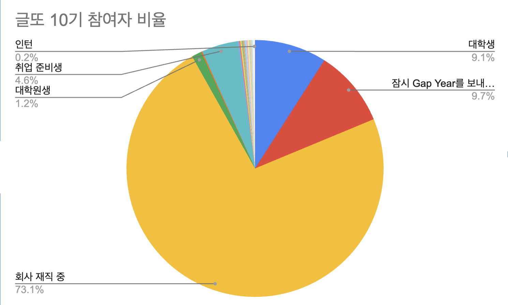    
&nbsp;&nbsp;&nbsp;&nbsp;&nbsp;
  [🔗출처 : [https://geultto.github.io/blog/geultto-story/geultto-10th-midterm-retrospective/](https://geultto.github.io/blog/geultto-story/geultto-10th-midterm-retrospective/)]

&nbsp;&nbsp;&nbsp;&nbsp;&nbsp;● 직군 비율  
&nbsp;&nbsp;&nbsp;&nbsp;&nbsp;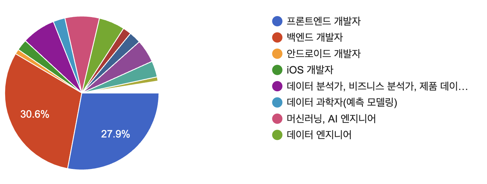    
&nbsp;&nbsp;&nbsp;&nbsp;&nbsp;
  [🔗출처 : [https://geultto.github.io/blog/geultto-story/geultto-10th-midterm-retrospective/](https://geultto.github.io/blog/geultto-story/geultto-10th-midterm-retrospective/)]

## 📃 ‘나‘의 글또 활동  {#나의_글또_활동}

### ✍️ 글또에서 작성한 글 {#글또에서_작성한_글}

글또 활동을 통해 총 14편의 글을 작성했다.

사실 글또에 합류하기 전까지만 해도 GitHub 블로그조차 없던 나였지만, 역시 사람은 뭐든 시작하면 적응하게 된다는 사실을 다시 한 번 깨달았다..

PASS한 마지막 회차를 제외하고는 모든 회차에 글을 작성했고, 2주 동안 무려 3개의 글을 올린적도 있었다.

그중 하나가 바로 Java 8, 11, 17, 21 버전을 정리한 Java 버전 톺아보기 시리즈였다.  
6개월 동안 작성한 주요 Tech 블로그 글은 아래와 같다   

- [🔗[Book Review] SQL 첫걸음](https://gusdn7142.github.io/db/Book-Review_SQL_%EC%B2%AB%EA%B1%B8%EC%9D%8C/)
- [🔗[SpringBoot] Excel 파일에서 데이터 추출](https://gusdn7142.github.io/spring/Excel-%ED%8C%8C%EC%9D%BC-%EB%8D%B0%EC%9D%B4%ED%84%B0-%EC%B6%94%EC%B6%9C-SpringBoot/)
- [🔗[SpringBoot] Swagger 적용기](https://gusdn7142.github.io/spring/Swagger-%EC%A0%81%EC%9A%A9%EA%B8%B0-SpringBoot/)
- [🔗[Java] Various Types](https://gusdn7142.github.io/java/Various_Types_in_Java/)
- [🔗[Java] Collection](https://gusdn7142.github.io/java/Java-Collection/)
- [🔗[Java] 8버전 톺아보기](https://gusdn7142.github.io/java/Java_8%EB%B2%84%EC%A0%84_%ED%86%BA%EC%95%84%EB%B3%B4%EA%B8%B0/)
- [🔗[Java] 11버전 톺아보기](https://gusdn7142.github.io/java/Java_11%EB%B2%84%EC%A0%84_%ED%86%BA%EC%95%84%EB%B3%B4%EA%B8%B0/)
- [🔗[Java] 17버전 톺아보기](https://gusdn7142.github.io/java/Java_17%EB%B2%84%EC%A0%84_%ED%86%BA%EC%95%84%EB%B3%B4%EA%B8%B0/)
- [🔗[Java] 21버전 톺아보기](https://gusdn7142.github.io/java/Java_21%EB%B2%84%EC%A0%84_%ED%86%BA%EC%95%84%EB%B3%B4%EA%B8%B0/)
- [🔗Apache Jmeter 톺아보기 - 1. Intro & Install](https://gusdn7142.github.io/performance/Apache_Jmeter_%ED%86%BA%EC%95%84%EB%B3%B4%EA%B8%B01_Intro_&_Install/)
- [🔗Apache Jmeter 톺아보기 - 2. 성능테스트 이해](https://gusdn7142.github.io/performance/Apache-Jmeter-%ED%86%BA%EC%95%84%EB%B3%B4%EA%B8%B02_%EC%84%B1%EB%8A%A5%ED%85%8C%EC%8A%A4%ED%8A%B8_%EC%9D%B4%ED%95%B4/)

작성한 글의 대부분은 회사 업무와 연관되어 있다.

예를 들어, 사내 최초로 Swagger API를 적용하며 학습한 내용을 정리하기도 했고, Java 8에서 17로 프로젝트 버전을 업그레이드하며 각 버전의 주요 특징을 비교한 글도 남겼다.

### **🙋‍♂ 참여한 소모임 채널** {#참여한_소모임_채널}

| 유형 | 소모임 채널 |
| --- | --- |
| 내면 성찰 | **감사회고해또**, 일기써또, **책읽어또**, 데일리 크리에이또 |
| 생산적인 삶 & 자기계발 | **다진마늘**, 시공삶(’시간을 공유하는 삶’), 쓸모또 (’쓸만한_10분_모각글또’), 모비숲, 앱-만들어또, 미룬이 챌린지, 튜사또 |
| 지역기반 모임 | 인천에도 글또이또 |
| 취미 | 뮤직스타또, 오늘도 절약해또, 피크민또 |
| 커리어 발전 | 업그레이드또, **넥스또** 스위치 ON, 이력또 |

10월에는 **감사회고해또**, 11월에는 **책읽어또**, 12월에는 **다진마늘**과 **피크민또**, 1월에는 **쓸모또**, 2월에는 **시공삶**, 3월에는 **넥스또**에 참여하며 매달 하나 이상의 소모임에 도전했다.

이러한 경험을 통해 **새로운 것에 도전하는 데 대한 두려움**을 점점 줄여나갈 수 있었다.  
내가 참여했던 여러 채널 중, 특히 기억에 남는 경험들은 다음과 같다.  

**1️⃣ 감사회고해또**

- 이 채널은 “$감사회고”라는 제목으로 글을 시작하며, 아주 사소한 것에도 감사함을 느껴보자는 취지로 만들어졌다.
- 나는 슬랙의 **감사회고해또** 채널에 2~3일에 한 번씩 감사회고를 남기곤 했는데, 돌아보면 보람 있었던 시간들이었다.
- 다른 분들의 감사회고를 보면서도 사람마다 어떤 것에 감사함을 느끼며 하루를 살아가는지 알 수 있었고, 그 자체로도 매우 뜻깊은 경험이었다.
- 지금 떠오른 감사회고 에피소드는 다음과 같다.   
    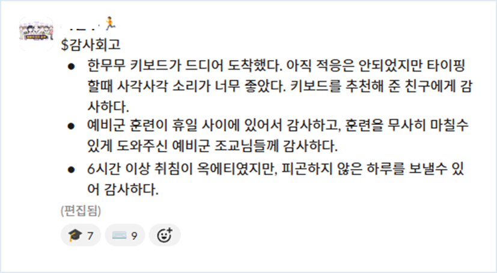        
    
    [출처 : 글또 슬랙]
        
    예비군 훈련을 건강하고 무사히 마칠 수 있었던 일,   
    처음 접한 기계식 키보드의 세계,    
    오랜만에 깊이 잠든 날의 숙면처럼     
    일상 속 작은 순간들이 감사의 대상으로 다가왔다.

**2️⃣ 책읽어또**

- **책읽어또**는 독서를 장려하는 소모임으로, 매일 책 10장(약 20페이지)을 읽고, 그 안에서 인상 깊은 문장을 한 줄 이상 기록해 인증하는 방식으로 운영되었다.
- 나는 첫 번째 책인 『김미경의 딥마인드』를 하루에 약 20페이지씩 읽으며 10일 만에 완독했다.
- 이후에는 독서 속도가 조금 느려졌지만 꾸준히 책 읽기를 이어갔고, 『빠르게 실패하기』도 완독에 성공했다. 현재는 『개발자의 원칙』과 『우울한 마음도 습관입니다』를 읽고 있다.
- 지금까지 내가 선택한 책들은, **현재의 삶에 만족하며 안주하지 않고, 나 자신을 더 깊이 이해하고 성장하고자 하는 마음에서 고른 책들이었다.**
- 특히 『김미경의 딥마인드』와 『빠르게 실패하기』는 ‘글또 큐레이션’에도 등재되어, 많은 분들에게 소개되기도 했다.     
    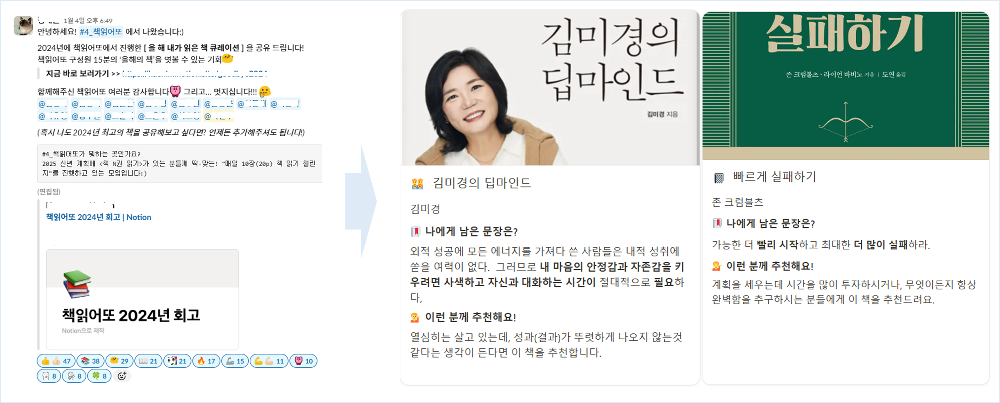        
    
    [출처 : 글또 슬랙]
    
    

**3️⃣ 다진마늘**

- 내가 지난 4개월간 가장 활발하게 참여한 채널 중 하나인 **다진마늘**은 아직까지도 거의 매일 꾸준히 참여하고 있다.
- 이 채널은 **월말에 회고를 작성하고 다음 달 목표를 노션에 기록**하며 목표 달성을 위해 생산적인 삶을 다짐하고 실천하는 모임이다.
- 매일 자신이 실천할 **To Do List**를 슬랙 스레드의 댓글에 작성하고, 실제로 행동으로 옮기면 **취소선 표시**를 하여 목표 달성 정도를 명확하게 나타내 성취감을 느낄 수 있는 채널이다.
- 2025년 4월 11일 기준, **글또 10기**가 마무리되었음에도 불구하고, 여전히 활발하게 운영 중이며, 오늘도 **총 45명의 인원**이 참여하였다.   
    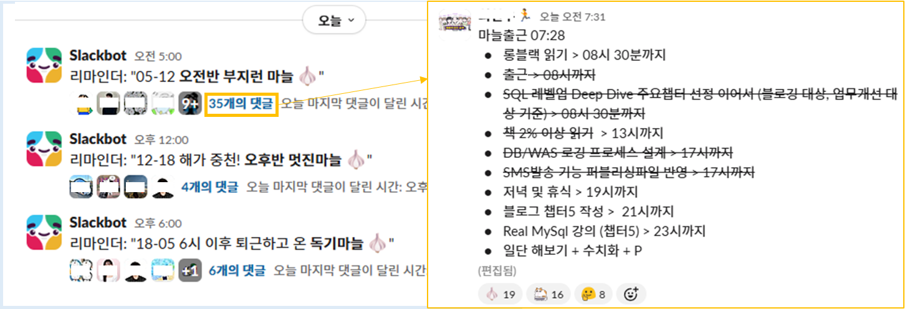        
    
    [출처 : 글또 슬랙]
    

    

4️⃣ **쓸모또** 

- 쓸모또는 ‘쓸만한 10분 모각글또’의 줄임말로, **매일 꾸준한 글쓰기**를 통해 글쓰기에 대한 부담감과 막연한 두려움을 줄이고, 작은 성취를 단계적으로 체감하며 **지속 가능한 글쓰기 습관**을 만드는 것을 목표로 하는 소모임이다.
- 매일 오후 9시부터 10시 사이, **게더타운에 모여 함께 글쓰기를 진행**하며, 매주 **최소 2회 이상 참여**가 기본 규칙이었지만, 유연하게 운영되었다.
- 2주마다 새로운 인원을 모집하며, 나는 **1월 중순부터 한 달 이상 참여**했다.
- 참여 후기를 남기자면, 직장인으로서 매주 저녁 시간을 확보하는 것이 쉽지 않았지만, 게더타운이라는 집중력 높은 환경 덕분에 그 시간만큼은 글쓰기에 온전히 몰입할 수 있었다.    
    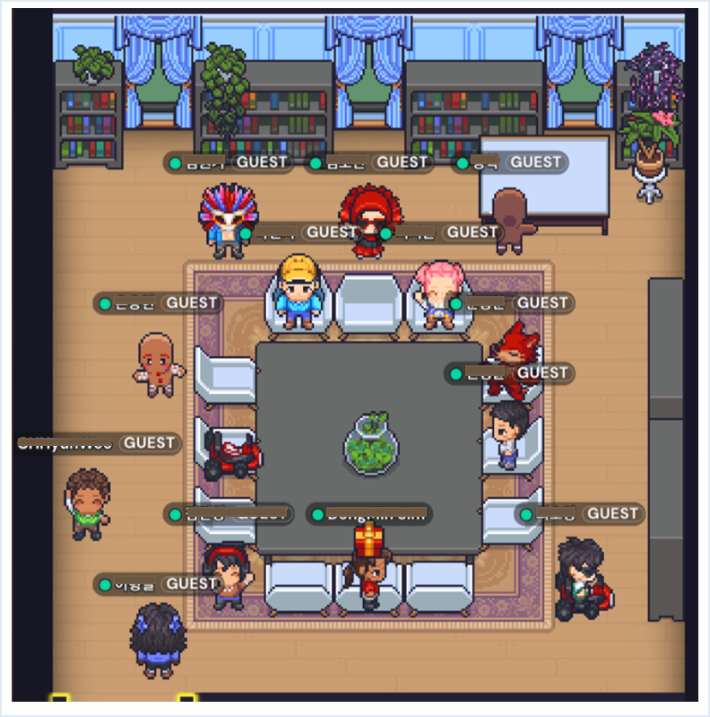        
    
    [출처 : 글또 게더타운]
    

    

4️⃣ **넥스또_스위치_ON**  

- 먼저 넥스또_스위치_ON 챌린지는 **한달 동안** **자신만의 목표를 구체화하고 팀원들과 공유함으로써 함께 동기를 부여받고, 성장과 발전을 도모하는** 취지로 만들어졌다.
- 평소 계획과 목표 설정에 관심이 많아 참여하고자 생각 했었는데, 모임장님과 얘기를 나누다 얼떨결에 **운영진**으로 합류하게 되었다.
- 3명의 조원들과 함께 목표를 세우고, 이를 **임파서블 미션**, **파서블 미션**, **마이크로 미션**으로 나누어 한 달 동안 실천해 나갔다.
- 목표를 설정하고 미션을 세부적으로 나누는 데 시간이 많이 걸려 미션 수행에 충분한 시간을 투자하지는 못했지만, 매주 조원들과 **미션 회고**를 진행하며 **메타 인지**를 통해 계획을 계속 수정해 나갔다.
- 결국 **넥스또_스위치_ON** 챌린지가 끝날 무렵, 내가 세운 목표를 대부분 달성할 수 있었다. 혼자서 이룬 것이라고 생각하기보다 조원들과 함께 **으쌰으쌰**하며 동기부여를 얻어 목표를 달성할 수 있었다고 생각한다.
- 마지막 회차에는 **모임장님**께서 감사하게도 **상장**을 만들어 주셨다. 사실 이 기간 동안 **야근**이 많아 미션 수행에 어려움이 있었지만, 그럼에도 불구하고 끝까지 포기하지 않고 목표를 이루게 되어 보람있는 경험이었다.    
    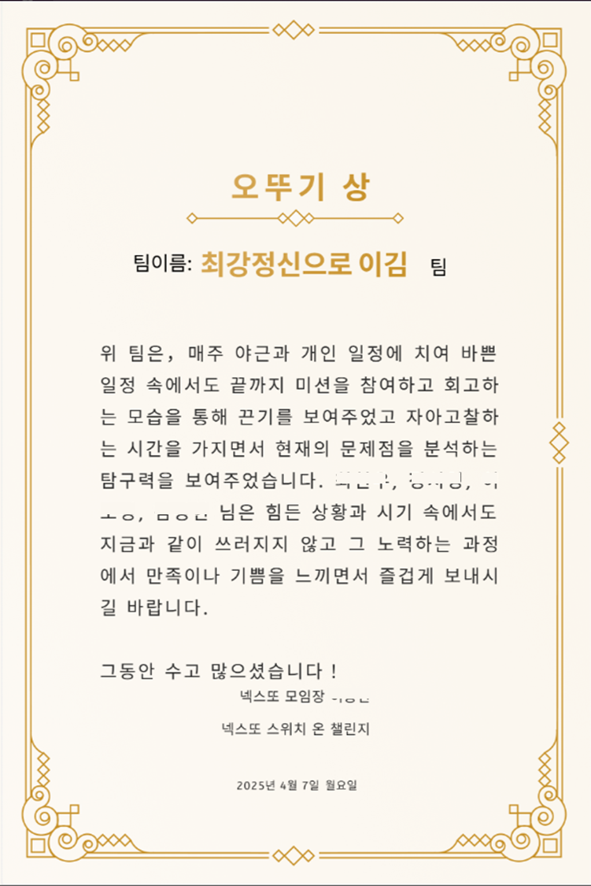        
    
    [출처 : 글또 슬랙]
        
    

**5️⃣ 튜사또**  

- **튜사또**는 내가 단독으로 추진한 오프라인 모각공 모임이었다. 글또와 협약을 맺어 이용할 수 있는 작업 공간인 **튜링의 사과**’에서 함께 **모각공**을 할 파티원을 약 한 달간 주말마다 모집했었다.   
            
    
    [🔗[배경 출처 : '무한도전 - 박명수의 기습 공격' 3편 MBC090516방송](https://www.youtube.com/watch?v=d7hovqsJ2dE)]
        
- 참여자 모집 공고의 이름에 ‘기습공격’이 붙은 이유는 ‘무한도전’의 ‘박명수의 기습공격’에서 영감을 받아 지은 것이다. 예상보다 많은 분들이 지원해 주셔서, 매번 4명에서 최대 8명까지 함께 **튜사**를 다녀왔다.
- 시간은 **10 to 10**로, 점심부터 저녁까지 공부나 글쓰기를 하며 온종일 시간을 보냈다. 그러다보니 주말이 순식간에 지나갔다.
- 이 경험을 통해 나는 사람들을 모아 함께 무언가를 해나가는 과정에 흥미를 느끼고, 그런 활동을 기획하고 운영하는 데 강점이 있다는 사실을 알게 되었다. 실제로 튜링의 사과 이용 방법 안내(+대여 서비스)는 물론, 맛집 지도 제공과 식사 인원 분배 등 전반적인 관리를 주도적으로 수행하며 참여자 분들에게 실질적인 정보를 제공해 주었다.      
            
    
    
    [🔗[참고 : 튜링의 사과 이용 안내](https://velog.io/@turingapple/%EC%84%B1%EC%88%98%EB%8F%99-%ED%8A%9C%EB%A7%81%EC%9D%98-%EC%82%AC%EA%B3%BC-%EC%9D%B4%EC%9A%A9-%EC%95%88%EB%82%B4)]
        

### ☕ 커피챗  {#커피챗}

- 아래는 3월에 진행한 커피챗 활동을 정리한 기록이다. 현재까지 합산해보니, 총 15번 이상의 커피챗을 경험한 것 같다.    
    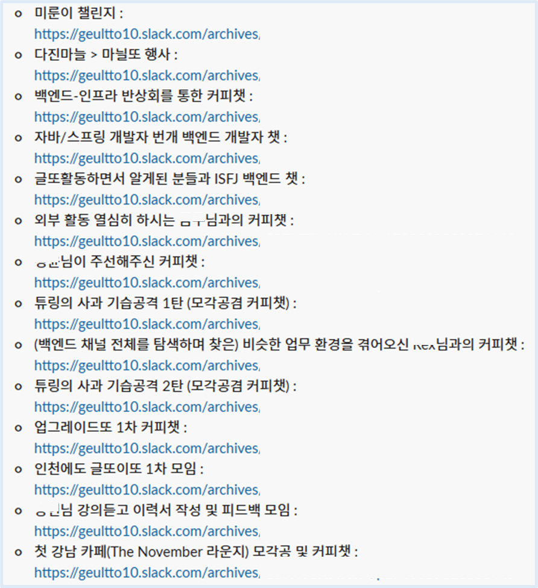        
    
    [출처 : 글또 슬랙]
            
- 글또에 오기 전까지는 커피챗이라는 개념 자체가 낯설었다. 궁금해서 GPT에 물어보니, 아래와 같은 답변을 받았다.     
    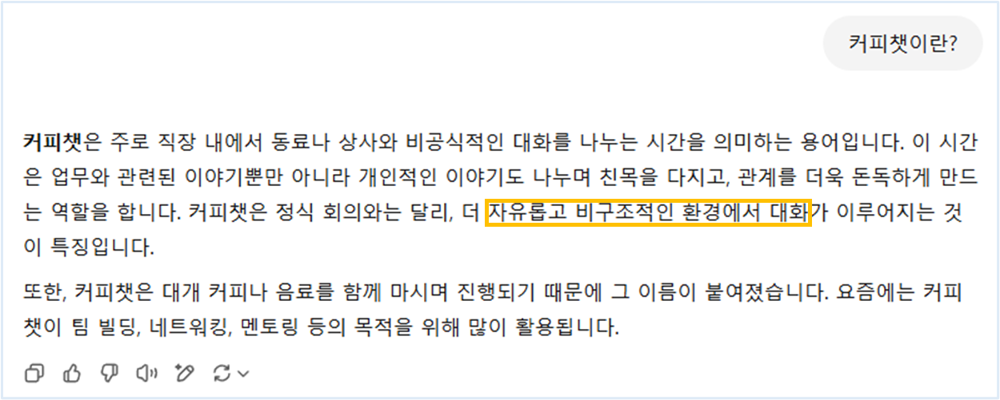        
    
    [출처 : 글또 슬랙]
            
- GPT가 말해준 것처럼 편안한 분위기에서 기술, 커리어, 가치관 등 다양한 이야기를 나눌 수 있을 거라 생각해 여러 커피챗에 참여했다. 걱정과는 달리, 자연스럽게 이야기를 주고받으며 많은 인사이트를 얻을 수 있었다.
- 글또는 끝났지만, 여전히 커피챗 약속을 잡은 분들이 많아 다시 커피챗을 시작해볼 계획이다.
    

### ✈️ 종이비행기  {#종이비행기}

- 글또 10기에 처음 생긴 기능이었는데,  2025년 4월 11일 기준 총 **43개**의 종이비행기를 받았고, **68개**의 종이비행기를 보냈었다.     
     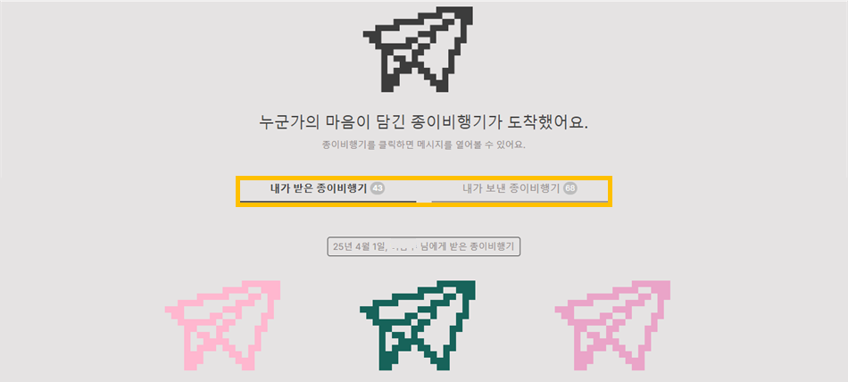        
    
    [출처 : 글또 슬랙]
            
- 슬랙에서 나의 활발한 글또 활동을 보며 삶의 동기부여가 되었다며 종이비행기를 보내주신 분도 계셨, 나의 정성이 가득 담긴 커피챗 후기를 보고 커피챗 신청에 대한 용기를 얻으셨다고 메시지를 보내주신 분도 계셨다.
- 나 또한 삶을 진취적이고 주도적으로 살아가시는 분들, 어려운 취준 시절을 보내고 계시는 분 등등 많은 분들에게 응원의 종이비행기를 보내곤 했었다.

### 🎋 대나무숲  {#대나무숲}
- 오픈소스로 제공되는 대나무 숲은 아래와 같은 목적으로 사용할 수 있다.  
     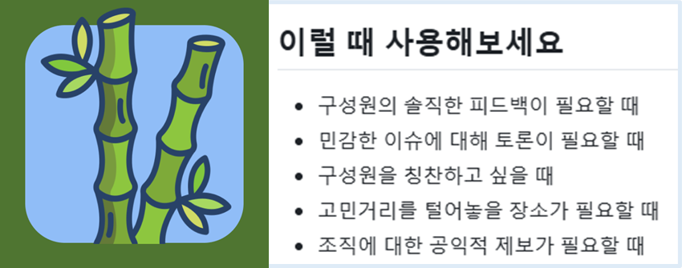        
    
    [출처 : [https://github.com/wormwlrm/bamboo-forest](https://github.com/wormwlrm/bamboo-forest)]
           
- 나도 익명으로 개인적인 고민을 몇 번 올려본 적이 있다.
- 글또가 마무리될 무렵, 대나무 숲에 따뜻한 글 하나가 올라왔다.  
     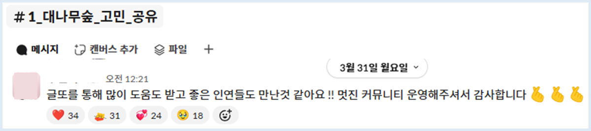        
    
    [출처 : 글또 슬랙]
               
- 이 글처럼, 나도 글또에서 좋은 사람들을 많이 만나며 인사이트를 얻고 배우며 그 경험을 나누었다.

## **🔒︎ 마치며**  {#마치며}

설날 무렵에 **지니 봇**이 복주머니를 전달해 주었는데, 나름 열심히 활동하고 있었기에, 그때 기분이 정말 뿌듯했다.  

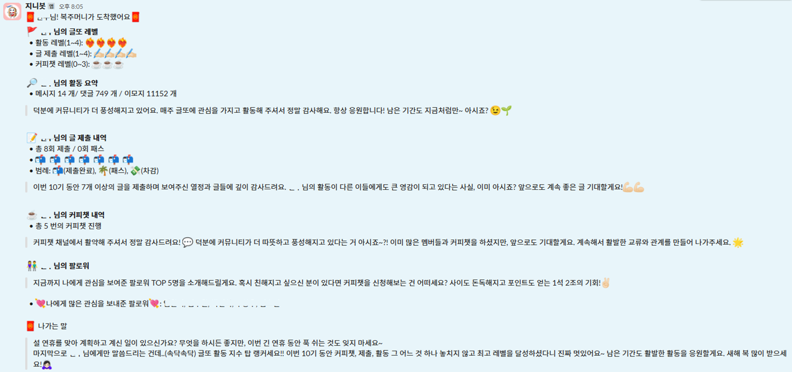        

[출처 : 글또 슬랙]
       

글또가 끝나갈 무렵, 처음에 세웠던 [🔗**세 가지 목표**](https://gusdn7142.github.io/other/%EA%B8%80%EB%98%90_10%EA%B8%B0_%EC%97%AC%EC%A0%95%EC%9D%84_%EC%8B%9C%EC%9E%91%ED%95%98%EB%A9%B0/)를 다시 떠올려봤다. 세 가지 모두 90% 이상은 달성했다고 느껴져 글또 10기 활동을 보람 있게 마무리할 수 있었다.

1. **Pass 없이 2주에 한번씩 글 업로드**
    - 14회차까지 꾸준히 달려오며, 한 회차에 글을 세 번이나 작성했던 적도 있었는데 글쓰기 습관을 유지하기 위해 PASS는 사용하지 않았다.   
    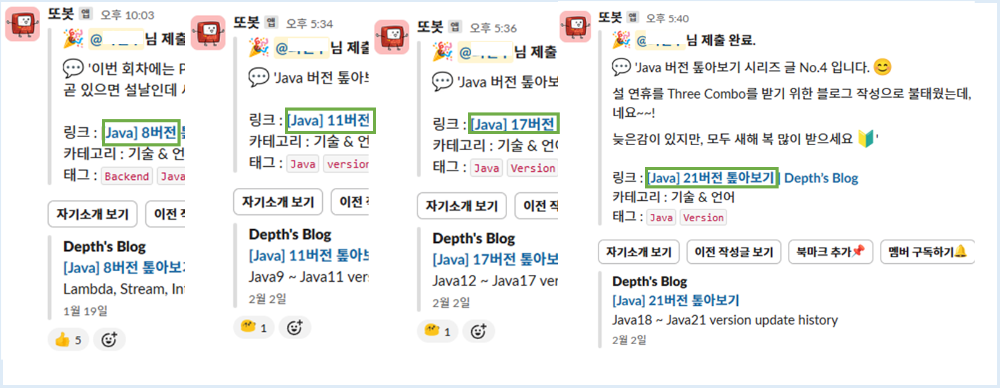        
    
    [출처 : 글또 슬랙]
           
    - 하지만 결국 다른 일들로 바빠지면서 15회차에는 글을 쓸 엄두가 나지 않아 처음으로 PASS권을 사용했다. 그럼에도 이 포스팅을 계기로 다시 글쓰기를 이어가고자 한다.  
    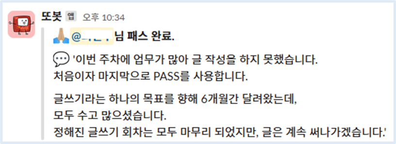        
    
    [출처 : 글또 슬랙]
                   
2. **많은 개발자 분들과 소통하기**
    - 다진마늘의 ‘마니또’ 행사, 넥스또의 ‘미룬이 챌린지’, 업그레이드또의 단체 커피챗, 넥스또의 ‘넥스또_스위치_ON’, 튜사또, 그리고 다수의 커피챗을 통해 다양한 개발자들과 교류할 수 있었다.
    - 내향적인 성향(I)이라 처음엔 낯선 사람들을 만나고 나면 에너지가 방전되었지만, 이런 경험이 쌓이면서 점점 익숙해졌고, 이제는 에너지를 잘 유지할 수 있는 힘도 생겼다.
3. **소모임 활동하기**
    - 위에서 적은 것과 같이 나는 주로 활발한 분위기의 ‘Hot’한 소모임 채널들에 참여하며 활동을 했다.
    - 사실 글또에는 수많은 소모임 채널이 있었는데, 직접 활동하지 않은 채널에서도 스레드 글들을 통해 다양한 정보와 인사이트를 얻었다.

**글또를 통해 다양한 도전과 소중한 경험을 쌓을 수 있어 뜻깊었다.** 
앞으로도 주도적이고 능동적인 삶을 살아가려는 마음가짐을 잃지 않으려 한다.

애플의 창업자이자 혁신가인 스티브 잡스는 인생의 경험들이 훗날 서로 연결된다는 의미로 **‘커넥팅 더 닷(connecting the dots)’**이라는 말을 남겼다.

지금 돌아보면, 글또에서의 경험과 그 안에서 만난 사람들과의 인연도 그런 ‘점’들 중 하나였던 것 같다.

열심히 살아가는 사람들이 **서로 연결되어, 긍정적인 영향을 주고받으며 더 의미 있고 따뜻한 삶을 함께 만들어가는 모습**. 그런 모습이야말로 내가 바라는 이상적인 사회의 모습인것 같다.

**마지막으로, 10기 동안 글또를 운영해주신 성윤님과 운영진분들, 함께 글을 쓰고 활동했던 모든 분들께 감사의 마음을 전합니다.**

## **📃 참고**  {#참고}

1. 2024년 회고글
    - [https://gusdn7142.github.io/other/2024년_톺아보기/#나의_목표](https://gusdn7142.github.io/other/2024%EB%85%84_%ED%86%BA%EC%95%84%EB%B3%B4%EA%B8%B0/#%EB%82%98%EC%9D%98_%EB%AA%A9%ED%91%9C)
2. 다른 분들의 글또 10기 회고글
    - [https://velog.io/@wisepine/글또를-활동을-마치며-9기-10기-회고](https://velog.io/@wisepine/%EA%B8%80%EB%98%90%EB%A5%BC-%ED%99%9C%EB%8F%99%EC%9D%84-%EB%A7%88%EC%B9%98%EB%A9%B0-9%EA%B8%B0-10%EA%B8%B0-%ED%9A%8C%EA%B3%A0)
    - [https://chordplaylist.tistory.com/368#4. 앞으로의 다짐-1](https://chordplaylist.tistory.com/368#4.%20%EC%95%9E%EC%9C%BC%EB%A1%9C%EC%9D%98%20%EB%8B%A4%EC%A7%90-1)
    - [https://www.reese-log.com/geultto-10th-retrospective](https://www.reese-log.com/geultto-10th-retrospective)
    - [https://velog.io/@devohda/글또-10기를-마무리하며](https://velog.io/@devohda/%EA%B8%80%EB%98%90-10%EA%B8%B0%EB%A5%BC-%EB%A7%88%EB%AC%B4%EB%A6%AC%ED%95%98%EB%A9%B0)
3.  글또 10기의 활동 중간 점검 설문 결과
    - [https://geultto.github.io/blog/geultto-story/geultto-10th-midterm-retrospective/](https://geultto.github.io/blog/geultto-story/geultto-10th-midterm-retrospective/)
4. 글또 소개글
    - [https://geultto.github.io/](https://geultto.github.io/)
    - [https://geultto.github.io/blog/geultto-summary/](https://geultto.github.io/blog/geultto-summary/)