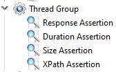

### **⬛︎ 목차**

&ensp;&ensp;<b>[1️⃣ Jmeter 사용 계기](#Jmeter_사용_계기) </b>
&ensp;&ensp;<b>[2️⃣ Jmeter 소개](#Jmeter_소개)</b>
&ensp;&ensp;<b>[3️⃣ Jmeter 다운로드 및 설치](#Jmeter_다운로드_및_설치)</b>
&ensp;&ensp;<b>[4️⃣ Jmeter Elements 이해](#Jmeter_Elements_이해)</b>
&ensp;&ensp;<b>[📂 마무리](#마무리)</b>

## 1️⃣ **Jmeter 사용 계기** {#Jmeter_사용_계기}

성능 테스트 도구로는 **JMeter, nGrinder, Apache Bench (AB), Wrk** 등 여러 가지가 있습니다.
그중에서도 JMeter가 레퍼런스가 많고 접근성이 좋아, 먼저 사용해 보았습니다.

앞으로 JMeter뿐만 아니라 다양한 성능 테스트 도구를 학습하고 비교 분석할 예정입니다.
이 과정에서 얻은 지식과 경험을 정리하여, 효율적인 성능 테스트 전략을 마련하는 것을 목표로 합니다.

## 2️⃣ Jmeter 소개 {#Jmeter_소개}

[**🔗 공식 문서**](https://jmeter.apache.org/)에서는 Apache Jmeter에 대해 아래와 같이 소개되어 있습니다.

> *The **Apache JMeter™** application is open source software, a 100% pure Java application designed to load test functional behavior and measure performance.   
> It was originally designed for testing Web Applications but has since expanded to other test functions.*   
> - *아파치 JMeter 애플리케이션은 성능 측정과 기능 동작 부하 테스트를 위한 **100% 순수 자바 애플리케이션인  오픈소스 소프트웨어**입니다.    
> 원래 웹 애플리케이션 테스트용으로 설계되었지만, 이후 다른 테스트 기능으로도 확장되었습니다.*  

> **JMeter is not a browser,** it works at protocol level.  
> JMeter does not perform all the actions supported by browsers. In particular, JMeter does not execute the Javascript found in HTML pages.  
> Nor does it render the HTML pages as a browser  
> - *Jmeter는 브라우저가 아니며 프로토콜 수준에서 동작합니다.  
> JMeter는 브라우저에서 지원하는 모든 동작을 수행하지 않습니다.   
> ⚠️ **JMeter는 HTML 페이지에서 발견되는 Javascript를 실행하지 않습니다.**   
> 또한 브라우저에서처럼 HTML 페이지를 렌더링하지도 않습니다*   

JMeter를 활용하면 웹 애플리케이션뿐만 아니라 다양한 환경에서도 성능 테스트를 수행할 수 있습니다.

### 지원하는 테스트 유형

| 종류 | 설명 |
| --- | --- |
| 웹 애플리케이션 테스트 | - HTTP, HTTPS 기반의 웹사이트 및 API 테스트   - Java, NodeJS, PHP, ASP.NET 등 다양한 언어와 프레임워크 지원 |
| API 테스트 | - REST 및 SOAP 웹 서비스 테스트   - JSON, XML 응답 데이터 검증 및 데이터 추출 가능 |
| 파일 및 데이터 전송 테스트 | - FTP 업로드/다운로드 테스트   - 데이터베이스(JDBC) 쿼리 실행 및 성능 분석 |
| 메시징 및 네트워크 테스트 | - 메시지 큐(MOM) 시스템(JMS) 성능 테스트   - SMTP, POP3, IMAP을 통한 이메일 서비스 테스트 |
| 스크립트 및 명령어 실행 | - Native Shell Script 및 Java Object 테스트 지원   - JSR223 기반의 Groovy, BeanShell 등의 스크립트 실행 가능 |
| 분산 테스트  | - 여러 대의 JMeter 인스턴스를 활용하여 대규모 부하 테스트 수행 |

**🏚️ 예시) Jmeter를 활용한 분산테스트 환경 이해** > Master-Slave 구조

    

  [🔗참고 : [https://jmeter.apache.org/usermanual/jmeter_distributed_testing_step_by_step.html](https://jmeter.apache.org/usermanual/jmeter_distributed_testing_step_by_step.html)]

①Controller Node (Master)

&nbsp;&nbsp;&nbsp;&nbsp;&nbsp;● JMeter의 GUI가 실행되는 시스템으로, **성능 테스트를 제어**하는 역할을 합니다.  
&nbsp;&nbsp;&nbsp;&nbsp;&nbsp;● 테스트 계획을 설정하고, 테스트 실행을 시작하며 결과를 확인해 볼 수 있습니다.

 

②Worker Nodes (Slave) 

&nbsp;&nbsp;&nbsp;&nbsp;&nbsp;● `jmeter-server`를 실행하는 시스템으로, Master Node에서 받은 명령을 바탕으로 실제 요청을 생성하고 **Target 시스템에 요청**을 보냅니다.

③Target 
  
&nbsp;&nbsp;&nbsp;&nbsp;&nbsp;● **부하 테스트의 대상이 되는 웹 서버**나 시스템으로, 이 곳에 대량의 요청을 보내 성능을 측정할 수 있습니다.

> Master-Slave 구조란?
> 
> - 웹서버 분산 테스트에서 마스터-슬레이브 구조는 마스터 노드가 전체 테스트를 제어하고 슬레이브 노드에 작업을 분배하여 대규모 부하를 생성 후 실제 사용자 환경을 시뮬레이션 하는데 사용됩니다.

## 3️⃣ Jmeter 다운로드 및 설치 > Windows 10/11 기준 {#Jmeter_다운로드_및_설치}

**1단계)** 🔗[apache jmeter 공식 홈페이지](https://jmeter.apache.org/download_jmeter.cgi)에 접속해 zip 파일 다운로드

    
&nbsp;&nbsp;&nbsp;&nbsp;&nbsp;● `Binaries > apache-jmeter-5.6.3.zip`

**2단계)** zip 파일 압축 해제 후 내부 “/bin” 폴더에서 **jmeter.bat 실행**

    

**3단계) JMeter** **Plugin [선택] 설치** 

플러그인의 경우 입문 단계에서 필수로 설치할 필요는 없습니다. 기본으로 제공되는 기능에서 부족함을 느낄 경우 검색하여 설치하시는 것을 권장드립니다.

<b>설치 방법은 아래와 같습니다.</b>  

  3-1) <a href="https://jmeter-plugins.org/" target="_blank">https://jmeter-plugins.org/</a> 사이트 접속

3-2) Install 탭에서 jar 파일 다운로드

    

3-3) 다운로드한 jar 파일을 jmeter 폴더의 lib/ext 폴더로 이동 

3-4) Jmeter 재시작 후, 우측 상단의 Plugin Manger 아이콘을 클릭해 접속  

    

3-5) 필요한 기능을 다운로드하여 설치  

## 4️⃣ Jmeter Elements 이해 {#Jmeter_Elements_이해}

Jmeter로 성능 테스트를 위해서는 테스트 구성 요소에 대한 이해가 먼저 필요합니다.

테스트에서 가장 많이 사용되는 요소는 Sampler, Config Element, Listener이므로, 이 부분을 중점적으로 살펴보시길 권장합니다.

    

  [🔗참고 : [https://www.youtube.com/watch?v=ZkEDBsAicjM&t=44s](https://www.youtube.com/watch?v=ZkEDBsAicjM&t=44s)]

### 4-1) 상위 요소

### **4-1-1) Thread Group**

    

JMeter에서 각 사용자의 동작을 시뮬레이션하는 가장 기본적인 단위로, **각 스레드는 독립적으로 실행**됩니다.  
여러개의 스레드 그룹을 사용해 다양한 시나리오를 테스트할 수도 있습니다.

✅ 주요 설정 옵션

| 설정 | 설명 |
| --- | --- |
| Number of Threads (Users) | - 동시에 요청을 보낼 스레드(==유저) 수   - ex) 1000 |
| Ramp-Up Period (seconds) | - 전체 스레드를 만드는데 소요되는 시간 (==Number of Threads 갯수만큼 도달하는데 몇 초를 사용할 것인지를 의미)   - ex) 5          |
| Loop Count | - 각 스레드가 요청을 몇 번 반복할지 설정 (무한 반복 가능)   - 10 |

### 4-2) 하위 요소

### **4-2-1) Sampler**

실제로 **요청(Request)을 서버로 보내는 역할**을 하며, HTTP, FTP, JDBC, JMS 등 다양한 프로토콜을 지원합니다.

✅ 주요 **Sampler** 종류

    

| Sampler | 설명 |
| --- | --- |
| HTTP Request | - 웹 서버에 HTTP 요청(GET, POST 등) 전송   - ex) Protocol, IP, Http Method, URL Path, Parameter 등 입력 |
| JDBC Request | - 데이터베이스에 SQL 쿼리 실행 |
| FTP Request | - FTP 서버에서 파일을 다운로드/업로드 |
| JMS Request | - JMS 메시지 큐와 연동하여 메시지 전송 |

### **4-2-2) Logic Controller**

**요청(Sampler)의 실행 순서를 제어**하는 역할을 하며, 특정 조건이나 패턴에 따라 요청을 조작할 수 있습니다.

✅ 주요 **Logic Controller** 종류

 

| **Logic Controller** | 설명 |
| --- | --- |
| Loop Controller | - 지정된 횟수만큼 샘플러 실행 |
| If Controller | - 특정 조건이 참일 때만 실행 |
| While Controller | - 조건이 참일 동안 반복 실행 |
| Switch Controller | - 여러 요청 중 특정 조건을 만족하는 것만 실행 |
| Random Controller | - 샘플러를 랜덤하게 실행 |

### **4-2-3) Pre Processors**

**샘플러(Sampler)가 실행되기 직전에 실행되는 처리 로직**으로, 요청을 사전 처리하여 데이터를 변경하거나 특정 조건을 설정할 수 있습니다.

✅ 주요 **Pre Processors** 종류

 

| Pre Processors | 설명 |
| --- | --- |
| User Parameters | - 변수 설정 및 사용자별 값 지정 |
| BeanShell PreProcessor | - BeanShell 스크립트 실행 |
| JDBC PreProcessor | - DB에서 값을 가져와서 요청 전에 설정 |

### **4-2-4) Post Processors**

**샘플러(Sampler)가 실행된 이후에 결과를 처리하는 역할을** 하며, 응답 데이터를 분석하여 변수로 저장 가능합니다.

✅ 주요 **Post Processors** 종류

 

| Post Processors | 설명 |
| --- | --- |
| Regular Expression Extractor | - 응답에서 특정 데이터를 정규식으로 추출 |
| JSON Extractor | - JSON 응답에서 특정 값을 추출 |
| XPath Extractor | - XML 응답에서 특정 값을 추출 |
| JDBC PostProcessor | - SQL 쿼리 실행 후 결과를 변수에 저장 |

### **4-2-5) Assertions**

요청의 응답이 **정상인지 검증**하는 역할을 하며, 테스트 성공/실패를 판단할 수 있도록 합니다.

✅ 주요 **Assertions**  종류

 

| **Assertions**  | 설명 |
| --- | --- |
| Response Assertion | - 응답 코드, 본문 내용 등을 검증 |
| Duration Assertion | - 응답 시간이 특정 시간 내에 있는지 검증 |
| Size Assertion | - 응답 크기(바이트 단위)를 검증 |
| XPath Assertion | - XML 응답이 특정 조건을 만족하는지 검증 |

### **4-2-6) Timer**

**요청 간에 지연 시간을 추가하여 부하 테스트를 조정**합니다.

✅ 주요 **Timer** 종류

 

| **Timer** | 설명 |
| --- | --- |
| Constant Timer | - 요청 간 일정한 시간(delay) 추가 |
| Gaussian Random Timer | - 랜덤하게 딜레이 추가 |
| Uniform Random Timer | - 균등 분포로 딜레이 추가 |
| Poisson Random Timer | - 포아송 분포 기반 딜레이 추가 |

### **4-2-7) Test Fragment**

 

**반복적으로 사용되는 테스트 요소를 모듈화**하여 저장하며, **Module Controller**를 사용하여 필요할 때 호출 가능합니다.

### **4-2-8) Config Element**

**전역 변수나 설정을 관리**하는 요소로, HTTP Header, 쿠키, 데이터베이스 연결 정보 등을 설정 가능합니다.

✅ 주요 **Config Element** 종류

 

| Config Element | 설명 |
| --- | --- |
| CSV Data Set Config | - CSV 파일에서 테스트 데이터 읽기 |
| HTTP Header Manager | - HTTP 요청의 Header 설정 |
| JDBC Connection Configuration | - DB 연결 정보 설정 |

### **4-2-9) Listener**

**테스트 결과를 수집하고 분석**하는 역할을 하며, 실행 로그, 응답 시간 등을 시각적으로 출력 가능합니다.

✅ 주요 **Listener** 종류

 

| Listener  | 설명 |
| --- | --- |
| View Results Tree | - 스레드 요청의 응답을 Tree 형식으로 확인   - Load Time (응답시간), Connect Time (서버 연결완료 시간), Latency (지연시간) |
| View Results Table | - 스레드 요청의 응답을 Table 형식으로 확인 |
| Summary Report | - 전체 성능 정보를 요약하여 제공     - Average (평균 응답시간), Min (최소 응답시간), Max (최대 응답시간), Throughput (TPS) |
| Graph Results | - 그래프 형태로 결과 표시 |

## **📂 마무리** {#마무리}

지금까지 JMeter를 사용하게 된 계기부터 소개, 다운로드 및 설치, 그리고 구성 요소까지 살펴보았습니다.

여기서 **주의해야 할 점은 JMeter의 기본 기능만으로는 JavaScript 코드를 실행할 수 없다**는 것입니다.   
예를 들어, JSP 파일을 호출해도 내부에 포함된 JavaScript는 실행되지 않습니다.   
반드시 JavaScript 실행이 필요한 상황이라면, JMeter가 제공하는 WebDriver 플러그인을 사용해볼 수 있습니다.

다음 시리즈에서는 JMeter를 활용해 실제로 어떻게 성능 테스트를 진행할 수 있는지, 실습 예제를 통해 알아보겠습니다.

## **📃 참고**

1. Jmeter Introduce
    - [https://jmeter.apache.org/](https://jmeter.apache.org/)
2. Jmeter Elements
    - [https://jmeter.apache.org/usermanual/test_plan.html](https://jmeter.apache.org/usermanual/test_plan.html)
    - [https://jaehoney.tistory.com/224](https://jaehoney.tistory.com/224)
    - [https://www.youtube.com/watch?v=ZkEDBsAicjM&t=44s](https://www.youtube.com/watch?v=ZkEDBsAicjM&t=44s)
3. Jmeter Download And Install
    - [https://leeggmin.tistory.com/10](https://leeggmin.tistory.com/10)
    - [https://jmeter.apache.org/download_jmeter.cgi](https://jmeter.apache.org/download_jmeter.cgi)